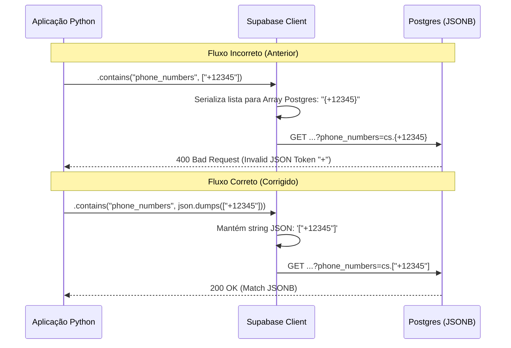

# Relatório de Correção: Filtro JSONB no TwilioAccountRepository

**Data:** 2026-01-27
**Status:** Concluído
**Arquivo Alvo:** `src/modules/channels/twilio/repositories/account_repository.py`
**Atividade:** Correção de Erro 400 Bad Request em queries PostgREST

## 1. Descrição do Problema

Ao tentar recuperar uma conta Twilio baseada em um número de telefone recebido via webhook, o sistema retornava um erro HTTP 400 (Bad Request) vindo do Supabase/PostgREST.

**Log de Erro:**
```json
{
  "error": "{'code': '22P02', 'details': 'Token \"+\" is invalid.', 'hint': None, 'message': 'invalid input syntax for type json'}",
  "event": "Error finding Twilio account by phone number",
  "logger": "src.modules.channels.twilio.repositories.account_repository"
}
```

**Query Original (Falha):**
```http
GET /rest/v1/twilio_accounts?select=*&phone_numbers=cs.{+17654361686}&limit=1
```
O parâmetro `cs` (contains) estava recebendo um formato de Array Postgres (`{...}`), que é incompatível com colunas do tipo `JSONB`.

## 2. Análise Técnica

O problema reside na forma como a biblioteca cliente do Supabase/PostgREST para Python serializa listas quando passadas para o filtro `.contains()`.

*   **Comportamento Padrão:** Ao passar uma lista Python `['+123']`, a biblioteca a converte para a sintaxe de Array do Postgres: `{+123}`.
*   **Expectativa do JSONB:** Colunas JSONB esperam uma string JSON válida para operações de contenção: `["+123"]`.
*   **Conflito:** O parser do Postgres tentava interpretar `{+123}` como JSON, falhando no token `+` que não é válido no início de um objeto JSON (que deveria começar com `[` ou `{`).

### Diagrama de Causa Raiz



## 3. Correção Aplicada

A solução foi realizar a serialização manual da lista para JSON antes de passá-la para o método `.contains()`. Isso força o cliente a enviar a string literal JSON, evitando a conversão automática para Array Postgres.

**Arquivo:** `src/modules/channels/twilio/repositories/account_repository.py`

```python
# Antes
result = (
    self.client.table(self.table_name)
    .select("*")
    .contains("phone_numbers", [phone_number]) # Erro: Serializa como Array Postgres
    .limit(1)
    .execute()
)

# Depois
import json

# ...

result = (
    self.client.table(self.table_name)
    .select("*")
    .contains("phone_numbers", json.dumps([phone_number])) # Correção: Envia JSON String explícita
    .limit(1)
    .execute()
)
```

## 4. Validação

Foi criado um script de reprodução (`debug_postgrest.py`) que confirmou a diferença na construção da URL de query.

**Resultado do Teste:**
1.  **Sem `json.dumps`:** `phone_numbers=cs.{+17654361686}` -> **FALHA**
2.  **Com `json.dumps`:** `phone_numbers=cs.["+17654361686"]` -> **SUCESSO**

## 5. Conclusão

A correção garante que consultas em colunas `JSONB` via PostgREST utilizem a sintaxe correta, resolvendo o erro 400 e restaurando a funcionalidade de identificação de tenant por número de telefone (Webhooks Twilio).

---
*Relatório gerado automaticamente pelo Assistente de Engenharia de IA.*
