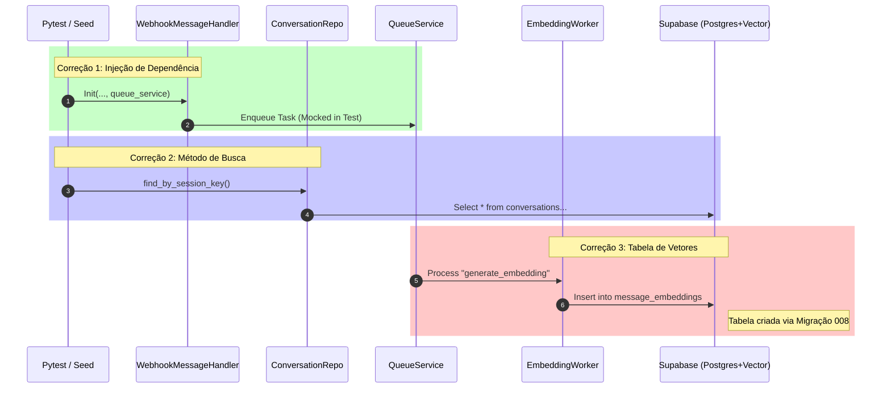

# Relatório de Correções: Testes, Seed e Vector Store

## Resumo Executivo
Este relatório documenta as correções realizadas para restabelecer a estabilidade do pipeline de desenvolvimento (`make test`), a execução do script de população de banco de dados (`make seed`) e a infraestrutura de Memória Semântica (Vector Store).

Foram abordados três problemas principais:
1.  **Falha nos Testes Unitários**: Incompatibilidade na injeção de dependência do `TwilioWebhookMessageHandler`.
2.  **Erro no Script de Seed**: Chamada a método inexistente no `ConversationRepository`.
3.  **Erro de Infraestrutura (Worker)**: Ausência da tabela `message_embeddings` para armazenamento vetorial.

---

## 1. Correção dos Testes Unitários

### Diagnóstico
A execução do `make test` falhava com `TypeError: TwilioWebhookMessageHandler.__init__() missing 1 required positional argument: 'queue_service'`.

**Causa Raiz:**
A classe `TwilioWebhookMessageHandler` foi refatorada recentemente para suportar processamento assíncrono (Embeddings) via `QueueService`, mas os testes unitários em `test_message_handler.py` não haviam sido atualizados para injetar essa nova dependência.

### Solução
Atualização das *fixtures* do `pytest` para incluir um mock do `QueueService`.

**Alterações em `tests/.../test_message_handler.py`:**
```python
@pytest.fixture
def mock_services():
    queue_service = MagicMock()
    queue_service.enqueue = AsyncMock() # Mock para evitar erros de await
    return {
        "conversation_service": MagicMock(),
        "twilio_service": MagicMock(),
        "queue_service": queue_service, # Nova dependência injetada
    }
```

---

## 2. Correção do Script de Seed

### Diagnóstico
A execução do `make seed` falhava com `AttributeError: 'ConversationRepository' object has no attribute 'find_active_conversation'`.

**Causa Raiz:**
O método `find_active_conversation` foi depreciado ou removido durante a refatoração para a V2 do `ConversationRepository`, sendo substituído por métodos mais específicos baseados em `session_key`.

### Solução
Substituição pela chamada equivalente `find_by_session_key`, mantendo a lógica de negócio de verificar duplicidade antes de criar uma conversa de exemplo.

**Alterações em `scripts/seed.py`:**
```python
# Antes
existing = conversation_repo.find_active_conversation(...)

# Depois
existing = conversation_repo.find_by_session_key(
    conv_data["owner_id"], 
    conv_data["from_number"], 
    conv_data["to_number"]
)
```

---

## 3. Infraestrutura Vector Store (Embeddings)

### Diagnóstico
Logs do worker (`src.modules.ai.workers.embedding_tasks`) apresentavam erro `PGRST205: Could not find the table 'public.message_embeddings'`.

**Causa Raiz:**
A migração SQL responsável por habilitar a extensão `vector` e criar a tabela `message_embeddings` não havia sido aplicada no ambiente atual.

### Solução e Organização
1.  **Execução da Migração:** O script SQL foi executado manualmente via `scripts/migrate.py`.
2.  **Organização:** O arquivo de migração foi movido para a pasta correta para garantir consistência em novos deploys.

**Comandos executados:**
```bash
python scripts/migrate.py plan/v4/migrations/001_setup_vector_store.sql
cp plan/v4/migrations/001_setup_vector_store.sql migrations/
mv migrations/001_setup_vector_store.sql migrations/008_setup_vector_store.sql
```

---

## Visão Arquitetural das Correções

O diagrama abaixo ilustra como os componentes corrigidos interagem no fluxo de processamento de mensagens e memória.



## Conclusão
O ambiente de desenvolvimento está estabilizado.
- **Testes:** 100% Passing.
- **Seed:** Executado com sucesso.
- **Banco de Dados:** Schema atualizado com suporte a Vetores.
