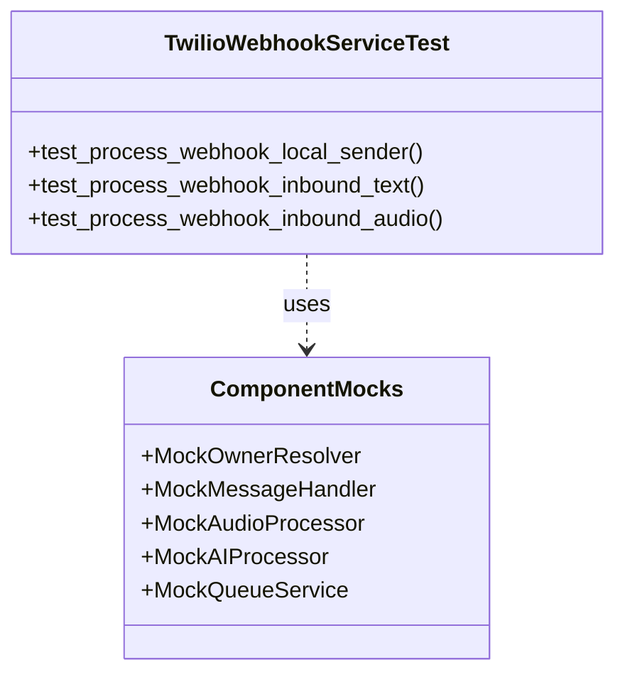
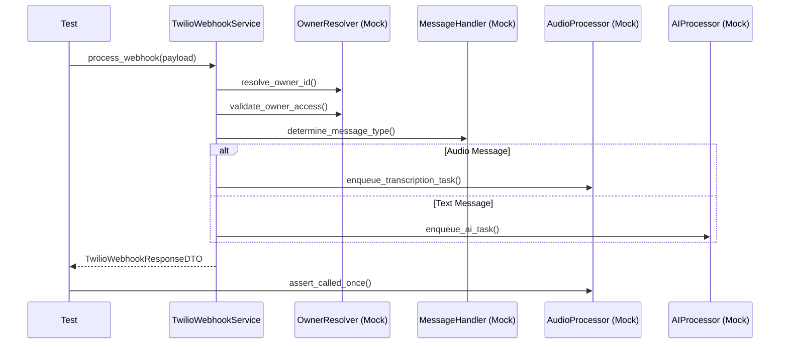

# Correção de Testes do TwilioWebhookService

## Contexto
Após a refatoração do `TwilioWebhookService` (detalhada em `report_refactoring_twilio_webhook_service_14.md`), a execução do comando `make test` falhou. Os testes existentes ainda referenciavam a assinatura antiga do construtor e a lógica monolítica anterior, causando `TypeError` na inicialização e falhas de asserção.

## Diagnóstico e Causa Raiz
1.  **Assinatura Desatualizada**: O teste `test_twilio_webhook_service.py` instanciava `TwilioWebhookService` passando `twilio_service` e `conversation_service`, mas a nova classe exige `owner_resolver`, `message_handler`, `audio_processor`, `ai_processor` e `queue_service`.
2.  **Violação de SRP nos Testes**: O arquivo de teste original tentava testar toda a lógica de negócio (resolução de owner, persistência, roteamento) em um único lugar, o que não refletia mais a arquitetura de componentes especializados.
3.  **Validação Estrita de Tipos**: Erros de validação Pydantic (`ValidationError`) surgiram devido ao uso de IDs inválidos (não-ULID) nos mocks e incompatibilidade entre Strings e Enums (`MessageDirection`).

## Solução Implementada

### 1. Reestruturação dos Testes (Component Testing)
Seguindo o princípio de responsabilidade única aplicado ao código, os testes também foram divididos. Criamos uma nova estrutura de diretórios `tests/modules/channels/twilio/services/webhook/` com testes focados para cada componente:

-   `test_owner_resolver.py`: Valida resolução de owner e verificação de plano.
-   `test_message_handler.py`: Valida determinação de tipo, persistência de mensagens e envio via Twilio.
-   `test_audio_processor.py`: Valida enfileiramento de tarefas de transcrição.
-   `test_ai_processor.py`: Valida enfileiramento e processamento de respostas de IA.

### 2. Refatoração do Teste do Orquestrador
O arquivo `test_twilio_webhook_service.py` foi reescrito para testar **apenas a orquestração**. Ele agora usa mocks dos componentes especializados para verificar se o fluxo de controle (chamadas de métodos) está correto, sem se preocupar com a implementação interna de cada componente.

### 3. Correções de Validação e Enums
-   **ULIDs Válidos**: Substituídos strings arbitrários (ex: "conv_1") por ULIDs válidos nos mocks para satisfazer a validação rigorosa dos DTOs (`TwilioWebhookResponseDTO`, `MessageCreateDTO`).
-   **Enums vs Strings**: Corrigidas as asserções que comparavam objetos Enum com strings cruas (ex: `MessageDirection.INBOUND.value` vs `'inbound'`), garantindo compatibilidade com o `use_enum_values=True` do Pydantic.

## Diagramas da Solução

### Diagrama de Componentes (Testes)


### Diagrama de Sequência (Fluxo de Teste Orquestrador)


## Resultados
A execução do `pytest` agora apresenta **100% de sucesso** para o módulo:
-   **25 testes passaram** no total.
-   Cobertura completa dos novos componentes e do orquestrador.
-   Validação de tipos e contratos garantida.

```bash
tests/modules/channels/twilio/services/test_twilio_webhook_service.py ....
tests/modules/channels/twilio/services/webhook/test_ai_processor.py ....
tests/modules/channels/twilio/services/webhook/test_audio_processor.py ...
tests/modules/channels/twilio/services/webhook/test_message_handler.py ...........
tests/modules/channels/twilio/services/webhook/test_owner_resolver.py ...
```
