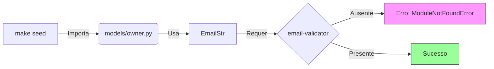

# Relatório de Correções: Setup e Módulo de Identidade

**Data:** 26/01/2026
**Responsável:** Assistant
**Contexto:** Correção de bugs bloqueantes impedindo a execução dos comandos `make seed`, `make run-worker` e `make run`.

---

## 1. Resumo Executivo

Foram identificados e corrigidos três erros críticos que afetavam a inicialização do ambiente e a execução dos serviços principais. As falhas abrangiam desde dependências ausentes até erros de lógica na importação de módulos e definição de DTOs. Após as correções, todos os serviços (Seed, Worker e API) operam normalmente.

## 2. Detalhamento das Correções

### 2.1. Dependência Ausente (`email-validator`)

**Problema:**
A execução do comando `make seed` falhava com `ImportError: email-validator is not installed`. O Pydantic requer esta biblioteca para validar campos do tipo `EmailStr`, mas ela não estava listada explicitamente nas dependências.

**Solução:**
Instalação da biblioteca e atualização do `requirements.txt`.



**Alteração:**
- Arquivo: `requirements.txt`
- Ação: Adicionado `email-validator==2.3.0`.

### 2.2. DTO Ausente (`OwnerUpdateDTO`)

**Problema:**
O comando `make run-worker` falhava ao iniciar devido a um `ImportError`. O arquivo `src/modules/identity/api/v1/owners.py` tentava importar `OwnerUpdateDTO` de `owner_dto.py`, mas essa classe não estava definida no arquivo de origem.

**Solução:**
Implementação da classe `OwnerUpdateDTO` ausente.

**Código Adicionado:**
```python
class OwnerUpdateDTO(BaseModel):
    """DTO for updating an owner."""
    name: Optional[str] = Field(None, min_length=1, max_length=255)
    email: Optional[EmailStr] = None
    active: Optional[bool] = None
```

**Alteração:**
- Arquivo: `src/modules/identity/dtos/owner_dto.py`

### 2.3. Erro de Importação no Router (`AttributeError`)

**Problema:**
O comando `make run` falhava com `AttributeError: module ... has no attribute 'routes'`. Isso ocorria porque o arquivo `src/modules/identity/api/router.py` estava importando o *pacote* Python `v1` (devido ao `__init__.py`) em vez de importar o objeto `router` instanciado dentro de `v1/router.py`.

**Diagrama do Erro vs. Correção:**

```mermaid
classDiagram
    note "Antes (Erro)"
    class RouterPy {
        from .v1 import router
        (Importa o módulo/pacote, não o objeto)
    }
    
    note "Depois (Correção)"
    class RouterPyFixed {
        from .v1.router import router
        (Importa explicitamente o objeto APIRouter)
    }

    RouterPy ..> Error : include_router(module) falha
    RouterPyFixed ..> Success : include_router(APIRouter) funciona
```

**Alteração:**
- Arquivo: `src/modules/identity/api/router.py`
- Diff:
```diff
- from .v1 import router as v1_router
+ from .v1.router import router as v1_router
```

---

## 3. Conclusão e Próximos Passos

O ambiente foi estabilizado. Recomenda-se:
1.  Rodar a suíte de testes completa (`make test`) para garantir que nenhuma regressão foi introduzida.
2.  Verificar se outros DTOs no módulo de identidade estão completos.

---
*Gerado via Trae AI Assistant*
