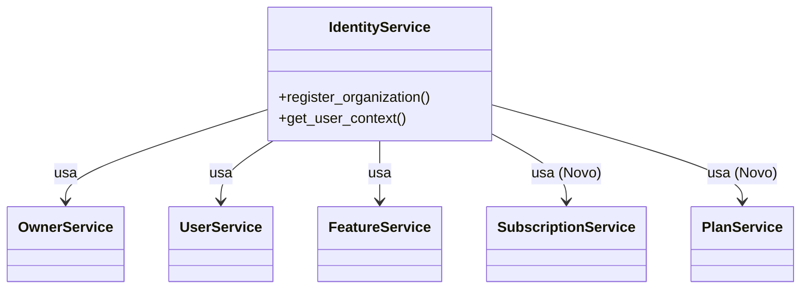

# Relatório de Correção: Testes de Atomicidade do IdentityService

**Data:** 26/01/2026
**Responsável:** Trae AI Assistant
**Arquivo:** `plan/v4/corrections/correction_identity_test_fix_02.md`

## 1. Contexto e Problema

Durante a execução da suíte de testes (`make test`), foi identificada uma falha no arquivo `tests/runnable/test_identity_atomicity.py`. O erro reportado foi um `TypeError` na instanciação da classe `IdentityService`.

**Erro Original:**
```
TypeError: IdentityService.__init__() missing 2 required positional arguments: 'subscription_service' and 'plan_service'
```

**Causa Raiz:**
A classe `IdentityService` sofreu uma evolução arquitetural recente para suportar as funcionalidades de **Planos** e **Assinaturas**, recebendo duas novas dependências no construtor: `SubscriptionService` e `PlanService`. No entanto, o teste unitário `test_identity_atomicity.py` realizava a instanciação manual da classe (sem usar o container de injeção de dependência) e não havia sido atualizado para refletir essa mudança na assinatura.

## 2. Solução Implementada

Para corrigir a quebra, o teste foi atualizado para mockar as novas dependências exigidas.

### Alterações em `tests/runnable/test_identity_atomicity.py`

1.  **Criação de Mocks:** Adicionados `MagicMock` para `SubscriptionService` e `PlanService` no método `setUp`.
2.  **Injeção de Dependência:** Atualizada a chamada do construtor `IdentityService(...)` para incluir os novos mocks.

### Diagrama de Dependências Atualizado

O diagrama abaixo ilustra a estrutura atual de dependências do `IdentityService`, destacando os novos serviços integrados.



## 3. Verificação e Resultados

Após a aplicação da correção, os testes foram reexecutados para validar a integridade do sistema.

### Execução Isolada
```bash
pytest tests/runnable/test_identity_atomicity.py
```
**Resultado:** ✅ 2 passed in 0.11s

### Execução da Suíte Completa (`make test`)
```bash
make test
```
**Resultado:** ✅ 106 passed, 12 warnings in 3.11s

## 4. Conclusão

A correção restabeleceu a estabilidade da pipeline de testes. A falha ressaltou a importância de manter os testes unitários sincronizados com as mudanças na assinatura dos construtores, especialmente quando a injeção de dependência é feita manualmente nos testes (ao invés de usar fixtures ou containers).

---
**Próximos Passos Sugeridos:**
- Avaliar a criação de uma *factory* ou *fixture* centralizada para instanciar o `IdentityService` em testes, reduzindo a necessidade de manutenção repetitiva em múltiplos arquivos de teste quando a assinatura mudar.
