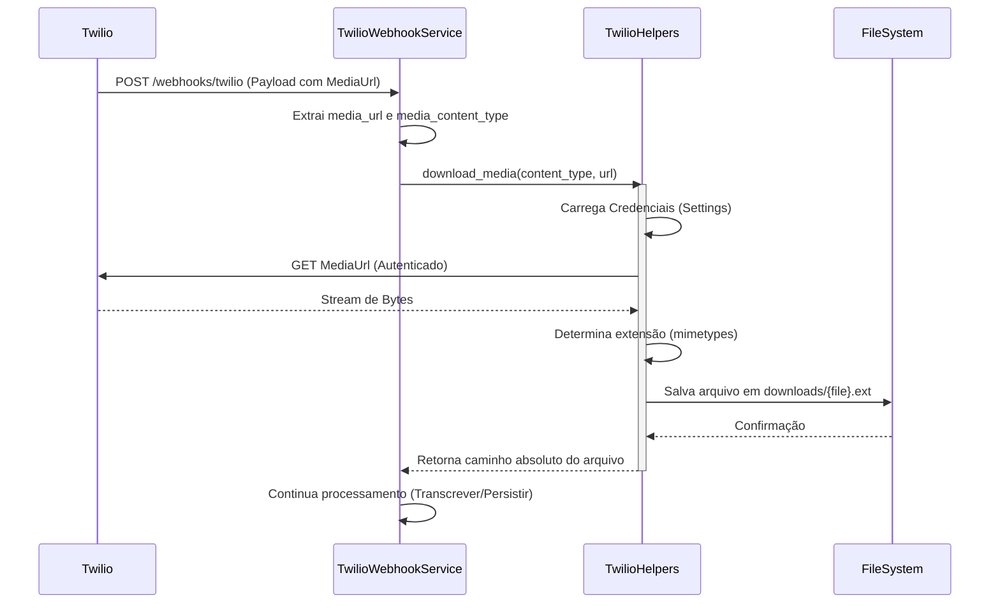

# Relatório de Correção: Download de Mídia Twilio

**Data:** 27/01/2026
**Atividade:** Correção de Bug e Refatoração de Helpers
**Arquivo:** `plan/v4/corrections/correction_media_download_fix_05.md`

## 1. Contexto e Problema Identificado

Durante a análise do código fonte, especificamente no processamento de webhooks do Twilio (`TwilioWebhookService`), foi identificado um bug crítico que impedia o download de arquivos de mídia (áudios, imagens, etc.) enviados pelos usuários.

### Problemas Detectados:
1.  **Argumentos Invertidos:** A chamada ao método `TwilioHelpers.download_media` no serviço estava passando os argumentos na ordem incorreta (`url, type` ao invés de `type, url`).
2.  **Tipagem Incorreta:** O serviço passava um Enum interno (`MessageType`) como argumento para o helper, que esperava uma string de Content-Type (MIME type). Isso causaria falha ao tentar processar a string (ex: `split('/')` em um objeto Enum).
3.  **Implementação Frágil do Helper:** A classe `TwilioHelpers` possuía várias dívidas técnicas:
    - Acesso direto a `os.environ` em vez de usar o sistema centralizado de `settings`.
    - Salvava arquivos na raiz do projeto, poluindo o diretório de trabalho.
    - Confiava apenas na URL para determinar a extensão do arquivo, ignorando o Content-Type oficial.
    - Utilizava `print()` para logs, violando o padrão de observabilidade do projeto.

## 2. Soluções Aplicadas

### 2.1. Correção no `TwilioWebhookService`

O fluxo de chamada foi ajustado para extrair corretamente os dados do payload e passá-los na ordem esperada.

```python
# Antes (Incorreto)
media_content = TwilioHelpers.download_media(
    payload.media_url, message_type  # Argumentos invertidos e tipo errado
)

# Depois (Corrigido)
media_content = None
if payload.media_url:
    media_content = TwilioHelpers.download_media(
        media_type=payload.media_content_type,  # Passa o MIME type real (ex: 'audio/ogg')
        media_url=payload.media_url,            # Passa a URL correta
    )
```

### 2.2. Refatoração Robusta do `TwilioHelpers`

A classe utilitária foi reescrita para ser segura e robusta.

**Principais Melhorias:**
- **Segurança:** Uso de `src.core.config.settings` para obter credenciais do Twilio, com fallback seguro.
- **Detecção de Tipo:** Implementação da biblioteca `mimetypes` para garantir que a extensão do arquivo corresponda ao conteúdo real (ex: salvar como `.ogg` se o content-type for `audio/ogg`).
- **Organização:** Criação automática de um diretório `downloads/` para armazenar os arquivos, evitando poluição da raiz.
- **Observabilidade:** Substituição de `print` por `logger` estruturado.

## 3. Fluxo de Dados Atualizado

Abaixo, o diagrama ilustra o fluxo correto de processamento de uma mensagem com mídia após as correções.



## 4. Conclusão

As correções garantem que o sistema agora é capaz de receber e armazenar arquivos de mídia de forma confiável. O risco de erros em tempo de execução (`AttributeError` ou `TypeError`) foi eliminado nessa funcionalidade, e a manutenibilidade do código foi elevada ao padronizar o uso de configurações e logs.

### Próximos Passos Sugeridos
- Implementar limpeza automática do diretório `downloads/` (rotação de arquivos temporários).
- Adicionar testes unitários específicos para `TwilioHelpers` mockando a resposta da API do Twilio.
