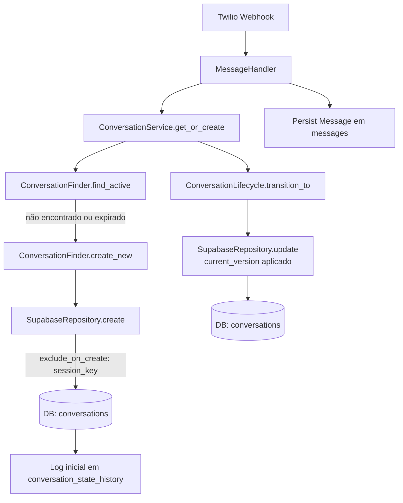

# Correção: Webhook Twilio – Inserção em Conversations (session_key gerado) e Update com Locking Otimista

## Contexto
- Logs indicavam falha ao processar mensagens inbound por erro no módulo de conversas:
  - `cannot insert a non-DEFAULT value into column "session_key"` ao criar registros em `conversations`.
  - Após correção parcial, surgiu: `SupabaseRepository.update() got an unexpected keyword argument 'current_version'` ao atualizar o estado da conversa durante transições (PENDING → PROGRESS).
- O endpoint `messages` do Supabase está operando corretamente (HTTP 201 Created), confirmando credenciais e fluxo de persistência de mensagens. Em chamadas sem `apikey`, a API retorna erro conforme política do Supabase (exige header `apikey`).

## Decisões
- Remover `session_key` do payload de criação de conversas; a coluna é gerada no banco.
- Generalizar a infraestrutura de repositórios para suportar exclusão de colunas geradas no `create` via `exclude_on_create`.
- Atualizar o método `update` para aceitar `current_version` e aplicar locking otimista (incremento de versão e verificação).
- Adicionar `update_timestamp` no `ConversationRepository` V2 para renovar `updated_at` após mensagens.

## Alterações de Código
- Infraestrutura de repositório:
  - `exclude_on_create` e suporte a `current_version` em update:
    - [supabase_repository.py:__init__](file:///Users/lennon/projects/ai_engineering/whatsapp_twilio_ai/src/core/database/supabase_repository.py#L32-L53)
    - [supabase_repository.py:update](file:///Users/lennon/projects/ai_engineering/whatsapp_twilio_ai/src/core/database/supabase_repository.py#L178-L205)
- Repositório de Conversas V2:
  - Ignora `session_key` no create e configura `exclude_on_create=["session_key"]`:
    - [conversation_repository.py](file:///Users/lennon/projects/ai_engineering/whatsapp_twilio_ai/src/modules/conversation/repositories/conversation_repository.py#L25-L44)
  - `update_timestamp` para renovar `updated_at`:
    - [conversation_repository.py](file:///Users/lennon/projects/ai_engineering/whatsapp_twilio_ai/src/modules/conversation/repositories/conversation_repository.py#L198-L203)
- Componente Finder:
  - Remove `session_key` do payload de criação:
    - [conversation_finder.py](file:///Users/lennon/projects/ai_engineering/whatsapp_twilio_ai/src/modules/conversation/components/conversation_finder.py#L110-L121)
- Lifecycle:
  - Utiliza `current_version` nas transições de estado:
    - [conversation_lifecycle.py:transition_to](file:///Users/lennon/projects/ai_engineering/whatsapp_twilio_ai/src/modules/conversation/components/conversation_lifecycle.py#L111-L118)

## Fluxo Corrigido

## Resultados
- Removida a causa raiz do 400 em `conversations` por inserção de `session_key`.
- Evitado `TypeError` em `update()` ao padronizar `current_version` na infraestrutura.
- Fluxo do webhook volta a responder 200 OK rapidamente, com processamento assíncrono conforme arquitetura de filas.
- Logs confirmam envio de resposta do AI Processor.

## Validações
- Testes unitários:
  - Finder: criação sem `session_key`; 5 testes OK.
    - [test_conversation_finder.py](file:///Users/lennon/projects/ai_engineering/whatsapp_twilio_ai/tests/modules/conversation/components/test_conversation_finder.py)
  - Repositório: criação + histórico; teste focal OK.
    - [test_conversation_repository.py::test_create_logs_history](file:///Users/lennon/projects/ai_engineering/whatsapp_twilio_ai/tests/modules/conversation/repositories/test_conversation_repository.py#L63-L93)
  - Lifecycle: transições usando `current_version`; 8 testes OK.
    - [test_conversation_lifecycle.py](file:///Users/lennon/projects/ai_engineering/whatsapp_twilio_ai/tests/modules/conversation/components/test_conversation_lifecycle.py)
- Serviços reiniciados: app, worker e scheduler (Makefile `restart`).

## Riscos e Próximos Passos
- Documentar colunas geradas por tabela e padronizar uso de `exclude_on_create` em repositórios críticos.
- Adicionar testes focalizados da infraestrutura (`update` com `current_version`) para evitar regressões.
- Monitorar concorrência nas transições; expandir métricas para conflitos de versão.
- Garantir cabeçalhos `apikey` em integrações diretas com Supabase REST quando necessário (o endpoint rejeita requisições sem `apikey`).

## Reflexões de Arquitetura
- Segurança: removemos manipulação direta de coluna gerada e mantivemos o modelo de autenticação do Supabase sem expor segredos no código.
- Escalabilidade e manutenção: abstração do repositório ficou mais robusta e reaproveitável (exclusão de colunas geradas, locking otimista), reduzindo acoplamento e erros transitórios em cenários concorrentes. O fluxo assíncrono do webhook permanece alinhado à estratégia de tempo de resposta mínimo.
