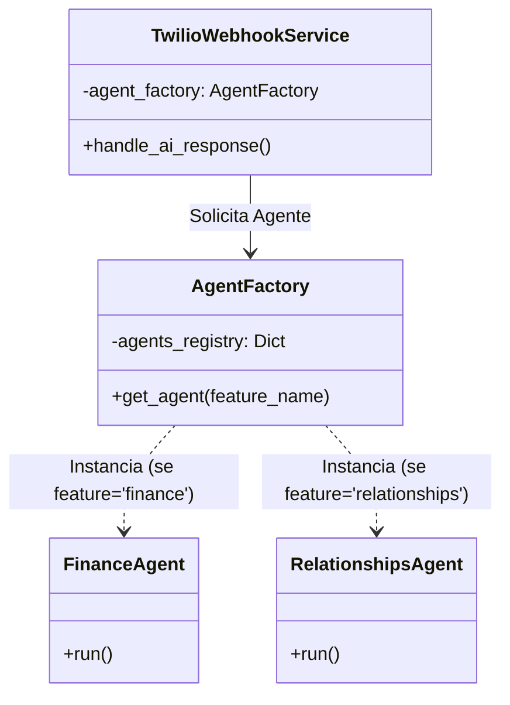

# Relatório de Implementação: Agent Factory & Dynamic Switching

**ID:** report_agent_factory_02  
**Data:** 2026-01-27  
**Autor:** Assistant (via Trae IDE)  
**Status:** Implementado  

## 1. Contexto

Conforme detalhado no [Research Report (research_agent_factory_02)](../research/research_agent_factory_02.md), o sistema possuía um acoplamento estático com o módulo financeiro, impedindo a utilização do novo módulo de relacionamentos. O objetivo foi implementar o padrão **Abstract Factory** para permitir a seleção dinâmica de agentes (Finance/Relationships) com base na configuração do usuário.

## 2. Alterações Realizadas

### 2.1. Refatoração do `AgentFactory`
Transformação do arquivo `src/modules/ai/engines/lchain/core/agents/agent_factory.py` de uma função estática para uma classe gerenciadora de providers.

- **Antes:** Função `create_master_agent` fixa.
- **Depois:** Classe `AgentFactory` com registro de providers (`agents_registry`) e método `get_agent(feature_name)`.

### 2.2. Atualização do Container DI
Modificação do `src/core/di/container.py` para registrar os novos componentes e conectar as dependências.

- Registrado `relationships_agent` (Factory).
- Registrado `agent_factory` (Factory) injetando os providers dos agentes:
  ```python
  agent_factory = providers.Factory(
      AgentFactory,
      agents_registry=providers.Dict(
          finance=finance_agent.provider,
          relationships=relationships_agent.provider
      ),
  )
  ```
- Atualizado `twilio_webhook_service` para receber `agent_factory` ao invés de `agent_runner`.

### 2.3. Integração no `TwilioWebhookService`
Ajuste no serviço de webhook para instanciar o agente dinamicamente.

- No método `handle_ai_response`, o serviço agora consulta a feature ativa do usuário e solicita o agente correspondente à factory:
  ```python
  feature_name = feature.name if feature else "finance"
  agent = self.agent_factory.get_agent(feature_name)
  response_text = agent.run(...)
  ```

## 3. Resultados

- **Flexibilidade:** O sistema agora suporta múltiplos agentes sem alteração de código no webhook.
- **Escalabilidade:** Adicionar novos agentes (ex: `sales`, `support`) requer apenas registrar o provider no container.
- **Isolamento:** Cada execução cria uma nova instância do agente (`RoutingAgent`), garantindo que a memória de conversação não vaze entre requisições (devido ao uso de `providers.Factory`).

## 4. Diagrama da Solução Implementada



## 5. Próximos Passos
- Validar via testes de integração se a alternância de features no banco de dados efetivamente troca o agente em execução.
- Monitorar logs para garantir que o fallback para 'finance' está funcionando conforme esperado em casos de features não mapeadas.
