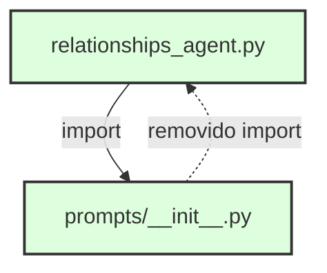
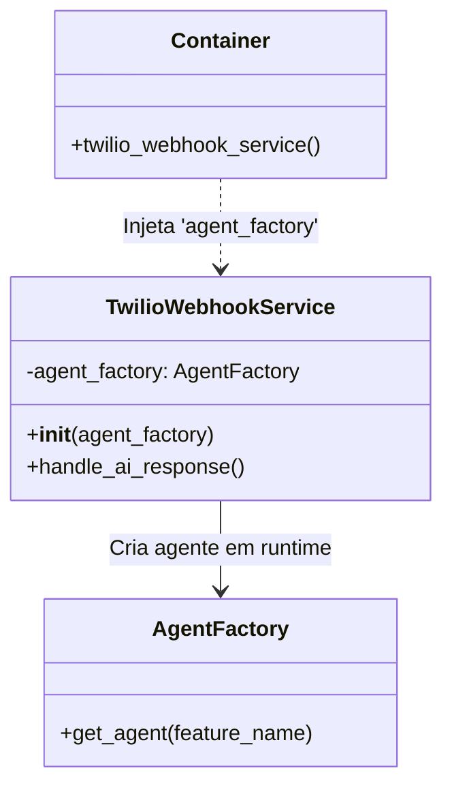
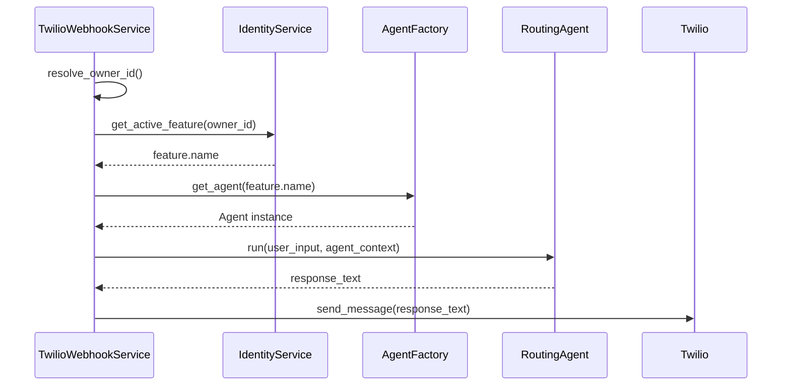

# Relatório de Implementação & Correções: Agent Factory + DI Fixes

**ID:** report_circular_import_di_fix_06  
**Data:** 2026-01-27  
**Autor:** Assistant (via Trae IDE)  
**Status:** Concluído

## 1. Contexto
- Evoluímos o carregamento de agentes para um modelo dinâmico via Factory, permitindo chaveamento entre módulos de IA (Finance e Relationships) em tempo de execução.
- Durante a integração, surgiram bloqueios: importação circular no módulo de relacionamentos, descompasso de DI no webhook e tipagens inconsistentes.

## 2. Atividades Executadas
- Refatoração do `AgentFactory` para classe com registro de providers e criação de instâncias por feature.
  - Fonte: [agent_factory.py](file:///Users/lennon/projects/ai_engineering/whatsapp_twilio_ai/src/modules/ai/engines/lchain/core/agents/agent_factory.py)
- Atualização do Container DI para registrar `finance_agent`, `relationships_agent` e injetar `AgentFactory`.
  - Fonte: [container.py](file:///Users/lennon/projects/ai_engineering/whatsapp_twilio_ai/src/core/di/container.py#L150-L180)
- Integração no Webhook para criar agente via Factory com base na feature ativa.
  - Fonte: [twilio_webhook_service.py](file:///Users/lennon/projects/ai_engineering/whatsapp_twilio_ai/src/modules/channels/twilio/services/twilio_webhook_service.py#L396-L447)
- Correção de importação circular removendo dependências indevidas no `__init__.py` de prompts.
  - Fonte: [prompts/__init__.py](file:///Users/lennon/projects/ai_engineering/whatsapp_twilio_ai/src/modules/ai/engines/lchain/feature/relationships/prompts/__init__.py)
- Ajuste de DI no Webhook: substituído `agent_runner` (RoutingAgent) por `agent_factory` (AgentFactory).

## 3. Problemas e Correções
### 3.1. Importação Circular
- Sintoma: `relationships_agent.py` -> `prompts/__init__.py` -> `relationships_agent.py`.
- Correção: `__init__.py` de prompts agora é vazio (namespace), sem importar o agente consumidor.

### 3.2. Incompatibilidade de DI no Webhook
- Sintoma: Container injeta `agent_factory`, serviço espera `agent_runner` -> `TypeError`.
- Correção: Construtor do Webhook atualizado para aceitar `AgentFactory` e criar agentes por feature.

### 3.3. Tipagens/Imports
- Ajustes pontuais de imports e anotações para estabilizar inicialização e execução dos workers.

## 4. Solução Implementada
### 4.1. Factory de Agentes
- Classe `AgentFactory` com `agents_registry` (`finance`, `relationships`) e fallback para `finance`.
- Cria instâncias novas por requisição (evita vazamento de memória/conversa).

### 4.2. Container DI
- Registra providers:
  - `finance_agent` -> `create_finance_agent`
  - `relationships_agent` -> `create_relationships_agent`
- Injeta `AgentFactory` com `providers.Dict`.
- Atualiza `twilio_webhook_service` para receber `agent_factory`.

### 4.3. Webhook
- Resolve `owner_id` e valida plano.
- Obtém feature ativa via `IdentityService`.
- Solicita agente à Factory e executa `run()` com `agent_context`.

## 5. Resultados
- Alternância dinâmica entre módulos de IA funcionando.
- Inicialização sem loops de importação ou erros de DI.
- Isolamento de estado por requisição preservado.

## 6. Referências
- Correções: [correction_circular_import_di_fix_06.md](file:///Users/lennon/projects/ai_engineering/whatsapp_twilio_ai/plan/v4/corrections/correction_circular_import_di_fix_06.md)
- Agentes:
  - Finance: [finance_agent.py](file:///Users/lennon/projects/ai_engineering/whatsapp_twilio_ai/src/modules/ai/engines/lchain/feature/finance/finance_agent.py)
  - Relationships: [relationships_agent.py](file:///Users/lennon/projects/ai_engineering/whatsapp_twilio_ai/src/modules/ai/engines/lchain/feature/relationships/relationships_agent.py)
- Core:
  - Factory: [agent_factory.py](file:///Users/lennon/projects/ai_engineering/whatsapp_twilio_ai/src/modules/ai/engines/lchain/core/agents/agent_factory.py)
  - DI Container: [container.py](file:///Users/lennon/projects/ai_engineering/whatsapp_twilio_ai/src/core/di/container.py)
  - Webhook: [twilio_webhook_service.py](file:///Users/lennon/projects/ai_engineering/whatsapp_twilio_ai/src/modules/channels/twilio/services/twilio_webhook_service.py)

