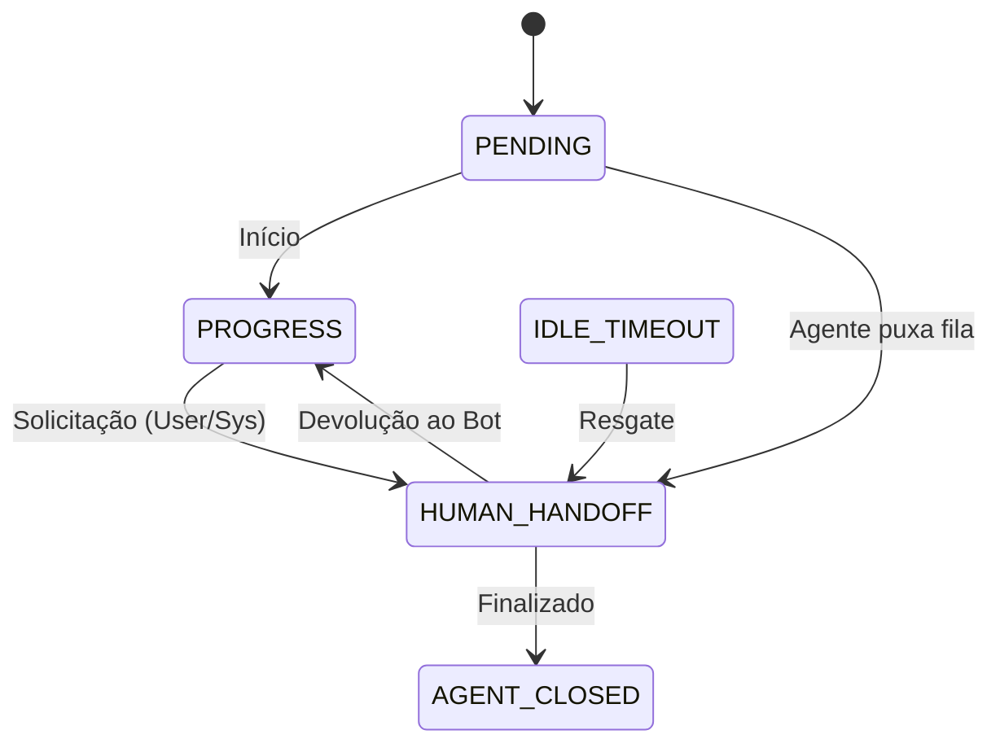

# Relatório de Implementação: Human Handoff (Fase 1 & 2)

## 1. Resumo da Atividade

Este relatório documenta a execução das Fases 1 (Refatoração) e 2 (Core Conversation) do planejamento de Human Handoff. O objetivo foi preparar a base do sistema para suportar a transferência de conversas entre o Bot (IA) e atendentes humanos.

**Status:** ✅ Concluído

---

## 2. Refatoração e Limpeza (Fase 1)

**Problema Identificado:** O diretório `src/modules/channels/twilio/workers/` continha scripts de utilidade (CLI) e não workers reais de fila, causando confusão semântica.

**Ações Realizadas:**
*   Criado novo diretório: `scripts/twilio/`.
*   Movido `sender.py` → `scripts/twilio/sender_cli.py`.
*   Movido `sender_test.py` → `scripts/twilio/sender_test.py`.
*   Movido `sender_user.py` → `scripts/twilio/sender_user.py`.
*   Removido o diretório antigo `src/modules/channels/twilio/workers/`.

**Resultado:** A estrutura de módulos agora reflete apenas código de produção, enquanto ferramentas de desenvolvimento estão isoladas em `scripts/`.

---

## 3. Implementação Core Conversation (Fase 2)

A lógica central de controle de estado foi implementada no módulo `conversation`.

### 3.1. Novo Estado: `HUMAN_HANDOFF`
Adicionado ao Enum `ConversationStatus` (`src/modules/conversation/enums/conversation_status.py`).
*   Considerado um **estado ativo** (`active_statuses`), ou seja, a conversa não está fechada, mas o controle mudou.

### 3.2. Modelo de Dados
Atualizado `Conversation` model (`src/modules/conversation/models/conversation.py`) com novos campos:
*   `agent_id` (Text, Optional): Identificador do agente humano responsável.
*   `handoff_at` (Timestamp, Optional): Momento em que a conversa foi transferida.

### 3.3. Regras de Transição (Lifecycle)
Atualizado `ConversationLifecycle` e `ConversationRepository` para permitir o seguinte fluxo:



### 3.4. Serviços
Novos métodos adicionados ao `ConversationService`:
*   `request_handoff(conversation, reason)`: Transfere para `HUMAN_HANDOFF`.
*   `assign_agent(conversation, agent_id)`: Atribui um humano à conversa.
*   `release_to_bot(conversation)`: Devolve a conversa para o estado `PROGRESS` (Bot).

---

## 4. Banco de Dados (Migration)

Foi criado o arquivo de migração `migrations/009_add_handoff_fields.sql` para atualizar o esquema do banco de dados:

```sql
ALTER TABLE conversations ADD COLUMN IF NOT EXISTS agent_id TEXT;
ALTER TABLE conversations ADD COLUMN IF NOT EXISTS handoff_at TIMESTAMP WITH TIME ZONE;

CREATE INDEX IF NOT EXISTS idx_conversations_agent_id ON conversations(agent_id);
CREATE INDEX IF NOT EXISTS idx_conversations_status_handoff ON conversations(status) WHERE status = 'human_handoff';
```

---

## 5. Próximos Passos (Roadmap)

Conforme o planejamento original (`research_compliance_handoff_17.md`), as próximas fases são:

*   **Fase 3: Integração (Twilio)**
    *   Atualizar `TwilioWebhookService` para checar `conversation.status == HUMAN_HANDOFF`.
    *   Se verdadeiro, **ignorar** o processamento de IA e apenas salvar a mensagem.
    *   *Nota:* Isso é crítico para evitar que o bot responda junto com o humano.

*   **Fase 4: API e Realtime**
    *   Criar endpoints para o frontend do agente (listar filas, assumir, enviar mensagem).
