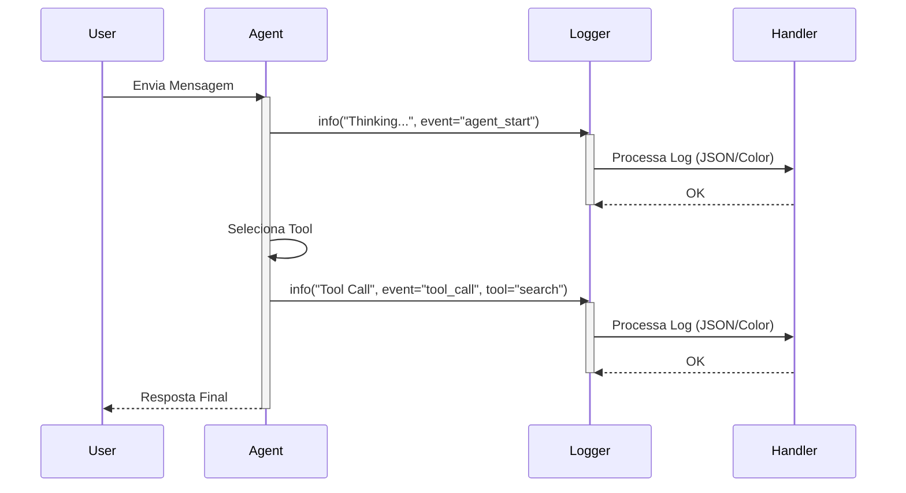

# Relatório de Implementação: Logging via Print em Produção (AI Engine)

**Data:** 28/01/2026  
**Autor:** Trae AI Assistant  
**Status:** Concluído

## 1. Contexto e Problema

O projeto utilizava declarações `print` e métodos `to_console` para logging na camada de AI Engine (`agent.py` e `routing_agent.py`). Esta abordagem apresentava os seguintes problemas:

*   **Falta de Estrutura:** Logs em texto plano dificultam a ingestão por ferramentas de observabilidade (ex: Datadog, Splunk).
*   **Performance:** `print` é uma operação síncrona e bloqueante que escreve diretamente no stdout.
*   **Acoplamento:** Uso da biblioteca `colorama` diretamente na lógica de negócio para formatação de console.
*   **Inconsistência:** Mistura de logs estruturados (em outras partes do sistema) com logs não estruturados no core da IA.
*   **Falta de Metadados:** Logs não incluíam informações cruciais como `correlation_id`, `owner_id` ou `event_type` de forma padronizada.

Este relatório documenta a migração para o logger estruturado (`structlog`) do projeto, alinhado com as diretrizes arquiteturais.

## 2. Solução Implementada

Substituímos todas as ocorrências de `print` e `to_console` pelo wrapper de logging centralizado (`src.core.utils.logging.get_logger`).

### 2.1 Mudanças Principais

1.  **Remoção de `to_console`:** Os métodos `to_console` foram removidos das classes `Agent` e `RoutingAgent`.
2.  **Adoção de `structlog`:** Uso de `logger.info`, `logger.error` e `logger.warning` com suporte a kwargs para metadados estruturados.
3.  **Metadados Contextuais:**
    *   Eventos de Roteamento: `event="routing_agent_context"`, `correlation_id`, `feature`, `owner_id`.
    *   Chamadas de Ferramentas: `event="tool_call"`, `tool_name`, `tool_args`.
    *   Erros de LLM: `event="llm_error"`, `error_type`.
4.  **Limpeza de Código:** Remoção de imports não utilizados (`colorama`, `termcolor`).

### 2.2 Diagramas da Solução

#### Diagrama de Componentes (Antes vs Depois)

```mermaid
graph TD
    subgraph "Antes"
        AgentOld[Agent] -->|print| Stdout[Console (Stdout)]
        AgentOld -->|usa| Colorama
        RoutingAgentOld[RoutingAgent] -->|print| Stdout
    end

    subgraph "Depois"
        AgentNew[Agent] -->|log| Logger[Structlog Wrapper]
        RoutingAgentNew[RoutingAgent] -->|log| Logger
        
        Logger -->|DEV| ConsoleRenderer[Colored Console]
        Logger -->|PROD| JSONRenderer[JSON Format]
        
        ConsoleRenderer --> Stdout
        JSONRenderer --> Stdout
    end
```

#### Diagrama de Sequência (Fluxo de Logging)



## 3. Arquivos Alterados

| Arquivo | Alteração |
| :--- | :--- |
| `src/modules/ai/engines/lchain/core/agents/agent.py` | Substituição de `print`/`to_console` por `logger`. Remoção de `colorama`. |
| `src/modules/ai/engines/lchain/core/agents/routing_agent.py` | Substituição de `print`/`to_console` por `logger`. Injeção de metadados de contexto. |
| `src/modules/ai/infrastructure/llm.py` | Substituição de `print` por `logger.warning` na inicialização de modelos. |
| `src/modules/ai/engines/lchain/core/utils/utils.py` | Comentado exemplo de `print` em docstring para evitar confusão. |
| `src/modules/ai/engines/lchain/feature/finance/tools/query.py` | Removido bloco `if __name__ == "__main__"` que continha prints de teste. |

## 4. Benefícios e Resultados

1.  **Observabilidade:** Logs agora são estruturados em JSON em produção, permitindo filtros por `event`, `feature`, `owner_id`, etc.
2.  **Padronização:** Todo o logging do AI Engine agora segue o padrão do restante da aplicação.
3.  **Manutenibilidade:** Código mais limpo sem lógica de formatação de console misturada com regras de negócio.
4.  **Segurança:** Redução do risco de vazar dados sensíveis em texto plano, pois o logger pode ser configurado para sanitizar campos.

## 5. Próximos Passos

*   Monitorar os logs no ambiente de staging para garantir que a verbosidade está adequada.
*   Avaliar a necessidade de adicionar logs de debug (`logger.debug`) para introspecção mais profunda durante o desenvolvimento.
