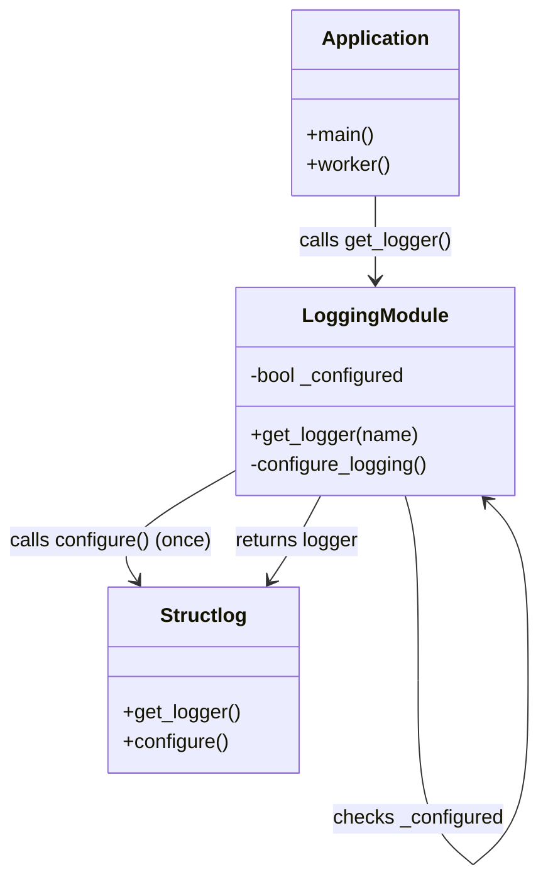
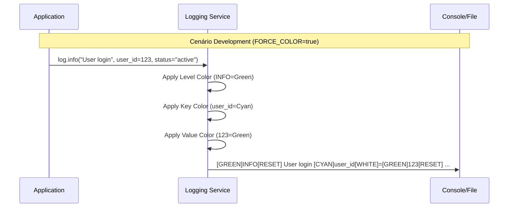

# Relatório de Implementação: Logging Avançado e Observabilidade

**Data:** 28/01/2026
**Atividade:** Refatoração e Melhoria do Sistema de Logging
**Sequência:** 13

---

## 1. Contexto
O sistema de logs da aplicação necessitava de melhorias na Experiência do Desenvolvedor (DX), especificamente na visualização colorida e estruturada em ambiente local, sem comprometer a integridade dos logs para ferramentas de observabilidade em produção. Além disso, a configuração de logging estava descentralizada, exigindo chamadas manuais repetitivas.

## 2. Análise Detalhada

### 2.1. Visualização e Cores em Background
- **Local:** `src/core/utils/logging.py`, `Makefile`
- **Problema:** Ao executar serviços em background via `make` (redirecionando stdout para arquivos), as bibliotecas de detecção de TTY desativavam as cores automaticamente, tornando os logs difíceis de ler (`tail -f`).
- **Risco:** Perda de agilidade no debugging visual local.
- **Solução:**
    - Implementação da variável de ambiente `FORCE_COLOR`.
    - Ajuste no `Makefile` para injetar `FORCE_COLOR=true`.
    - Modificação no `logging.py` para forçar `strip=False` no `Colorama` quando a flag estiver ativa.

### 2.2. Estrutura Visual dos Logs
- **Local:** `ColoredConsoleRenderer` em `logging.py`
- **Problema:** A formatação padrão `chave=valor` era visualmente monótona, dificultando a distinção rápida entre campos.
- **Solução:**
    - Refatoração do renderizador para aplicar cores semânticas:
        - **Chaves:** Ciano (Dim)
        - **Separadores:** Branco (Dim)
        - **Valores:** Verde (Bright)
    - Adoção de estilo `logfmt` limpo (espaços em vez de pipes `|`).

### 2.3. Arquitetura de Inicialização (Lazy Loading)
- **Local:** `src/core/utils/logging.py`, `src/main.py`, `workers/*.py`
- **Problema:** Violação do princípio DRY. A função `configure_logging()` precisava ser invocada explicitamente no início de cada entrypoint (`main`, `scheduler`, `worker`).
- **Risco:** Novos scripts ou módulos poderiam esquecer de inicializar o logging, resultando em perda de formatação ou output padrão do Python.
- **Solução:**
    - Implementação do padrão **Lazy Initialization** dentro da função `get_logger()`.
    - O sistema agora se auto-configura na primeira chamada de log, garantindo consistência global.

### 2.4. Compatibilidade com Observabilidade
- **Local:** `settings.ENV`
- **Problema:** Risco de "poluição" de logs em produção com caracteres ANSI (escape codes) gerados para visualização local.
- **Solução:**
    - Separação estrita de renderizadores baseada no ambiente.
    - **Dev:** `ColoredConsoleRenderer` (Prioriza legibilidade humana).
    - **Prod:** `JSONRenderer` (Prioriza parsing de máquina/Datadog/OTEL).

---

## 3. Diagramas

### 3.1. Componente: Lazy Initialization Architecture


### 3.2. Fluxo de Decisão de Renderização
```mermaid
flowchart TD
    A[Log Event Created] --> B{Environment?}
    B -- Production --> C[JSONRenderer]
    B -- Development --> D{FORCE_COLOR?}
    
    C --> E[{"level": "info", "msg": "..."}]
    
    D -- Yes --> F[ColoredConsoleRenderer (Force ANSI)]
    D -- No --> G[Check TTY]
    
    G -- Is TTY --> F
    G -- Not TTY --> H[Plain Text Renderer]
    
    F --> I[Formatted Color Log]
    H --> J[Plain Text Log]
```

### 3.3. Exemplo de Transformação Visual


---

## 4. Conclusão e Próximos Passos

A refatoração elevou o nível de maturidade da instrumentação local. O desenvolvedor agora possui uma interface visual rica e consistente (seja rodando direto no terminal ou via Makefile em background), enquanto a operação em produção permanece segura e padronizada com JSON.

### Resumo das Alterações
| Arquivo | Alteração | Motivo |
|---------|-----------|--------|
| `src/core/utils/logging.py` | Lazy Init, `FORCE_COLOR`, Novo Renderer | Centralização e DX |
| `Makefile` | `FORCE_COLOR=true` | Logs coloridos em processos background |
| `src/main.py` | Remoção de `configure_logging()` | Limpeza de código (DRY) |
| `*/workers/*.py` | Remoção de `configure_logging()` | Limpeza de código (DRY) |
