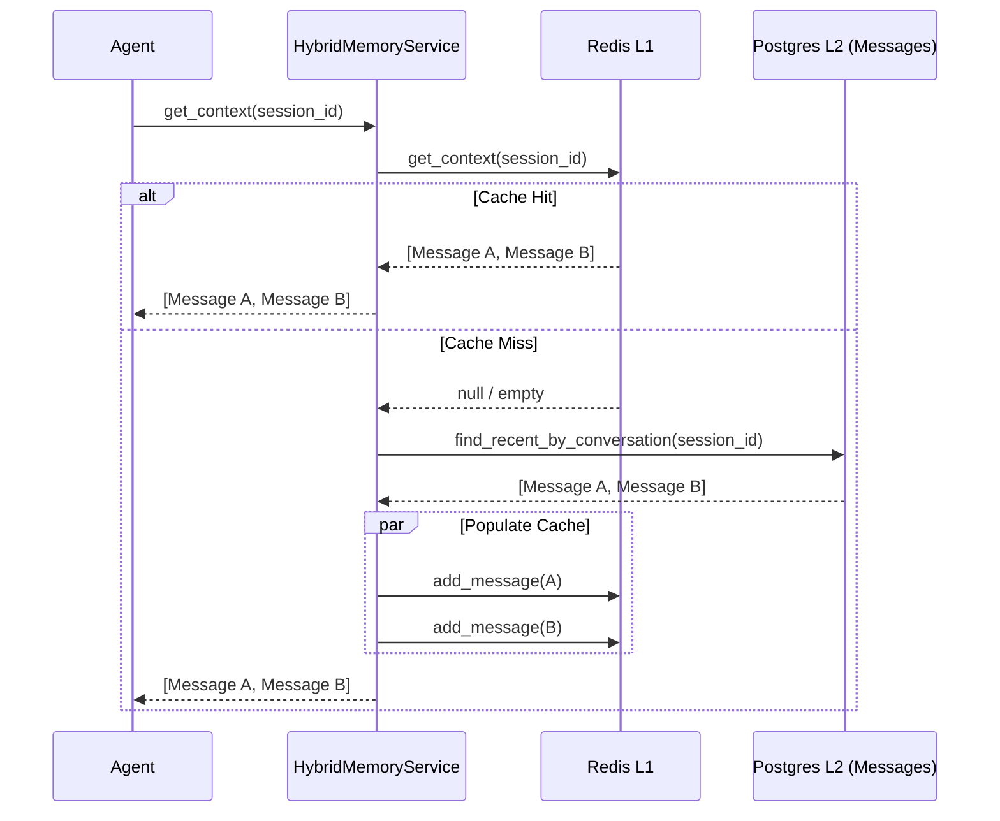
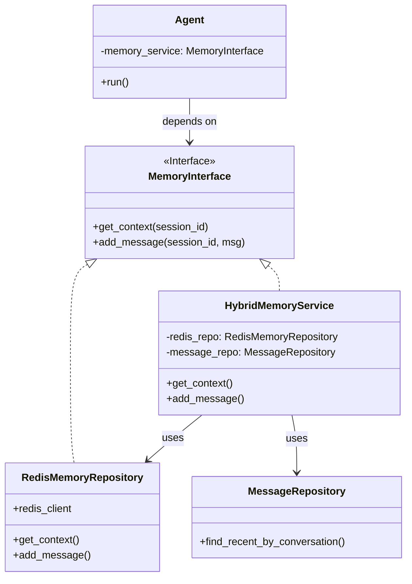

# Relatório de Implementação: Memória Híbrida (Redis + Postgres)

**Data:** 29/01/2026
**Autor:** Assistant
**Atividade:** Integração de Memória Híbrida (Fase 2)
**Sequência:** 16

---

## 1. Contexto e Problema

O sistema de IA necessita de contexto conversacional para responder adequadamente aos usuários.
- **Estado Anterior:** O Agente não tinha acesso ao histórico persistido no banco de dados (`MessageRepository`), dependendo apenas de um cache volátil (Redis) que iniciava vazio ou da memória em tempo de execução.
- **Problema:** Usuários perdiam o contexto ao retomar conversas após a expiração do cache ou reinício do serviço. Além disso, havia o risco de criar tabelas duplicadas para armazenar histórico de chat específico para IA, violando o princípio de *Single Source of Truth*.

## 2. Análise de Riscos

| Risco | Descrição | Mitigação |
| :--- | :--- | :--- |
| **Latência de Leitura** | Consultar o PostgreSQL a cada interação do agente pode introduzir latência inaceitável (>50ms). | Implementação de estratégia **Read-Through** com Cache L1 (Redis). |
| **Duplicação de Dados** | Criar `ai_chat_history` duplicaria dados de `messages`, gerando inconsistência. | Utilizar `MessageRepository` como *Cold Storage* oficial. |
| **Acoplamento** | O módulo de IA poderia ficar fortemente acoplado ao esquema do banco de dados. | Uso de Interface (`MemoryInterface`) e DTOs agnósticos no Service. |

## 3. Solução Implementada

Foi adotada uma arquitetura de **Memória Híbrida** com estratégia *Read-Through*.

### 3.1. Componentes

1.  **`HybridMemoryService`**: Orquestrador que implementa `MemoryInterface`.
    *   **L1 (Hot):** `RedisMemoryRepository` - Acesso rápido (<5ms).
    *   **L2 (Cold):** `MessageRepository` - Persistência duradoura e fonte da verdade.
2.  **`AgentContext`**: Atualizado para incluir `session_id` (Conversation ID), permitindo que o agente solicite o contexto correto.
3.  **Injeção de Dependência**: O container agora fornece o `HybridMemoryService` para a `AgentFactory`.

### 3.2. Fluxo de Dados (Read-Through)

### 3.3. Diagrama de Classes e Dependências

## 4. Alterações Realizadas

### 4.1. Código Fonte

*   **Criado:** `src/modules/ai/memory/services/hybrid_memory_service.py`
    *   Lógica de fallback Redis -> DB.
    *   Conversão de `Message` (Model) para dicionário (Agent format).
*   **Modificado:** `src/modules/ai/engines/lchain/core/models/agent_context.py`
    *   Adicionado campo `session_id`.
*   **Modificado:** `src/modules/channels/twilio/services/webhook/ai_processor.py`
    *   População do `session_id` com o `conversation_id`.
*   **Modificado:** `src/modules/ai/engines/lchain/core/agents/agent.py`
    *   Lógica para carregar memória no início do método `run` e injetar no `step_history`.
*   **Modificado:** `src/core/di/container.py`
    *   Registro do `HybridMemoryService` substituindo o uso direto do Redis.

### 4.2. Testes

*   **Criado:** `tests/modules/ai/memory/test_hybrid_memory_service.py`
    *   Teste Unitário cobrindo:
        *   Cache Hit (Redis retorna dados).
        *   Cache Miss (Redis vazio -> Busca DB -> Popula Redis).
        *   Empty State (Redis vazio e DB vazio).

## 5. Resultados e Próximos Passos

A implementação garante que o agente tenha "memória infinita" (limitada pela janela de contexto do LLM) sem comprometer a performance, pois o acesso ao banco ocorre apenas na primeira interação após a expiração do cache.

**Próximos Passos (Fase 3):**
*   Implementar a camada **L3 (Semântica)** usando Vector Store.
*   Isso permitirá busca por similaridade em históricos muito antigos que não cabem na janela de contexto (RAG Conversacional).
