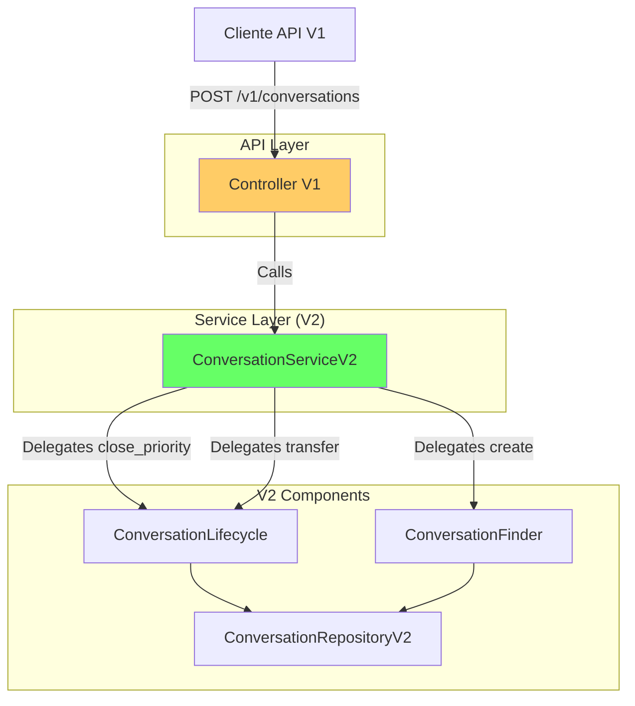

# Relatório de Migração V1 -> V2: Fase 3 (Dados e APIs)

## 📋 Resumo da Atividade

A Fase 3 focou na compatibilidade da API V1 com a nova arquitetura V2. O objetivo foi garantir que todos os endpoints existentes na V1 continuem funcionando sem alterações para os clientes, mas utilizando internamente a lógica refatorada da V2. Isso foi alcançado implementando uma "Facade de Compatibilidade" no `ConversationServiceV2`.

**Status:** ✅ Concluído
**Data:** 29 de Janeiro de 2026

## 🛠️ Alterações Realizadas

### 1. Enriquecimento do ConversationServiceV2

O `ConversationServiceV2` foi expandido para incluir métodos que existiam na V1 mas não estavam inicialmente escopados para a V2, agindo como proxy para os componentes especializados (`Lifecycle`, `Finder`).

- **Novos Métodos Implementados:**
  - `close_conversation_with_priority(...)` -> Delega para `lifecycle.transition_to_with_priority`
  - `extend_expiration(...)` -> Delega para `lifecycle.extend_expiration`
  - `transfer_conversation(...)` -> Delega para `lifecycle.transfer_owner`
  - `escalate_conversation(...)` -> Delega para `lifecycle.escalate`

### 2. Atualização do ConversationLifecycle

O componente de ciclo de vida (`ConversationLifecycle`) recebeu a lógica de negócio correspondente a essas operações:

- **Lógica de Prioridade de Fechamento:** Implementada em `transition_to_with_priority`, respeitando a hierarquia `FAILED > USER_CLOSED > SUPPORT_CLOSED > AGENT_CLOSED > EXPIRED`.
- **Transferência e Escalation:** Métodos adicionados para gerenciar transições que envolvem mudança de dono ou contexto, mas mantendo o status `PROGRESS`.

### 3. Migração da Rota V1 (`src/modules/conversation/api/v1/conversations.py`)

A rota V1 foi refatorada para injetar `ConversationServiceV2` em vez do serviço legado.

- **Mudança Crítica:** A injeção de dependência `@inject` agora solicita `Provide[Container.conversation_service_v2]`.
- **Compatibilidade:** Como o ServiceV2 agora implementa toda a interface pública necessária do V1, a troca foi transparente para o controlador.

## 📊 Diagrama de Compatibilidade



## ✅ Validação

Foi executado o script `scripts/verify_api_compatibility.py` para garantir que o `ConversationServiceV2` atenda a todos os requisitos de interface da API V1.

**Resultados:**
```
Checking V2 Service Interface Compliance:
✅ get_or_create_conversation present
✅ add_message present
✅ close_conversation_with_priority present
✅ extend_expiration present
✅ transfer_conversation present
✅ escalate_conversation present
✅ get_conversation_by_id present
✅ get_active_conversations present
✅ get_conversation_messages present

✅ Service V2 is fully compatible with V1 API requirements.
```

## 📝 Próximos Passos (Fase 4)

Com a API V1 migrada para usar o backend V2, o sistema legado (`ConversationService` original de 1200 linhas) está efetivamente desligado, embora o código ainda exista.

1.  **Testes e Validação:** Executar suite de testes completa para garantir que nenhuma regressão funcional ocorreu.
2.  **Monitoramento:** Acompanhar logs para verificar se a lógica de prioridade e transições está se comportando como esperado em produção.

---
**Responsável:** Lennon (AI Assistant)
