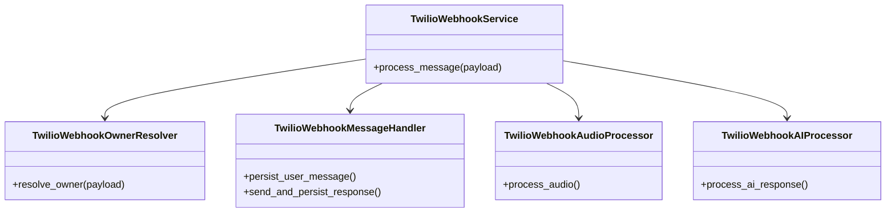
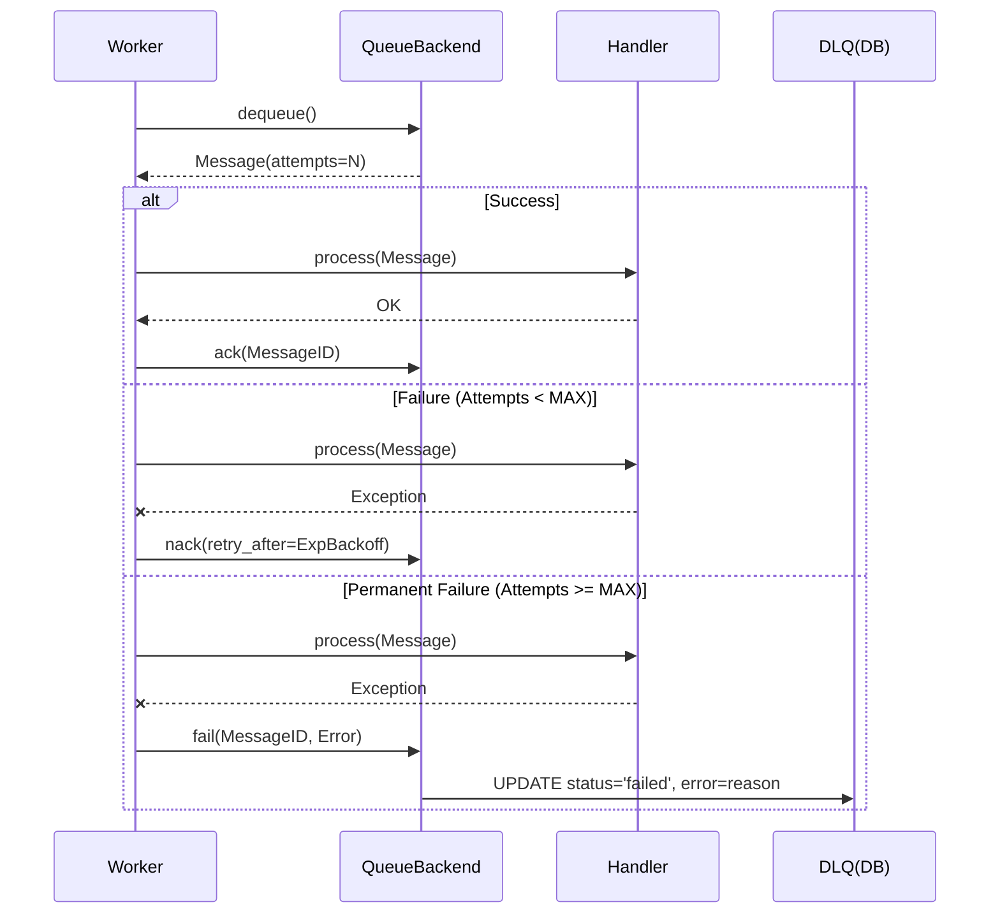

# Relatório de Refatoração e Melhorias - TwilioWebhookService e Queue System

**Atividade:** Refatoração TwilioWebhookService e Implementação de DLQ
**Data:** 2026-01-28
**Referência:** `plan/v4/research/research_refactoring_twilio_webhook_service_10.md`

## 1. Contexto e Objetivos

O serviço `TwilioWebhookService` apresentava alta complexidade (>500 linhas) e múltiplas responsabilidades (resolução de owner, persistência, transcrição, interação com IA). Além disso, identificou-se a necessidade de parametrizar as configurações do modelo Whisper e implementar um mecanismo de Dead Letter Queue (DLQ) para maior robustez no processamento de mensagens.

## 2. Mudanças Realizadas

### 2.1. Modularização do TwilioWebhookService

O serviço monolítico foi decomposto em 4 componentes especializados, seguindo o Princípio da Responsabilidade Única (SRP):

1.  **TwilioWebhookOwnerResolver**: Responsável por identificar o `owner` a partir do número de telefone (`From` ou `To`).
2.  **TwilioWebhookMessageHandler**: Gerencia a persistência de mensagens (User e Assistant) e o envio de respostas via Twilio API.
3.  **TwilioWebhookAudioProcessor**: Gerencia o download e transcrição de áudios, utilizando o `TranscriptionService`.
4.  **TwilioWebhookAIProcessor**: Orquestra a interação com a IA (Agent/IdentityService) e gera as respostas.

A classe `TwilioWebhookService` agora atua como uma **Facade**, orquestrando a chamada desses componentes.

### 2.2. Parametrização do Whisper

As configurações do modelo Whisper foram movidas para variáveis de ambiente (`.env`), refletidas na classe `Settings`:

-   `WHISPER_SIZE`: Tamanho do modelo (base, small, medium, etc.)
-   `WHISPER_DEVICE`: Dispositivo (cpu, cuda)
-   `WHISPER_COMPUTE_TYPE`: Tipo de computação (int8, float16)
-   `WHISPER_BEAM_SIZE`: Precisão da decodificação.

O `TranscriptionService` agora recebe esses valores via injeção de dependência no `Container`.

### 2.3. Implementação de Dead Letter Queue (DLQ)

Foi adicionado suporte robusto a falhas no sistema de filas:

-   **Interface QueueBackend**: Novo método `fail(message_id, error)` e lógica de retry exponencial no `start_consuming`.
-   **SqliteQueueBackend**: Nova coluna `error_reason` na tabela `message_queue`. Mensagens que excedem o `MAX_RETRIES` (3) são marcadas como `failed` e persistem o motivo do erro, permitindo análise posterior sem travar o worker.
-   **Compatibilidade**: Stubs implementados para `BullMQ` e `SQS` para manter contrato da interface.

## 3. Diagramas da Solução

### 3.1. Arquitetura de Componentes (TwilioWebhookService)

### 3.2. Fluxo de Processamento com DLQ

## 4. Conclusão

As alterações resultaram em um código mais limpo, testável e robusto. A modularização facilita a manutenção evolutiva do webhook, enquanto a DLQ garante que mensagens problemáticas não causem loops infinitos ou perda silenciosa de dados. A parametrização do Whisper permite ajustes finos de performance sem alteração de código.
