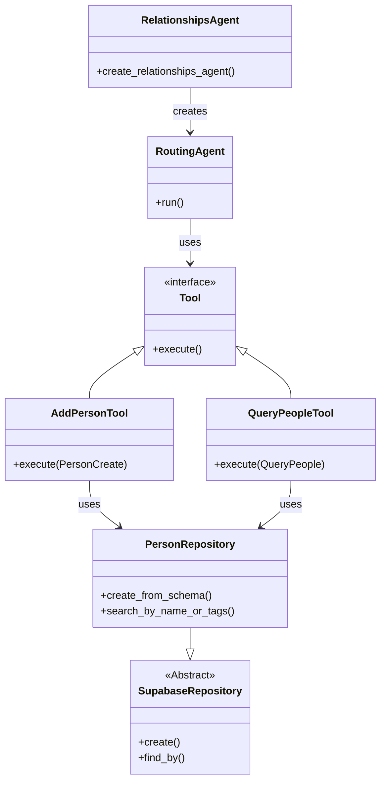
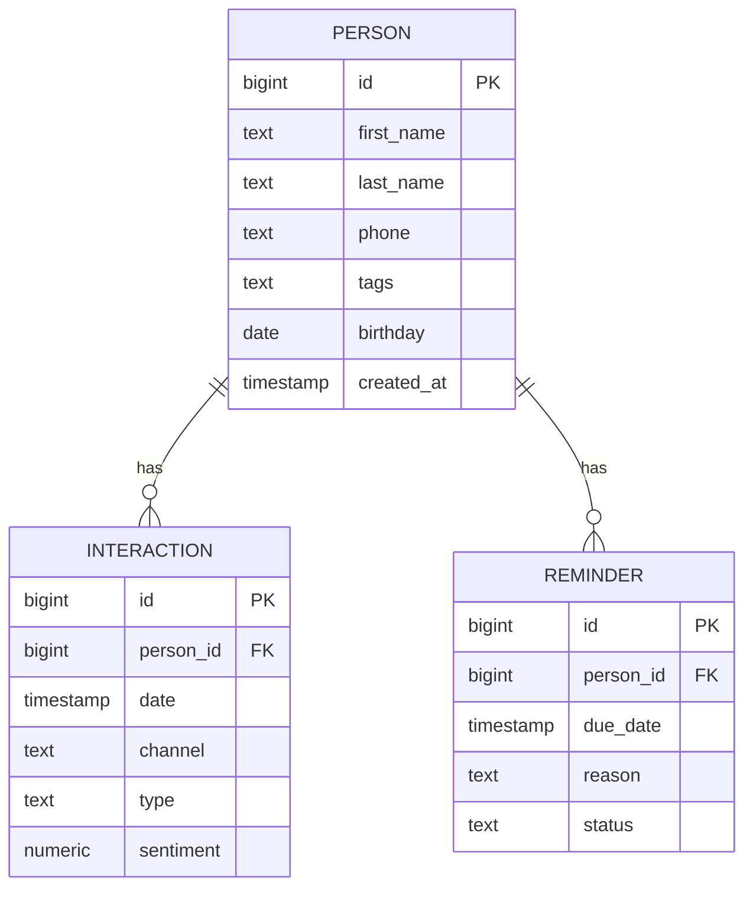
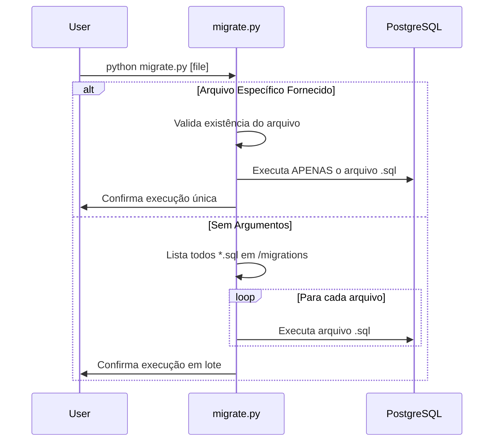

# Relatório de Refatoração e Infraestrutura: Feature Relationships

**Data:** 27/01/2026
**Autor:** Assistant (Trae AI)
**Contexto:** Alinhamento arquitetural do módulo `relationships` com o padrão `finance` e melhorias na infraestrutura de banco de dados.

---

## 1. Refatoração do Módulo Relationships

### Local
`src/modules/ai/engines/lchain/feature/relationships/`

### Problema
O módulo `relationships` operava com uma arquitetura legada em comparação ao módulo `finance`. Principais discrepâncias:
1.  **Acesso a Dados**: Utilizava sessões `SQLModel` diretamente dentro das tools, violando a camada de abstração de repositório.
2.  **Modelagem**: Modelos misturavam definição de banco de dados e validação, sem a segregação `Base/Create/Update` usada no projeto.
3.  **Ferramentas**: Implementação monolítica em um único arquivo, dificultando a leitura e expansão.

### Risco
*   **Manutenibilidade**: A falta de padrão aumenta a carga cognitiva para entender e modificar o código.
*   **Acoplamento**: Dependência direta do `SQLModel` nas tools dificulta testes unitários e futuras trocas de ORM/Banco.
*   **Inconsistência**: Comportamentos diferentes entre módulos para tarefas similares (ex: validação de dados).

### Solução
Alinhamento completo com a arquitetura de referência (`finance`):
1.  **Camada de Repositório**: Implementação de `PersonRepository`, `InteractionRepository` e `ReminderRepository` herdando de `SupabaseRepository`.
2.  **Modelos Pydantic**: Criação de `models.py` com esquemas segregados (`PersonCreate`, `PersonUpdate`, `Person`) e validadores customizados.
3.  **Segregação de Tools**: Divisão em `tools/add.py` (escrita) e `tools/query.py` (leitura), injetando repositórios via Singleton.
4.  **Agent Factory**: Implementação de `create_relationships_agent` recebendo `AILogThoughtService`.

#### Diagrama de Componentes (Nova Arquitetura)

---

## 2. Infraestrutura de Banco de Dados e Tooling

### Local
`migrations/`, `scripts/`

### Problema
1.  **Schema Ausente**: Não havia definição SQL para as entidades de relacionamento (`person`, `interaction`, `reminder`).
2.  **Dados de Teste**: Dependência de mocks em memória (`mock_data.py`) e falta de um processo robusto de seed.
3.  **Tooling Rígido**: O script `migrate.py` executava obrigatoriamente *todas* as migrações, sem opção de executar um arquivo específico para desenvolvimento/teste rápido.

### Risco
*   **Integridade de Dados**: Sem Foreign Keys e Constraints no banco, a consistência relacional (ex: deletar Pessoa deve deletar Interações) dependia do código da aplicação.
*   **Produtividade**: Rodar todas as migrações a cada pequena alteração de schema é lento e propenso a erros em bases populadas.

### Solução
1.  **Migração SQL (`007`)**: Criação de tabelas com chaves estrangeiras (`ON DELETE CASCADE`), índices e triggers de `updated_at`.
2.  **Seed Script**: Implementação de `scripts/seed_feature_relationships.py` idempotente, usando os repositórios oficiais para garantir que a lógica de inserção é a mesma da aplicação.
3.  **Migrate CLI**: Atualização do `scripts/migrate.py` com `argparse` para aceitar um arquivo específico opcional.

#### Diagrama de Dados (ER)

#### Fluxo de Execução (Migrate Script)

---

## Resumo das Alterações

| Arquivo | Ação | Descrição |
| :--- | :--- | :--- |
| `migrations/007_feature_relationships.sql` | Criado | Definição das tabelas e triggers. |
| `migrations/000_drop_schema.sql` | Atualizado | Inclusão de drop tables para limpeza limpa. |
| `scripts/seed_feature_relationships.py` | Criado | Script de população de dados usando Repositories. |
| `scripts/migrate.py` | Modificado | Adicionado suporte a argumento de arquivo único. |
| `src/.../relationships/models/models.py` | Criado | Modelos Pydantic padronizados. |
| `src/.../relationships/repositories/*` | Criado | Repositórios Supabase. |
| `src/.../relationships/tools/*` | Refatorado | Split em `add.py` e `query.py`. |
| `src/.../relationships/mock_data.py` | Deletado | Substituído por Seed Script e Banco Real. |
