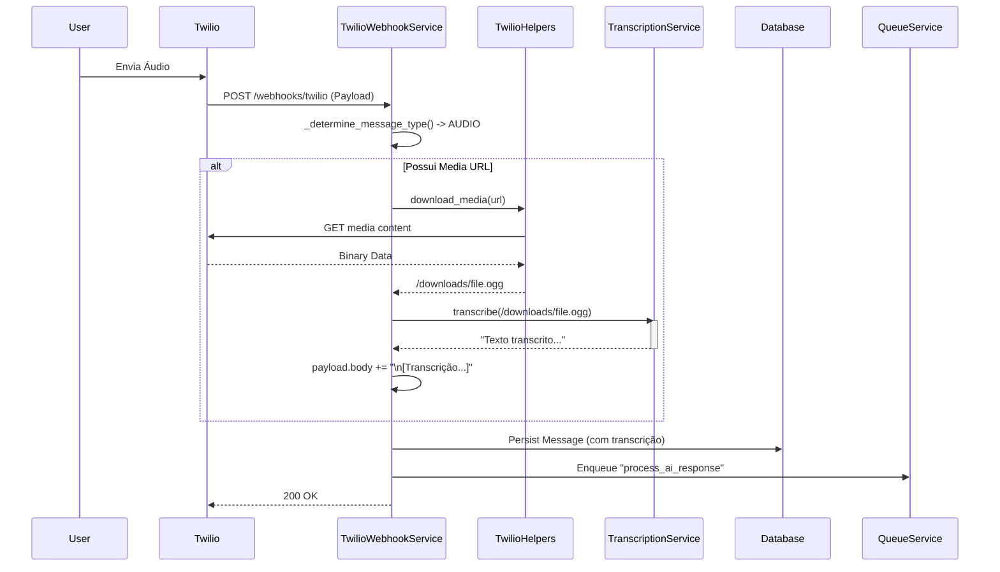

# Relatório de Implementação: Transcrição de Áudio (Whisper)

**Atividade**: Implementação de Transcrição de Áudio (Faster-Whisper)
**Sequência**: 10
**Data**: 27/01/2026
**Autor**: Lennon (AI Assistant)

---

## 1. Contexto e Problema

O sistema recebia mensagens de áudio via WhatsApp (Twilio), mas não possuía capacidade de interpretá-las. Os áudios eram tratados apenas como mídia anexada, sem extração de conteúdo textual, impedindo que os agentes de IA (Finance, Relationships) processassem as solicitações dos usuários enviadas por voz.

## 2. Solução Implementada

Seguindo a pesquisa realizada (`research_whisper_implementation_09.md`), optou-se pela utilização da biblioteca **Faster-Whisper**, uma reimplementação otimizada do modelo Whisper da OpenAI que utiliza CTranslate2 para inferência mais rápida e eficiente em memória.

### 2.1. Componentes Criados/Alterados

1.  **`src/modules/channels/twilio/services/transcription_service.py` (Novo)**
    *   Encapsula a lógica do Faster-Whisper.
    *   Carrega o modelo em memória (Singleton) para evitar overhead de inicialização a cada requisição.
    *   Realiza a transcrição de arquivos de áudio locais.

2.  **`src/modules/channels/twilio/services/twilio_webhook_service.py` (Alterado)**
    *   Injeção de dependência do `TranscriptionService`.
    *   Lógica adicionada em `_process_inbound_message`:
        *   Detecta se a mensagem é do tipo `AUDIO`.
        *   Utiliza `TwilioHelpers` para baixar o arquivo de mídia.
        *   Invoca o serviço de transcrição.
        *   Anexa o texto transcrito ao corpo da mensagem (`payload.body`) no formato `[Transcrição de Áudio: ...]`.
        *   Permite que o fluxo normal do Agente processe o texto transcrito como se fosse uma mensagem de texto.

3.  **`src/core/di/container.py` (Alterado)**
    *   Registro do `TranscriptionService` como **Singleton** (crucial para performance).
    *   Atualização da fábrica do `TwilioWebhookService` para injetar a nova dependência.

4.  **`src/core/utils/helpers.py` (Corrigido)**
    *   Correção de typo no nome do método: `çdownload_media` -> `download_media`.

5.  **`requirements.txt` (Alterado)**
    *   Adição de `faster-whisper==1.0.3`.

### 2.2. Diagrama de Sequência (Fluxo de Transcrição)

## 3. Riscos e Mitigações

| Risco | Impacto | Mitigação |
|-------|---------|-----------|
| **Consumo de Recursos** | O modelo Whisper consome CPU/RAM significativos. | Utilizado modelo `base` com quantização `int8` e carregamento Singleton. |
| **Latência** | Transcrição adiciona tempo ao processamento síncrono do webhook. | A transcrição é rápida (Faster-Whisper), mas idealmente deveria ser assíncrona. Mantido síncrono no passo 1 por simplicidade, mas pronto para mover para Worker se necessário. |
| **Dependência de Arquivo** | Necessidade de salvar arquivo em disco. | Uso de diretório temporário `downloads/`. Recomendável limpeza periódica (não implementada nesta iteração). |

## 4. Próximos Passos (Sugestões)

1.  **Limpeza de Arquivos**: Implementar job para limpar a pasta `downloads/` periodicamente ou remover o arquivo logo após a transcrição.
2.  **Assincronismo Total**: Mover o download e transcrição para o `QueueService` se a latência do webhook começar a exceder o timeout do Twilio (geralmente 10-15s). Atualmente, para áudios curtos, deve funcionar bem.
3.  **Suporte a Outros Idiomas**: Parametrizar o idioma da transcrição (atualmente hardcoded "pt") baseado no perfil do usuário.

---
**Status**: Implementado e Integrado.
