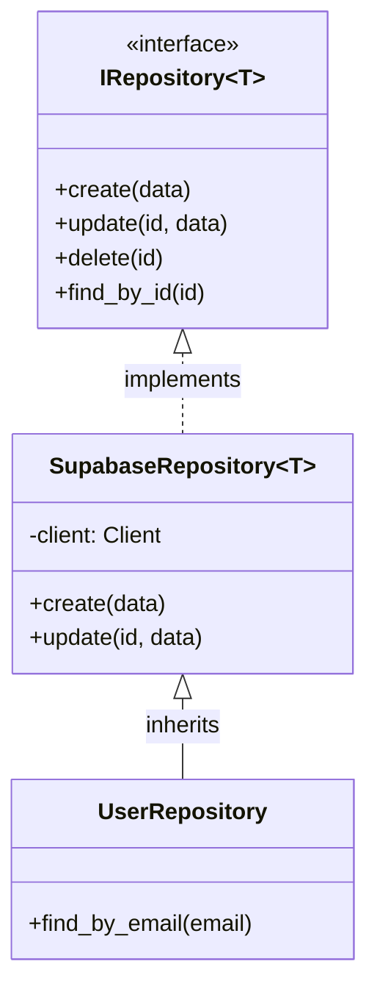

# Relatório de Mitigação: Vazamento de Abstração do Banco de Dados - Fase 1

**Data:** 26/01/2026
**Responsável:** Arquiteto de Software (AI Assistant)
**Status:** Concluído (Fase 1 - Estrutural)

## 1. Contexto e Problema
O projeto utilizava uma classe base `BaseRepository` que estava fortemente acoplada à biblioteca `supabase-py`. Embora funcionasse como um facilitador de CRUD, ela expunha detalhes de implementação (como `self.client.table(...)`) para as classes filhas e forçava uma dependência direta do Supabase em toda a camada de acesso a dados.

Isso violava o princípio de inversão de dependência e dificultava a migração futura para outros bancos de dados (ex: PostgreSQL puro com SQLAlchemy) ou a realização de testes unitários isolados sem mocks complexos do client Supabase.

## 2. Solução Implementada

Realizamos uma refatoração estrutural para aplicar o **Repository Pattern** de forma mais estrita, separando a *Interface* da *Implementação*.

### 2.1. Criação de Interface Abstrata (`IRepository`)
Foi criada uma interface (Protocol) em `src/core/database/interface.py` que define o contrato padrão para qualquer repositório de dados no sistema, independente da tecnologia subjacente.

```python
class IRepository(Generic[T], Protocol):
    def create(self, data: Dict[str, Any]) -> Optional[T]: ...
    def find_by_id(self, id_value: Any, id_column: str = "id") -> Optional[T]: ...
    def update(self, id_value: Union[int, str], data: Dict[str, Any], id_column: str = "id") -> Optional[T]: ...
    def delete(self, id_value: Union[int, str], id_column: str = "id") -> bool: ...
    # ... outros métodos
```

### 2.2. Implementação Específica para Supabase (`SupabaseRepository`)
A antiga `BaseRepository` foi renomeada para `SupabaseRepository` e movida para `src/core/database/supabase_repository.py`. Esta classe agora implementa explicitamente o contrato `IRepository` utilizando o client do Supabase.

### 2.3. Atualização dos Repositórios Concretos
Todos os repositórios do sistema (User, Conversation, Message, etc.) foram atualizados para herdar de `SupabaseRepository` em vez de `BaseRepository`. Isso deixa claro que eles são implementações baseadas em Supabase.

### 2.4. Compatibilidade
Foi mantido um arquivo `src/core/database/base_repository.py` apenas como um *shim* de retrocompatibilidade que emite um `DeprecationWarning`.

## 3. Diagrama da Arquitetura (Fase 1)



## 4. Próximos Passos (Planejados para Fase 2)
1.  **Injeção de Dependência:** Atualizar os Services para dependerem de `IRepository[User]` em vez de `UserRepository` concreto.
2.  **Interfaces de Domínio:** Criar interfaces específicas (ex: `IUserRepository`) para métodos não-CRUD.
