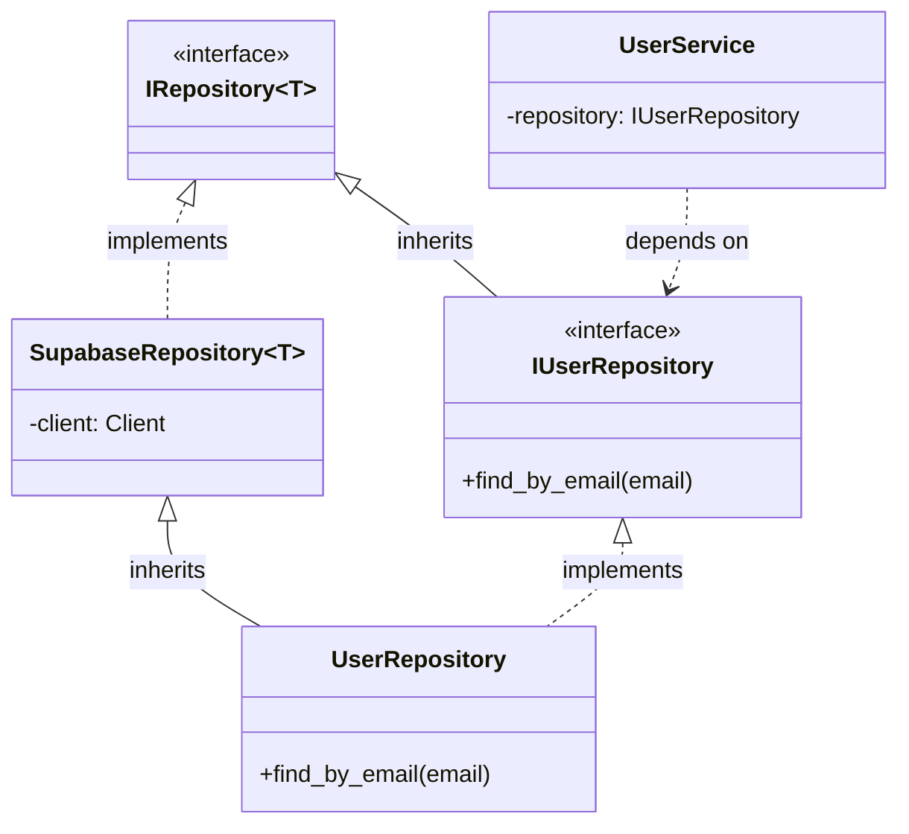

# Relatório de Mitigação: Vazamento de Abstração do Banco de Dados - Fase 2

**Data:** 26/01/2026
**Responsável:** Arquiteto de Software (AI Assistant)
**Status:** Concluído (Fase 2 - Desacoplamento de Serviços)

## 1. Contexto
Após a Fase 1 (Estruturação dos Repositórios), o sistema já possuía uma distinção clara entre Interface (`IRepository`) e Implementação (`SupabaseRepository`). No entanto, os **Serviços** (`UserService`, `OwnerService`) ainda dependiam diretamente das classes concretas (`UserRepository`), mantendo um acoplamento indesejado que dificultava testes unitários.

## 2. Solução Implementada

### 2.1. Interfaces de Domínio (`IUserRepository`, etc.)
Para permitir que os serviços dependam de abstrações sem perder o acesso a métodos específicos (como `find_by_email`), criamos interfaces (Protocols) que herdam de `IRepository`.

Arquivo: `src/modules/identity/repositories/interfaces.py`
```python
class IUserRepository(IRepository[User], Protocol):
    def find_by_email(self, email: str) -> Optional[User]: ...
    def find_by_role(self, owner_id: str, role: UserRole) -> List[User]: ...
```

### 2.2. Injeção de Dependência nos Serviços
Os serviços foram refatorados para receber a **Interface** no construtor.

**Antes:**
```python
class UserService:
    def __init__(self, repository: UserRepository): # Dependência Concreta
        self.repository = repository
```

**Depois:**
```python
class UserService:
    def __init__(self, repository: IUserRepository): # Dependência de Interface
        self.repository = repository
```

### 2.3. Diagrama da Arquitetura Final



## 3. Conclusão
Com a conclusão da Fase 2, os serviços de domínio estão completamente desacoplados da tecnologia de persistência. A injeção da implementação concreta é feita exclusivamente pelo Container de DI.
