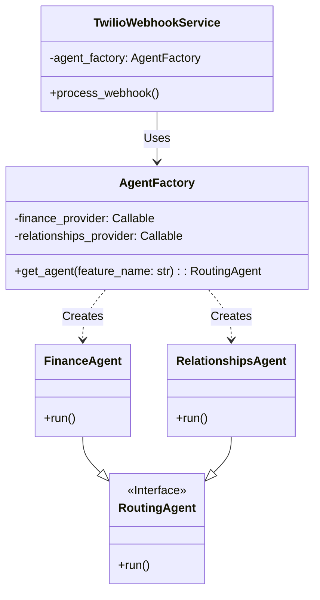
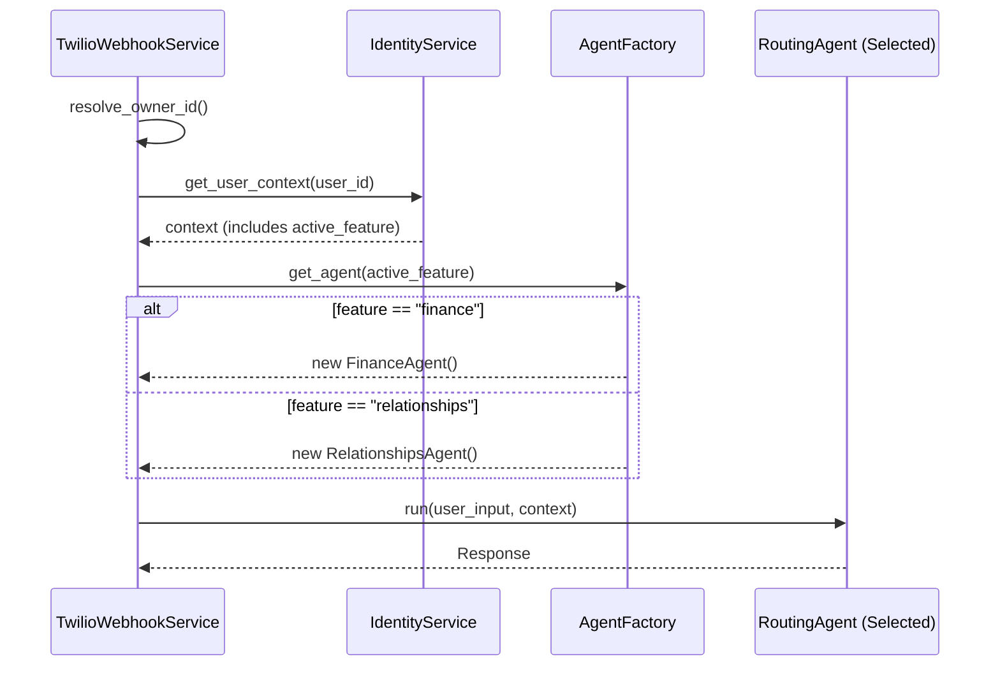

# Research Report: Agent Factory & Dynamic Module Switching

**ID:** research_agent_factory_02  
**Date:** 2026-01-27  
**Author:** Assistant (via Trae IDE)  
**Status:** Draft  

## 1. Analise e Validação

### Local (Fontes)
- `src/modules/ai/engines/lchain/core/agents/agent_factory.py`: Atualmente contém apenas uma função simples `create_master_agent` que retorna o `finance_agent` de forma estática.
- `src/core/di/container.py`: O container DI injeta o `master_agent` (que é o `finance_agent`) diretamente no `TwilioWebhookService`.
- `src/modules/channels/twilio/services/twilio_webhook_service.py`: Recebe um `agent_runner` fixo no construtor.
- `src/modules/ai/engines/lchain/feature/relationships/relationships_agent.py`: O novo agente já possui uma factory function `create_relationships_agent`.

### Problema
O sistema atual possui um acoplamento estático com o módulo de Finanças. O `TwilioWebhookService` é instanciado com um agente pré-definido (`FinanceAgent`), impossibilitando o uso do novo módulo de Relacionamentos (`RelationshipsAgent`) ou a alternância dinâmica entre eles com base na configuração do usuário (`Owner`).

### Risco
- **Incapacidade de Lançamento:** O novo módulo `Relationships` não pode ser utilizado pelos usuários, mesmo estando implementado.
- **Dívida Técnica:** Tentar resolver com `if/else` dentro do container ou criar múltiplos serviços de webhook duplicaria código e aumentaria a complexidade.

### Solução Proposta
Implementar o padrão **Abstract Factory** para a criação de agentes. O `AgentFactory` será responsável por instanciar o agente correto em tempo de execução (runtime), baseado na feature ativa do usuário.

## 2. Especificação da Solução

### Mudanças no `AgentFactory`
Transformar `agent_factory.py` de um módulo com uma função simples para uma classe `AgentFactory` que gerencia provedores de agentes.

### Mudanças no Container DI
Registrar os provedores (Factories) dos agentes individuais e injetá-los no `AgentFactory`.

### Mudanças no `TwilioWebhookService`
Substituir a dependência `agent_runner: RoutingAgent` por `agent_factory: AgentFactory`. No método `process_webhook`, utilizar a factory para obter o agente correto após identificar o usuário e suas features ativas.

## 3. Diagramas

### 3.1. Diagrama de Classes (Proposto)

### 3.2. Diagrama de Sequência (Execução)

## 4. Plano de Ação

1.  **Refatorar `AgentFactory`**:
    -   Criar classe `AgentFactory` em `src/modules/ai/engines/lchain/core/agents/agent_factory.py`.
    -   Adicionar suporte para registrar providers de `finance` e `relationships`.
    -   Implementar lógica de seleção baseada em string (nome da feature).

2.  **Atualizar Container DI (`container.py`)**:
    -   Registrar `relationships_agent` (Factory).
    -   Atualizar `agent_factory` para ser uma Factory de `AgentFactory`, injetando os providers dos agentes específicos (`finance_agent.provider`, etc).
    -   Atualizar `twilio_webhook_service` para receber `agent_factory` ao invés de `master_agent`.

3.  **Atualizar `TwilioWebhookService`**:
    -   Alterar construtor para receber `AgentFactory`.
    -   No `process_webhook`, recuperar a feature ativa do contexto do usuário.
    -   Chamar `agent_factory.get_agent(feature_name)` para instanciar o agente.
    -   Executar o agente.

4.  **Validação**:
    -   Testar webhook com usuário configurado para `finance` (comportamento atual).
    -   Testar webhook com usuário configurado para `relationships` (novo comportamento).

## 5. Decisões Importantes
- **Statefulness:** Como os agentes `RoutingAgent` possuem memória (`self.memory`), é crucial que a Factory crie uma **nova instância** a cada requisição (Scope: Transient/Factory), e não um Singleton. O uso de `providers.Factory` no container garante isso.
