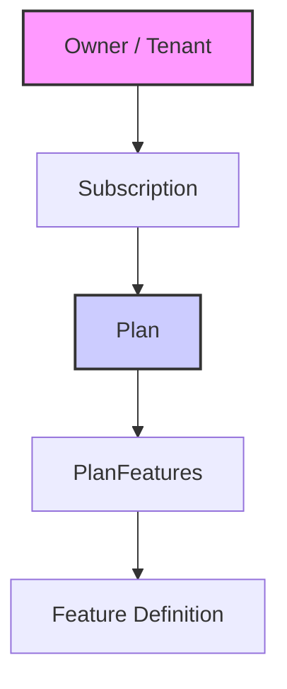

# Pesquisa e Plano de Melhoria do Módulo Identity (Fase 2)

## 1. Análise do Estado Atual
Com base na verificação do código fonte (`src/modules/identity/`), confirmamos que a **Fase 1** (Fundação Identity) foi parcialmente concluída, mas com desconexões críticas entre a camada de API e a lógica de negócio orquestrada.

### 1.1. O que foi entregue
*   **Estrutura de API**: Routers para `owners`, `users`, `plans` e `subscriptions` estão configurados e expostos.
*   **Modelagem**: `User` possui o campo `auth_id` para vínculo externo. Entidades de Plano e Assinatura existem.
*   **Serviços**: `IdentityService` possui a lógica robusta de `register_organization` (com rollback manual), mas ela **permanece inacessível** via API.

### 1.2. O Problema da "Lógica Órfã"
A API atual expõe `POST /owners` que chama diretamente `OwnerService.create_owner`.
*   **Risco**: Isso cria uma Organização (Owner) sem usuários e sem features iniciais.
*   **Solução Necessária**: O endpoint de cadastro deve utilizar `IdentityService.register_organization`, que garante a criação atômica de:
    1.  Owner (Tenant)
    2.  User Admin (Vinculado ao Owner)
    3.  Features Iniciais (Flags padrão)

### 1.3. Lacunas Identificadas
1.  **Endpoint de Onboarding Ausente**: Não existe uma rota pública (ex: `/register`) que chame a lógica orquestrada.
2.  **Autenticação**: O campo `auth_id` existe no modelo, mas não há middleware ou fluxo claro que garanta que o ID do Supabase Auth seja propagado corretamente durante a criação do usuário.
3.  **Segurança**: As rotas de criação de planos e owners estão abertas, sem validação de permissões (embora a autenticação seja responsabilidade de uma camada superior, a autorização básica por role faz falta).

---

## 2. Modelo de Dados e Arquitetura Sugerida

Validamos e adotamos a seguinte hierarquia para gestão de recursos e capacidades:

*   **Owner**: O cliente/organização.
*   **Subscription**: O vínculo temporal entre Owner e Plan (ex: "Ativo até 2025").
*   **Plan**: O pacote comercial (ex: "Free", "Pro").
*   **PlanFeatures**: A lista de capacidades do plano (ex: `{"max_projects": 10}`).

---

## 3. Plano de Ação (Refinado)

O objetivo desta fase é conectar as pontas soltas e implementar os endpoints essenciais para um SaaS funcional.

### 3.1. Novos Endpoints Essenciais

A implementação focará nesta estrutura de API:

#### Owners (Tenants)
*   `POST /identity/owners` (via `register_organization`): Criação completa (Owner + User + Features).
*   `GET /identity/owners/{id}`: Detalhes da organização.
*   `PATCH /identity/owners/{id}`: Atualização cadastral.

#### Users
*   `POST /identity/users/sync`: Sincronização/Criação de usuário após login externo (Webhook ou Front-initiated).
*   `GET /identity/users/me`: Retorna perfil completo do usuário logado (incluindo Owner e Role).
*   `GET /identity/users`: Listagem de membros da organização.
*   `PATCH /identity/users/{id}`: Atualização de perfil.

#### Features
*   `GET /identity/features`: Lista consolidada de features ativas (Plan Features + Overrides).

#### Plans & Subscriptions
*   `GET /identity/plans`: Listagem pública de planos.
*   `POST /identity/subscriptions`: Upgrade/Downgrade de plano.

### 3.2. Tarefas de Implementação

1.  **Refatorar API de Owners**:
    *   Substituir a criação simples pela orquestrada (`register_organization`).
2.  **Implementar User Sync & Me**:
    *   Criar lógica para resolver `auth_id` -> `User`.
3.  **Consolidar Features**:
    *   Garantir que o endpoint de features retorne a união do que o plano oferece.
4.  **Seed de Planos**:
    *   Script para popular planos básicos ("Free", "Pro").

## 4. Conclusão
A adoção deste modelo e lista de endpoints alinha o módulo `Identity` com as melhores práticas de SaaS, separando claramente a definição comercial (Planos) da posse do recurso (Owner), mediado pela Assinatura.
