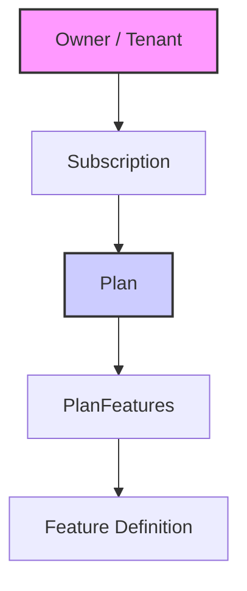

# Pesquisa e Plano de Melhoria do Módulo Identity (Consolidado)

Este documento consolida as análises e planos de melhoria das fases anteriores (`02` e `03`), definindo o roteiro definitivo para a evolução do módulo Identity.

## 1. Análise do Estado Atual

Com base na verificação do código fonte (`src/modules/identity/`), confirmamos que a **Fase 1** (Fundação Identity) foi parcialmente concluída, mas com desconexões críticas entre a camada de API e a lógica de negócio orquestrada.

### 1.1. O que foi entregue
*   **Estrutura de API**: Routers para `owners`, `users`, `plans` e `subscriptions` estão configurados e expostos.
*   **Modelagem**: `User` possui o campo `auth_id` para vínculo externo. Entidades de Plano e Assinatura existem.
*   **Serviços**: `IdentityService` possui a lógica robusta de `register_organization` (com rollback manual), mas ela **permanece inacessível** via API.

### 1.2. O Problema da "Lógica Órfã"
A API atual expõe `POST /owners` que chama diretamente `OwnerService.create_owner`.
*   **Risco**: Isso cria uma Organização (Owner) sem usuários e sem features iniciais.
*   **Solução Necessária**: O endpoint de cadastro deve utilizar `IdentityService.register_organization`, que garante a criação atômica de:
    1.  Owner (Tenant)
    2.  User Admin (Vinculado ao Owner)
    3.  Features Iniciais (Flags padrão)

### 1.3. Lacunas Identificadas
1.  **Endpoint de Onboarding Ausente**: Não existe uma rota pública (ex: `/register`) que chame a lógica orquestrada.
2.  **Autenticação**: O campo `auth_id` existe no modelo, mas não há middleware ou fluxo claro que garanta que o ID do Supabase Auth seja propagado corretamente durante a criação do usuário.
3.  **Segurança**: As rotas de criação de planos e owners estão abertas, sem validação de permissões (embora a autenticação seja responsabilidade de uma camada superior, a autorização básica por role faz falta).

---

## 2. Modelo de Dados e Arquitetura Alvo

Adotamos a seguinte hierarquia para gestão de recursos e capacidades, separando a definição comercial da posse do recurso:

*   **Owner**: O cliente/organização.
*   **Subscription**: O vínculo temporal entre Owner e Plan (ex: "Ativo até 2025").
*   **Plan**: O pacote comercial (ex: "Free", "Pro").
*   **PlanFeatures**: A lista de capacidades do plano (ex: `{"max_projects": 10}`).

---

## 3. Plano de Ação Consolidado

O objetivo é conectar as pontas soltas e implementar os endpoints essenciais para um SaaS funcional, garantindo consistência e segurança.

### 3.1. Novos Endpoints Essenciais

A implementação focará nesta estrutura de API:

#### Owners (Tenants) & Onboarding
*   `POST /identity/owners` (via `register_organization`): 
    *   **Ação**: Substituir a criação simples pela orquestrada.
    *   **Input**: `RegisterOrganizationDTO` (Nome, Dados Admin, Auth ID).
    *   **Output**: Owner + User + Features iniciais.
*   `GET /identity/owners/{id}`: Detalhes da organização.
*   `PATCH /identity/owners/{id}`: Atualização cadastral.

#### Users (Perfil e Acesso)
*   `POST /identity/users/sync`: 
    *   **Ação**: Sincronização/Criação de usuário após login externo (Webhook ou Front-initiated).
    *   **Lógica**: Recebe `auth_id` e email; se não existir, cria ou vincula.
*   `GET /identity/users/me`: 
    *   **Ação**: Retorna perfil completo do usuário logado.
    *   **Importante**: Deve resolver o `User` baseado no `auth_id` do token/contexto.
*   `GET /identity/users`: Listagem de membros da organização.
*   `PATCH /identity/users/{id}`: Atualização de perfil.

#### Features (Capacidades)
*   `GET /identity/features`: 
    *   **Ação**: Lista consolidada de features ativas.
    *   **Lógica**: `Plan Features` (do plano ativo) + `Feature Overrides` (específicas do Owner).

#### Plans & Subscriptions (Comercial)
*   `GET /identity/plans`: Listagem pública de planos.
*   `POST /identity/subscriptions`: Upgrade/Downgrade de plano.
    *   **Regra**: Apenas uma assinatura ativa por vez.

### 3.2. Tarefas de Implementação

1.  [ ] **Refatorar API de Owners (`owners.py`)**:
    *   Implementar `register_organization` no `POST /`.
    *   Garantir transação/rollback manual em caso de falha.
2.  [ ] **Implementar User Sync & Me (`users.py`)**:
    *   Criar endpoints de resolução de identidade.
    *   Validar propagação do `auth_id`.
3.  [ ] **Consolidar Features (`features.py` ou `router.py`)**:
    *   Criar endpoint que agrega features do plano e do owner.
4.  [ ] **Seed de Planos**:
    *   Criar script (`scripts/seed_plans.py`) para popular planos "Free" e "Pro" no banco.

## 4. Conclusão
Este plano consolidado remove a ambiguidade das fases anteriores e foca na entrega de valor: um sistema de identidade capaz de receber usuários reais, gerenciar seus planos e entregar as funcionalidades corretas.
