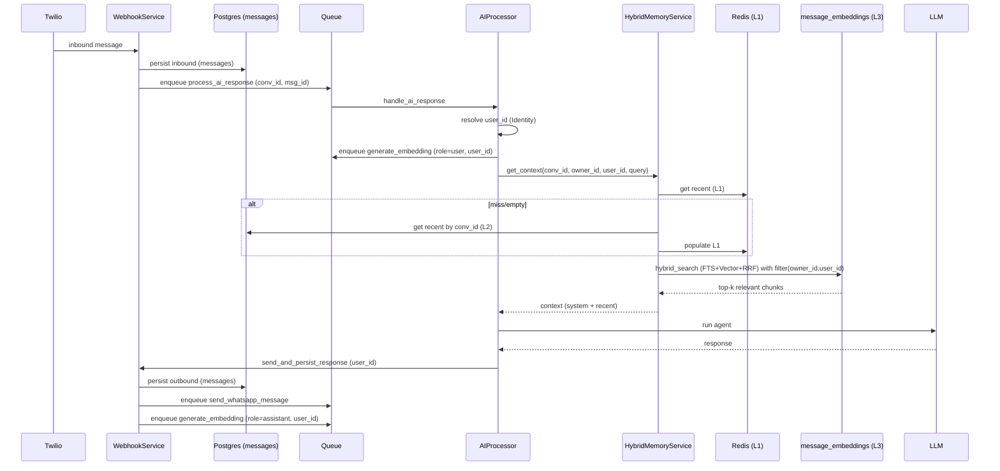
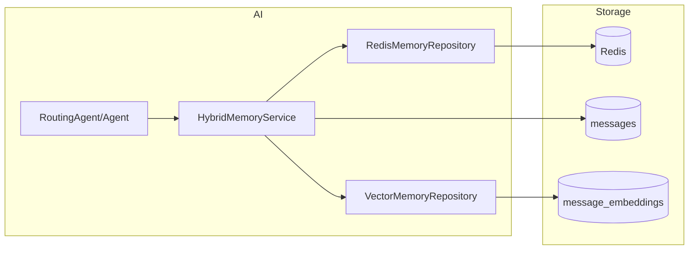
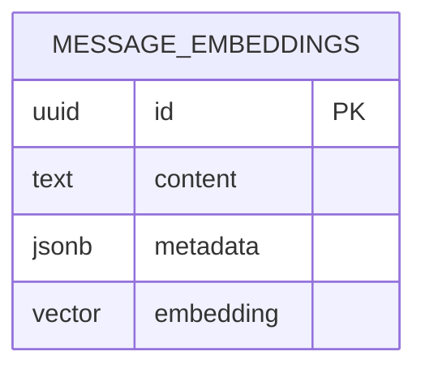

# Research 18 — Plano de Ação: Memória (L1/L2/L3) + RAG Híbrido (FTS + RRF)

## Contexto

Baseado no research [analise_modulo_ai_complete_rag_hybrid.md](file:///Users/lennon/projects/ai_engineering/whatsapp_twilio_ai/analises/analise_module_ai/analise_modulo_ai_complete_rag_hybrid.md), o foco deste plano é atacar os itens:
- **Causa B**: janela curta (`limit=10`) e Redis corta para 50.
- **Causa C**: L3 não captura preferências no **inbound**.
- **Causa D**: Redis (L1) pode ficar desligado silenciosamente.

E evoluir L3 para um padrão mais robusto e testável quando o dado é textual:
- **FTS (Full-Text Search) + RRF (Reciprocal Rank Fusion)** no centro do retrieval do L3.

## Não-objetivos (restrições explícitas)

- **Não alterar a Causa A**: escopo de memória por `conv_id` (quando `conv_id` muda, a memória curta muda junto).
- A proposta aqui é elevar a robustez dentro do escopo atual (conv_id) e habilitar uma “memória longa” melhor (L3) com governança por `owner_id/user_id`.

---

## Proposta de Arquitetura (resumo)

### O que muda
1. **Parametrização central** (settings) para limites/limiares (B).
2. **Indexação de embeddings no inbound** (C), incluindo cadeias como áudio transcrito (via payload atualizado).
3. **Filtro obrigatório por `owner_id` e `user_id` no L3** (governança e relevância).
4. **L3 híbrido**: combinar busca vetorial + busca textual (FTS) usando **RRF** (padrão “DB-first”).
5. **L1 com auto-recuperação**: Redis tenta se reabilitar automaticamente após backoff (D).

### Onde fica cada responsabilidade
- L1 (Redis): cache cronológico por `conv_id`.
- L2 (Postgres `messages`): fonte da verdade, recente por `conv_id`.
- L3 (Supabase pgvector `message_embeddings`): “memória longa”, com:
  - Similaridade vetorial (pgvector)
  - Busca textual (FTS)
  - Fusão por ranking (RRF)
  - Filtros por tenant/usuário via `metadata @> filter`

---

## Diagramas

### 1) Sequência — Inbound com indexação L3 e uso de L3 híbrido

### 2) Componentes — Memória com retrieval híbrido

### 3) Dados — `message_embeddings.metadata` (filtros e governança)

Metadados mínimos para governança e deduplicação lógica:
- `owner_id` (tenant)
- `user_id` (usuário Identity)
- `conv_id` (sessão)
- `msg_id` (correlação com messages)
- `role` (user/assistant)

---

## Plano de Implementação (orientado ao menor risco)

### Fase 1 — “Fechar buracos” (C, D, B)
1. **Indexar inbound no L3**:
   - Enfileirar `generate_embedding` no fluxo do AIProcessor para mensagens inbound com `user_id`.
   - Garantir que mensagens transcritas também sejam indexadas (cadeia que atualiza o payload).
2. **Redis resiliente**:
   - Quando desativado por falha, tentar reabilitar automaticamente após backoff configurável.
3. **Parametrizar limites**:
   - Extrair `limit=10`, `top_k`, thresholds para `settings.memory.*`.

### Fase 2 — Governança e relevância (owner/user)
1. **Filtro obrigatório no L3**:
   - Sempre aplicar filtro em `metadata @> filter` com `owner_id` e `user_id` (quando disponível).

### Fase 3 — Retrieval híbrido (FTS + vetor + RRF)
1. **Criar funções SQL** no banco (migrations) para:
   - `search_message_embeddings_text(...)`
   - `search_message_embeddings_hybrid_rrf(...)`
2. **Adicionar método no repositório** para chamar RPC via Supabase.
3. **Integrar no HybridMemoryService** com toggle `MEMORY_ENABLE_HYBRID_RETRIEVAL`.

### Fase 4 — (Opcional) Reranking/HyDE
Somente se métricas indicarem baixa qualidade de “lembrança”:
- Reranking como pós-processamento do Top-K.
- HyDE como expansão de query para recall em perguntas vagas.

---

## Critérios de Sucesso / Métricas

1. **Preferências capturadas no inbound** passam a reaparecer no L3 quando o usuário referencia depois.
2. **Redução de “esqueci suas preferências”** quando a preferência não está nas últimas N mensagens.
3. **Nenhum vazamento cross-user** dentro do mesmo `owner_id` (filtro obrigatório por `user_id`).
4. **Resiliência**: Redis fora não derruba a experiência; o sistema volta a usar L1 quando Redis retornar.

---

## Recomendações estruturais (próximo passo)

Separar explicitamente:
- **Perfil durável (Identity)**: preferências/fatos estruturados (`preferences_json`, etc.).
- **Memória conversacional**: contexto curto por conversa (`conv_id`).

O L3 continua útil como “memória longa textual”, mas **não deve ser o único lugar** onde preferências críticas vivem.

