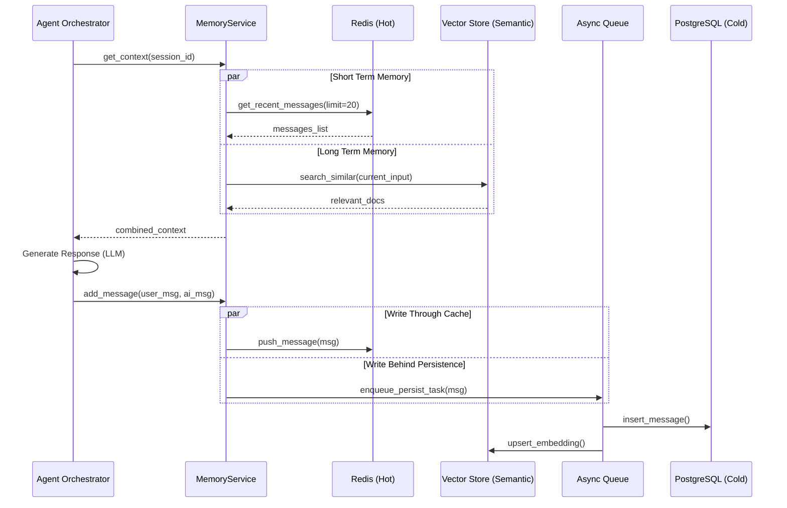

# Análise de Arquitetura de Memória para Agentes de IA

**Data:** 29/01/2026
**Status:** Planejamento
**Contexto:** Definição da estratégia de memória persistente e semântica para o módulo de IA (`src/modules/ai`), visando performance, escalabilidade e custo-benefício.

---

## 1. Introdução

A capacidade de manter o contexto conversacional (memória) é crucial para a experiência do usuário em agentes de IA. A análise preliminar (`Review Research - Memory.md`) identificou gargalos significativos em abordagens ingênuas (como escrita síncrona em banco relacional) e propôs arquiteturas otimizadas.

Este documento detalha os planos de desenvolvimento para as abordagens analisadas, com foco na recomendação de uma **Arquitetura Híbrida (Redis + PostgreSQL + Vector Store)**, que equilibra latência (cache), consistência (SQL) e inteligência (Busca Vetorial).

---

## 2. Análise das Abordagens

### Abordagem 1: LangChain Memory (In-Memory/Simples)

*   **Descrição:** Utilização das classes padrão do LangChain (`ConversationBufferMemory`) mantendo o histórico na memória RAM da instância da aplicação ou serializado de forma simples.
*   **Local:** `src/modules/ai/engines/lchain/memory/`
*   **Problema:** Volatilidade. Se o container reiniciar, a memória é perdida. Não escala horizontalmente (sticky sessions seriam necessárias).
*   **Risco:** Perda de dados do usuário, experiência inconsistente. Consumo excessivo de RAM com conversas longas.
*   **Veredito:** ❌ Inadequado para produção distribuída. Apenas para prototipagem local.

### Abordagem 2: PostgreSQL Puro (Persistência SQL)

*   **Descrição:** Persistência de cada mensagem diretamente no PostgreSQL (`PostgresChatMessageHistory`).
*   **Local:** `src/modules/ai/repositories/history_repository.py`
*   **Problema:** Latência de I/O. A cada interação, há leituras e escritas bloqueantes (ou síncronas) no banco principal. Busca semântica no Postgres (pgvector) pode ser lenta em grandes volumes sem indexação agressiva (HNSW), competindo recursos com o core transacional.
*   **Risco:** Degradação de performance do banco de dados principal sob carga. "Cold start" de memória lento (recuperar todo histórico).
*   **Veredito:** ⚠️ Viável para baixo volume, mas gargalo certo em escala.

### Abordagem 3: Híbrida (Redis + Postgres + Vector) ⭐ **RECOMENDADA**

*   **Descrição:** Arquitetura em camadas (Tiered Storage).
    *   **L1/L2 Cache (Redis):** "Memória de Curto Prazo". Armazena as últimas N mensagens (ex: 20) com TTL. Acesso ultra-rápido (<5ms).
    *   **Persistent Storage (PostgreSQL):** "Source of Truth". Armazena todo o histórico para fins de auditoria e backup. Escrita assíncrona (Write-Behind).
    *   **Vector Store (Qdrant/Pinecone):** "Memória de Longo Prazo/Semântica". Armazena embeddings de conversas passadas para recuperação por relevância (RAG).
*   **Local:** `src/modules/ai/memory/`
*   **Problema:** Complexidade de infraestrutura e sincronização de dados.
*   **Risco:** Inconsistência eventual (ex: cache vs banco) se não houver gestão robusta de falhas.
*   **Solução:** Implementação de um `MemoryManager` que abstrai essa complexidade, usando filas para persistência assíncrona.
*   **Veredito:** ✅ Ideal para produção. Maximiza performance (usuário sente a velocidade do Redis) e inteligência (Vector Search recupera contextos antigos).

---

## 3. Detalhamento da Solução Híbrida

### Diagrama de Sequência (Fluxo de Recuperação e Escrita)



### Componentes Propostos

A implementação será modularizada em `src/modules/ai/memory/`:

1.  **`MemoryInterface`**: Contrato padrão para operações de memória (add, get, search).
2.  **`HybridMemoryService`**: Implementação principal que orquestra Redis e Vector Store.
3.  **`RedisMessageHistory`**: Adaptador otimizado para listas do Redis.
4.  **`VectorMemoryService`**: Wrapper para interação com Qdrant/Pinecone e geração de embeddings (OpenAI/Cohere).
5.  **`AsyncMemoryWorker`**: Worker para processar a fila de persistência no Postgres e indexação vetorial, removendo latência da requisição HTTP.

---

## 4. Planos de Desenvolvimento

Abaixo, os planos de execução para as abordagens. **O foco será na implementação da Abordagem 3 (Híbrida).**

### Plano A: Implementação Básica (Descartado para Prod)
1. Configurar `ConversationBufferMemory`.
2. Integrar no `Agent.py`.
3. *Status: Apenas para testes unitários.*

### Plano B: Persistência SQL Simples (Descartado para Alta Performance)
1. Criar tabela `ai_chat_history`.
2. Implementar repositório `SQLAlchemy`.
3. Integrar escrita síncrona no fim do `agent.run()`.

### Plano C: Arquitetura Híbrida (Prioritário)

Este plano visa entregar a solução performática e escalável.

#### Fase 1: Fundação e Cache (Short-Term Memory)
*   **Objetivo:** Baixa latência nas respostas imediatas.
*   **Tarefas:**
    1.  [ ] Criar estrutura de pastas `src/modules/ai/memory/`.
    2.  [ ] Definir `MemoryInterface`.
    3.  [ ] Implementar `RedisMemoryRepository` usando listas do Redis (LPUSH/LRANGE).
    4.  [ ] Criar `MemoryService` que consome o repositório Redis.
    5.  [ ] Refatorar `Agent` (`src/modules/ai/engines/lchain/core/agents/agent.py`) para aceitar `MemoryService` injetado, substituindo a lista `self.memory`.

#### Fase 2: Persistência Assíncrona (Durability)
*   **Objetivo:** Garantir que dados não sejam perdidos sem travar a resposta.
*   **Tarefas:**
    1.  [ ] Criar modelagem SQL para histórico (se ainda não existir em `ai_result`).
    2.  [ ] Implementar Producer no `MemoryService` para enviar mensagens para uma fila (`memory_persistence_queue`).
    3.  [ ] Criar Consumer/Worker que lê da fila e salva no PostgreSQL.

#### Fase 3: Memória Semântica (Long-Term Memory)
*   **Objetivo:** Permitir que o agente lembre de fatos antigos ou relevantes.
*   **Tarefas:**
    1.  [ ] Escolher e configurar cliente Vector Store (ex: Qdrant local ou Pinecone).
    2.  [ ] Implementar serviço de Embeddings (cacheado para economizar custo).
    3.  [ ] Integrar busca vetorial no `MemoryService.get_context()`: ao buscar contexto, fazer query no VectorDB baseada no input do usuário.
    4.  [ ] Adicionar passo de indexação no Worker assíncrono (salvar embedding da nova mensagem).

---

## 5. Impacto no Código Existente (`src/modules/ai`)

### Alterações no `Agent`
Atualmente, a classe `Agent` gerencia memória como uma lista simples `self.memory`.
Isso precisará mudar para:

```python
# Antes
self.memory = []

# Depois
self.memory_service = memory_service  # Injetado
context_msgs = await self.memory_service.get_context(session_id)
```

### Alterações no `AgentContext`
O `AgentContext` precisará carregar o `session_id` ou `thread_id` para chavear o histórico no Redis/Banco. Já existe `owner_id` e `user`, que podem compor essa chave.

### Configuração
Novas variáveis de ambiente serão necessárias:
- `REDIS_URL`
- `VECTOR_STORE_API_KEY` (se Pinecone)
- `OPENAI_API_KEY` (para embeddings)

---

## 6. Conclusão

A adoção da **Arquitetura Híbrida** posiciona o projeto para escalar sem sacrificar a performance. O custo inicial de desenvolvimento é maior que a solução simples, mas o débito técnico evitado e o ganho de UX (latência baixa) justificam o investimento imediato, alinhado com o perfil de "soluções robustas e duradouras".
