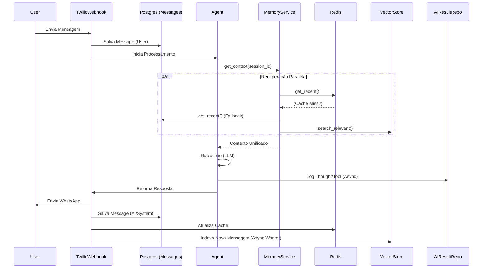

# Análise de Arquitetura de Memória para Agentes de IA - Versão 2

**Data:** 29/01/2026
**Status:** Planejamento Consolidado
**Versão Anterior:** `research_memory_system_analysis_01.md`
**Contexto:** Definição final da estratégia de memória para o módulo de IA, incorporando decisões de reutilização de código e arquitetura híbrida.

---

## 1. Introdução e Decisões Chave

Após a análise inicial e revisão do código fonte existente (`src/modules/conversation` e `src/modules/ai`), as seguintes decisões estruturais foram tomadas para evitar duplicidade e maximizar eficiência:

1.  **Reutilização do Módulo Conversation:**
    *   **Decisão:** NÃO criar uma nova tabela `ai_chat_history`.
    *   **Motivo:** O projeto já possui uma tabela `messages` robusta (via `MessageRepository`) que armazena todas as mensagens de User e System/AI. Duplicar esses dados seria ineficiente.
    *   **Ação:** O Agente lerá o histórico diretamente desta fonte (via repositório existente).

2.  **Manutenção do Módulo AI Result:**
    *   **Decisão:** MANTER o módulo `src/modules/ai/ai_result`.
    *   **Motivo:** Este módulo armazena "metadados de pensamento" (logs de tools, custos, traces), que são diferentes do "conteúdo da conversa". É essencial para auditoria e debug.

3.  **Arquitetura Híbrida Confirmada:**
    *   **Cache (Hot):** Redis para acesso rápido às últimas mensagens.
    *   **Persistência (Cold):** PostgreSQL (tabela `messages` existente).
    *   **Semântica (Long-Term):** Vector Store indexando o conteúdo das mensagens.

---

## 2. Arquitetura Detalhada

### Componentes do Sistema

| Camada | Tecnologia | Componente/Módulo | Responsabilidade |
| :--- | :--- | :--- | :--- |
| **L1 Cache** | Redis | `RedisMessageHistory` | Armazenar as últimas N mensagens da sessão ativa (TTL curto). Latência < 5ms. |
| **L2 Persistência** | PostgreSQL | `MessageRepository` (Conversation) | Fonte da verdade. Armazena todo histórico chat. Garantia de durabilidade. |
| **L3 Semântica** | Vector DB | `VectorMemoryService` | Busca por similaridade (RAG) em todo o histórico passado. |
| **Auditoria** | PostgreSQL | `AIResultRepository` (AI) | Log de execução, tool calls e erros. |

### Fluxo de Dados (Data Flow)

O fluxo foi otimizado para não bloquear a resposta do usuário com operações pesadas.

---

## 3. Estratégia de Implementação

### Fase 1: Fundação e Cache (Redis)
**Foco:** Reduzir a latência de leitura do histórico a cada turno do agente.

1.  **Refatoração do Agent:**
    *   Remover lista `self.memory`.
    *   Injetar `MemoryInterface`.
2.  **Implementação do Redis Service:**
    *   Criar `RedisMemoryRepository` em `src/modules/ai/memory/`.
    *   Implementar lógica de *Read-Through*: Tenta ler do Redis; se falhar, lê do `MessageRepository` e popula o Redis.
    *   Serialização: Converter objetos `Message` (Pydantic) para JSON ao salvar no Redis.

### Fase 2: Integração com Conversation (Cold Storage)
**Foco:** Conectar o Agente ao repositório existente sem duplicar dados.

1.  **Adaptação do Repositório:**
    *   Garantir que `MessageRepository` tenha métodos eficientes para buscar por `conv_id` ou `owner_id` + `correlation_id`.
    *   O Agente deve usar o `conv_id` presente no `AgentContext` para buscar o histórico.

### Fase 3: Memória Semântica (Vector Store)
**Foco:** Permitir que o agente lembre de fatos antigos.

1.  **Setup Vector DB:** Configurar cliente (Qdrant/Pinecone).
2.  **Indexação:**
    *   Criar um *Background Service* que escuta novos inserts na tabela `messages` (ou via evento da aplicação) e gera embeddings.
3.  **Retrieval:**
    *   No `MemoryService.get_context()`, incluir uma chamada ao Vector DB usando o input atual do usuário como query.
    *   Concatenar documentos relevantes no prompt do sistema.

---

## 4. Análise de Riscos e Mitigação

| Risco | Impacto | Mitigação |
| :--- | :--- | :--- |
| **Dessincronia Cache/DB** | Agente não vê mensagem recente | Usar TTL curto no Redis (ex: 1h) e invalidar cache na escrita. |
| **Custo de Embeddings** | Conta alta da OpenAI | Indexar apenas mensagens relevantes (ex: ignorar "oi", "obrigado"). |
| **Latência na Busca Vetorial** | Resposta lenta | Definir timeout agressivo (ex: 200ms) para a busca vetorial. Se falhar, segue sem ela. |
| **Modelos de Dados** | Pydantic v1 vs v2 | Garantir compatibilidade na serialização JSON entre módulos. |

---

## 5. Próximos Passos (To-Do)

1.  [x] Criar pacote `src/modules/ai/memory`.
2.  [x] Implementar `HybridMemoryService` (L1 + L2 Read-Through).
3.  [x] Refatorar `Agent` e `Webhook` para passar `session_id`.
4.  [ ] Criar Teste de Integração: Salvar msg no `MessageRepository` -> Ler via `MemoryService` (com hit no Redis na 2ª vez).
