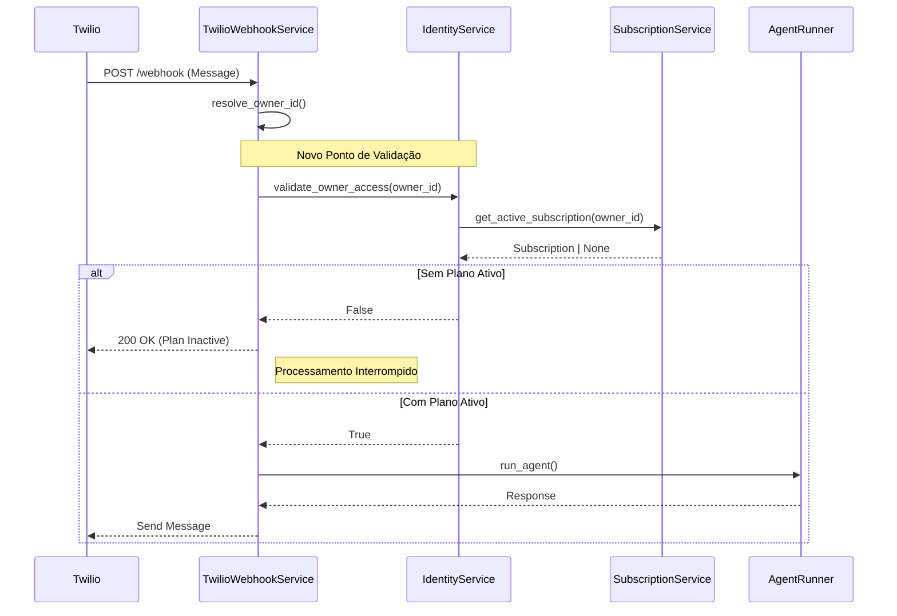
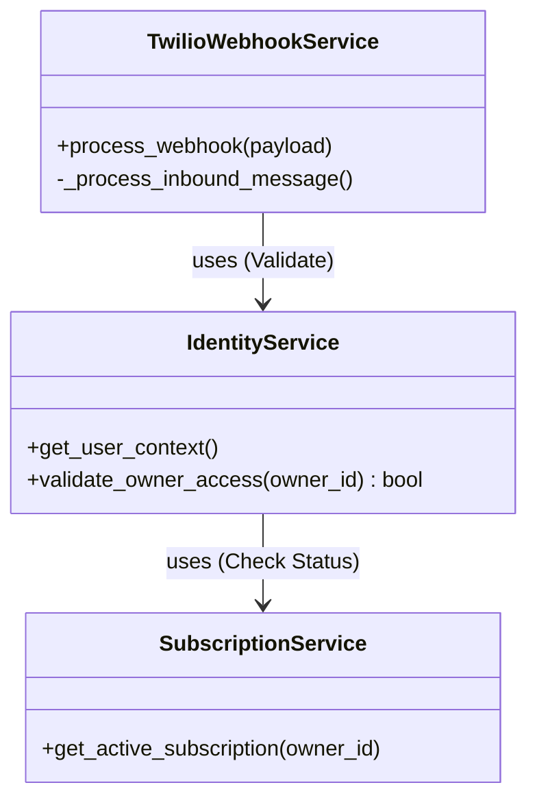

# Research: Validação de Plano e Acesso no Fluxo de Mensagens

**Data:** 2026-01-27
**Atividade:** Validação de Plano (Plan Validation)
**Sequência:** 01
**Autor:** Assistant (Trae AI)

---

## 1. Análise e Validação

### Contexto Atual
O serviço `TwilioWebhookService` é responsável por orquestrar a entrada de mensagens via WhatsApp. Atualmente, o fluxo de processamento realiza a resolução do `Owner` (Tenant) e do `User`, mas **não valida explicitamente** se o Owner possui uma assinatura (plano) ativa antes de iniciar o processamento da IA.

### Problema Identificado
A ausência de uma verificação de status de assinatura no início do pipeline de webhook permite que Owners com planos cancelados, expirados ou inadimplentes continuem consumindo recursos do sistema.

- **Consumo de Infraestrutura:** Custos de processamento (AWS/Cloud Run).
- **Consumo de Terceiros:** Custos de Twilio (sessões de 24h) e OpenAI (tokens) são gerados mesmo para usuários não pagantes.

### Validação Arquitetural
Analisando o princípio de Responsabilidade Única (SRP):
- O `TwilioWebhookService` não deve conhecer regras de negócio sobre "o que constitui um plano válido" (ex: trial, grace period, limites).
- O `IdentityService` já atua como *Facade* para o domínio de identidade (Users, Owners, Features, Subscriptions).

Portanto, a lógica de validação deve residir no `IdentityService`, sendo apenas consumida pelo webhook.

---

## 2. Especificação da Sugestão

### Local
- **Lógica de Negócio:** `src/modules/identity/services/identity_service.py`
- **Ponto de Aplicação:** `src/modules/channels/twilio/services/twilio_webhook_service.py`

### Detalhamento

| Item | Descrição |
|------|-----------|
| **Problema** | O sistema aceita e processa mensagens tecnicamente sem antes verificar se o cliente (Owner) possui um plano ativo, gerando custos indevidos. |
| **Risco** | **Financeiro (Alto):** Vazamento de receita (Revenue Leakage) e custos operacionais irrecuperáveis. |
| **Solução** | Implementar `validate_owner_access` no `IdentityService` e injetar este "Gatekeeper" no início do `process_webhook`. |
| **Bypass (Dev)** | Adicionado flag `API_BYPASS_SUBSCRIPTION_CHECK` para pular validação em ambiente de desenvolvimento (`API_ENVIRONMENT=development`). |

---

## 3. Plano de Ação

1.  **IdentityService:** Implementar método `validate_owner_access(owner_id)`.
    -   Deve consultar `SubscriptionService.get_active_subscription`.
    -   Deve retornar `True` apenas se houver subscrição ativa ou em período de trial válido.
2.  **TwilioWebhookService:** Adicionar verificação no método `process_webhook`.
    -   Se `validate_owner_access` retornar `False`, interromper o processamento.
    -   Retornar status HTTP 200 (para evitar retentativas do Twilio) com mensagem informativa no corpo da resposta (DTO).
3.  **Logging:** Adicionar logs de aviso (`WARNING`) quando uma mensagem for rejeitada por falta de plano, facilitando auditoria.

---

## 4. Diagramas de Solução

### Diagrama de Sequência (Fluxo Proposto)

### Diagrama de Componentes

---

## 5. Próximos Passos (Execução)

- [ ] Editar `src/modules/identity/services/identity_service.py` para adicionar `validate_owner_access`.
- [ ] Editar `src/modules/channels/twilio/services/twilio_webhook_service.py` para integrar a validação.
- [ ] Validar fluxo com testes manuais ou unitários.
