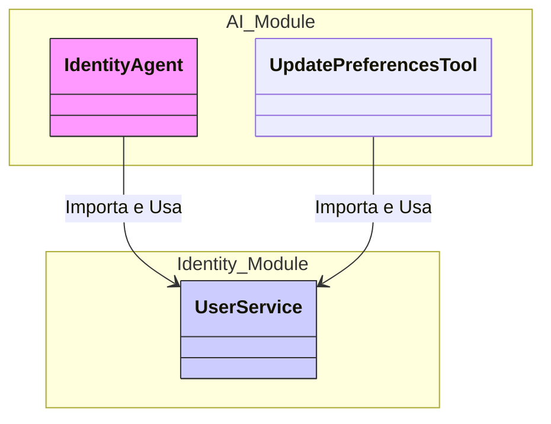
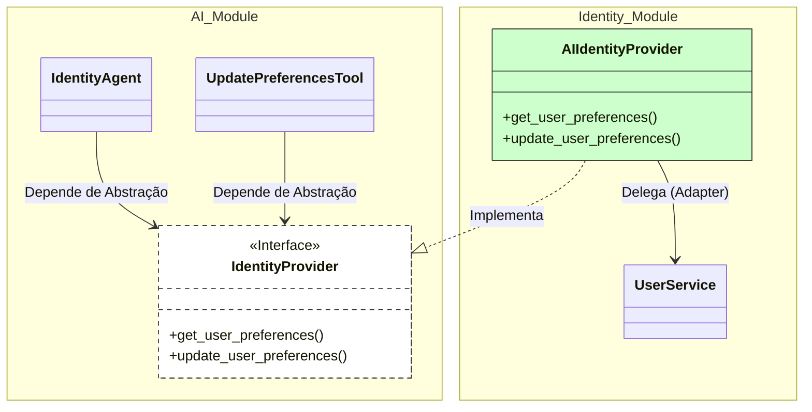
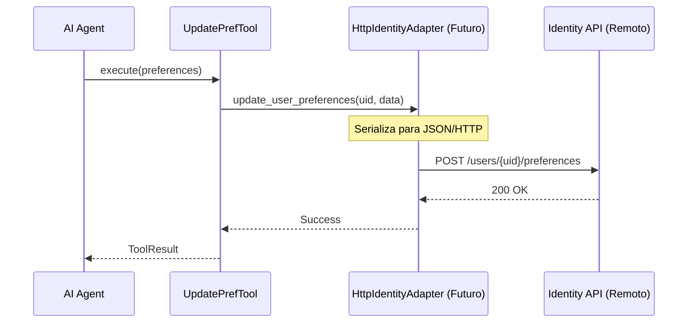

# ADR 25: Desacoplamento do Módulo AI via Inversão de Dependência

**Data:** 2026-02-04  
**Status:** Aceito  
**Contexto:** Preparação para Arquitetura de Microsserviços e Modularização  
**Impacto:** `src/modules/ai`, `src/modules/identity`, `src/core/di`

## 1. Contexto e Problema

O módulo de Inteligência Artificial (`src/modules/ai`) possuía um acoplamento direto e rígido com o módulo de Identidade (`src/modules/identity`). Especificamente, o agente de identidade (`identity_agent.py`) e a ferramenta de atualização de preferências (`update_preferences.py`) importavam e dependiam da implementação concreta de `UserService`.

**Problemas identificados:**
1.  **Violação de Fronteiras:** O módulo AI conhecia detalhes de implementação interna do módulo Identity.
2.  **Dificuldade de Extração:** Impedia a extração futura do módulo AI para um serviço independente (API/Microsserviço), pois o código quebraria ao perder o acesso direto ao pacote `src.modules.identity`.
3.  **Testabilidade:** Dificultava testes unitários isolados do módulo AI sem mockar serviços complexos de outro módulo.

## 2. Decisão Arquitetural

Decidimos aplicar o **Padrão de Inversão de Dependência (DIP)** e **Portas e Adaptadores (Hexagonal Architecture)** para desacoplar os módulos.

### Mudanças Implementadas:

1.  **Criação de Contrato (Porta):**
    *   Definimos um protocolo `IdentityProvider` dentro do módulo AI (`src/modules/ai/engines/lchain/core/interfaces/identity_provider.py`).
    *   Este protocolo define estritamente o que o AI precisa: `get_user_preferences` e `update_user_preferences`.

2.  **Refatoração do Consumidor (AI):**
    *   O `TaskAgent` e a `Tool` de preferências agora dependem exclusivamente da interface `IdentityProvider`.
    *   Todas as importações de `src.modules.identity` foram removidas do código fonte do módulo AI.

3.  **Criação de Adaptador (Identity):**
    *   Criamos `AIIdentityProvider` em `src/modules/identity/adapters/`.
    *   Esta classe implementa a interface do AI e delega as chamadas para o `UserService` local.

4.  **Injeção de Dependência (Wiring):**
    *   O Container de DI (`src/core/di/container.py`) foi reconfigurado para instanciar o `AIIdentityProvider` e injetá-lo onde o módulo AI espera um `IdentityProvider`.

## 3. Diagramas

### 3.1. Antes da Mudança (Acoplamento Direto)

### 3.2. Depois da Mudança (Inversão de Dependência)

### 3.3. Visão de Fluxo Futuro (Microsserviço)

Esta arquitetura habilita a transição para microsserviços sem alterar o código do Core AI. Apenas o Adaptador muda.

## 4. Resultados e Benefícios

| Critério | Antes | Depois |
|---|---|---|
| **Acoplamento** | Alto (Importação direta de classes concretas) | Baixo (Dependência de Interface/Protocolo) |
| **Portabilidade** | Baixa (Amarrado ao monólito) | Alta (Módulo AI agnóstico à implementação de usuário) |
| **Testabilidade** | Difícil (Requer mocks de Service complexo) | Fácil (Basta implementar um MockIdentityProvider simples) |
| **Manutenção** | Risco de quebra cruzada | Contratos explícitos protegem mudanças internas |

## 5. Próximos Passos (Plano de Ação)

Para completar a preparação do módulo AI como um serviço independente, recomenda-se:

1.  **Replicar para Outros Domínios:** Aplicar o mesmo padrão para dependências de `Finance` e `Relationships` (que hoje acessam Repositórios diretamente).
2.  **Interface Assíncrona:** Em uma futura refatoração, considerar migrar `IdentityProvider` para `async def`, antecipando a latência de rede de uma futura chamada HTTP/RPC.
3.  **Monitoramento:** Garantir que o `AIIdentityProvider` tenha logs adequados, já que agora ele é uma fronteira de sistema.

## 6. Referências de Código

*   **Interface:** [`src/modules/ai/engines/lchain/core/interfaces/identity_provider.py`](../../../../src/modules/ai/engines/lchain/core/interfaces/identity_provider.py)
*   **Adaptador:** [`src/modules/identity/adapters/ai_identity_provider.py`](../../../../src/modules/identity/adapters/ai_identity_provider.py)
*   **Container DI:** [`src/core/di/container.py`](../../../../src/core/di/container.py)
