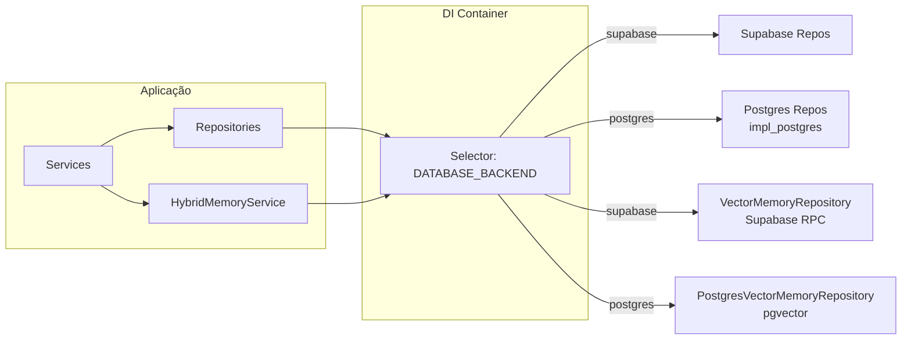
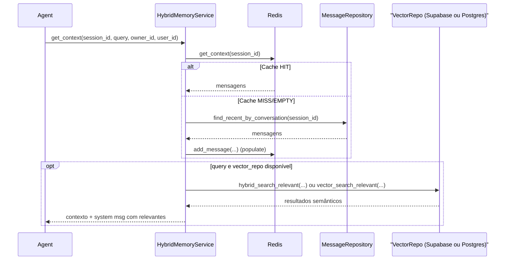
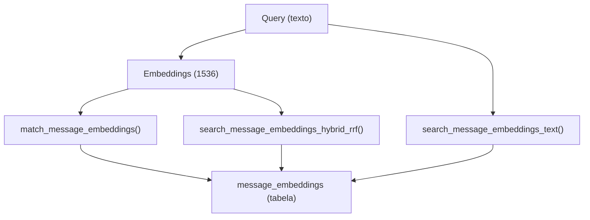

# Report — Backend Postgres + Vector Memory + Reorganização de Repositórios

Data: 2026-02-03 00:56

## Contexto
O projeto estava acoplado ao acesso via Supabase/PostgREST em diversos repositórios e no componente de memória semântica (vector store). O objetivo foi habilitar execução com Postgres “direto” (psycopg2) sem perder compatibilidade com Supabase, e reorganizar os repositórios Postgres sob `repositories/impl/postgres/`.

## Escopo do trabalho
- Seleção de backend via configuração (`DATABASE_BACKEND=supabase|postgres`)
- Implementação de repositórios Postgres por módulo (identity, conversation, twilio, ai_result)
- Reorganização dos repositórios Postgres para `repositories/impl/postgres/`
- Implementação de `PostgresVectorMemoryRepository` (pgvector + FTS + busca híbrida)
- Ajustes de DI e pontos de acoplamento (histórico de conversas / agent run)
- Validação via suíte de testes

## Decisões arquiteturais (resumo)
1. **Interface estável, implementações por backend**
   - Mantém o “contrato” de cada repositório consistente, com detalhes de infra encapsulados.
2. **DI faz roteamento por backend**
   - A seleção do backend acontece no container, evitando `if backend` espalhado no domínio.
3. **Vector memory no Postgres via pgvector + funções SQL**
   - Reaproveita a modelagem existente (`message_embeddings`) e as funções definidas em migrations.

---

## 1) Seleção de backend (Supabase vs Postgres)

### Local
- [settings.py](file:///Users/lennon/projects/ai_engineering/whatsapp_twilio_ai/src/core/config/settings.py)
- [container.py](file:///Users/lennon/projects/ai_engineering/whatsapp_twilio_ai/src/core/di/container.py)
- [.env.example](file:///Users/lennon/projects/ai_engineering/whatsapp_twilio_ai/.env.example)

### Problema
Os repositórios e a memória vetorial assumiam a existência de `supabase_client` (`client.table(...)`, `client.rpc(...)`). Ao trocar para Postgres direto, o app quebrava em runtime por falta dessas APIs.

### Risco
- Quebra em produção ao trocar backend.
- Crescimento de “ifs” de backend dentro de serviços e componentes de domínio.
- Divergência funcional entre backends.

### Solução
- Introduzido `DATABASE_BACKEND` e roteamento no DI via `providers.Selector(...)`.
- Ajuste para `db_backend = providers.Object(settings.database.backend)` (evita erro “str object is not callable” do Dependency Injector ao usar selector).
- Mantido Supabase como default (`DATABASE_BACKEND=supabase`).

---

## 2) Reorganização: `repositories/impl/postgres/`

### Local
- Identity: [identity/repositories/impl/postgres](file:///Users/lennon/projects/ai_engineering/whatsapp_twilio_ai/src/modules/identity/repositories/impl/postgres)
- Conversation: [conversation/repositories/impl/postgres](file:///Users/lennon/projects/ai_engineering/whatsapp_twilio_ai/src/modules/conversation/repositories/impl/postgres)
- Twilio: [twilio/repositories/impl/postgres](file:///Users/lennon/projects/ai_engineering/whatsapp_twilio_ai/src/modules/channels/twilio/repositories/impl/postgres)
- AI Result: [ai_result/repositories/impl/postgres](file:///Users/lennon/projects/ai_engineering/whatsapp_twilio_ai/src/modules/ai/ai_result/repositories/impl/postgres)
- Atualização de imports/DI: [container.py](file:///Users/lennon/projects/ai_engineering/whatsapp_twilio_ai/src/core/di/container.py)

### Problema
Os repositórios Postgres estavam no mesmo nível dos repositórios Supabase, poluindo o namespace e dificultando navegação e manutenção.

### Risco
- Aumento de custo cognitivo e chances de imports “errados”.
- Ambiguidade de “qual repositório está em uso” durante debug.

### Solução
- Padronização de estrutura `repositories/impl/postgres/` por módulo.
- Remoção dos arquivos antigos `postgres_*_repository.py` e atualização de todos os imports no container.

---

## 3) Histórico de conversas: desacoplar `.client` do Supabase

### Local
- [conversation_lifecycle.py](file:///Users/lennon/projects/ai_engineering/whatsapp_twilio_ai/src/modules/conversation/components/conversation_lifecycle.py)
- Supabase: [conversation_repository.py](file:///Users/lennon/projects/ai_engineering/whatsapp_twilio_ai/src/modules/conversation/repositories/conversation_repository.py)
- Postgres: [impl/postgres/conversation_repository.py](file:///Users/lennon/projects/ai_engineering/whatsapp_twilio_ai/src/modules/conversation/repositories/impl/postgres/conversation_repository.py)

### Problema
`ConversationLifecycle` gravava histórico via `self.repository.client.table(...)`, o que só existe no repositório Supabase.

### Risco
- Quebra do fluxo de transição/histórico quando o backend é Postgres.
- Histórico inconsistente entre backends.

### Solução
- Introduzido método `log_transition_history(history_data)` no repositório, com implementação por backend.
- `ConversationLifecycle` chama `self.repository.log_transition_history(...)` em vez de acessar `.client`.

---

## 4) Vector store no Postgres (pgvector)

### Local
- Repositório Postgres: [PostgresVectorMemoryRepository](file:///Users/lennon/projects/ai_engineering/whatsapp_twilio_ai/src/modules/ai/memory/repositories/impl/postgres/vector_memory_repository.py)
- Serviço: [HybridMemoryService](file:///Users/lennon/projects/ai_engineering/whatsapp_twilio_ai/src/modules/ai/memory/services/hybrid_memory_service.py)
- Tabela: [003_create_tables.sql](file:///Users/lennon/projects/ai_engineering/whatsapp_twilio_ai/migrations/003_create_tables.sql#L416-L433)
- Funções de busca: [004_create_search_functions.sql](file:///Users/lennon/projects/ai_engineering/whatsapp_twilio_ai/migrations/004_create_search_functions.sql)
- Integração DI: [container.py](file:///Users/lennon/projects/ai_engineering/whatsapp_twilio_ai/src/core/di/container.py)

### Problema
A memória semântica estava implementada via Supabase RPC (PostgREST), inviabilizando uso com Postgres direto.

### Risco
- Perda do L3 (memória semântica) no backend Postgres.
- Regressão funcional em recuperação de contexto (qualidade de respostas do agente).
- Crash em runtime caso o componente de memória tente acessar `.rpc` inexistente.

### Solução
Implementado `PostgresVectorMemoryRepository` com:
- `vector_search_relevant(...)` → chama `app.match_message_embeddings(...)`
- `text_search_relevant(...)` → chama `app.search_message_embeddings_text(...)`
- `hybrid_search_relevant(...)` → chama `app.search_message_embeddings_hybrid_rrf(...)`
- `add_texts(...)` → insere em `app.message_embeddings` com cast `::extensions.vector(1536)`

Observação: o repositório faz “degradação graciosa”: se as funções/tabelas não existirem no DB alvo, ele se auto-desabilita e retorna `[]` (evita crash), registrando warning.

---

## 5) Ajuste de saída do Agent (evitar duplicação e manter acúmulo)

### Local
- [agent.py](file:///Users/lennon/projects/ai_engineering/whatsapp_twilio_ai/src/modules/ai/engines/lchain/core/agents/agent.py)

### Problema
Durante ajustes, o `Agent.run()` passou a concatenar mensagens de forma que gerava duplicações (ex.: “Thinking...\nThinking...”) e/ou deixava de acumular mensagens em cenários válidos de streaming/loop.

### Risco
- Respostas com conteúdo duplicado.
- Regressão de comportamento esperado por testes e UX.

### Solução
- Mantido acúmulo de mensagens `assistant` + `finish`, com dedupe por conteúdo consecutivo.
- Resultado final prioriza `"\n".join(assistant_responses)` quando houver múltiplas mensagens.

---

## Diagramas (Mermaid)

### Arquitetura de componentes (backends e DI)

### Sequência: obtenção de contexto (L1/L2/L3)

### Dados: busca semântica via funções SQL (Postgres)

---

## Resultados obtidos
- Backend selecionável via `DATABASE_BACKEND` com DI centralizado.
- Repositórios Postgres organizados em `repositories/impl/postgres` por módulo.
- Histórico de conversas funcionando em ambos backends (método `log_transition_history`).
- Memória vetorial funcionando em Postgres via pgvector (dependente das migrations/funções estarem aplicadas no DB).
- Suíte de testes executada com sucesso: **400 passed**.

## Notas operacionais
- Para habilitar o vetorial no Postgres “puro”, o banco precisa ter:
  - extensão `pgvector` (aqui usada como `extensions.vector`)
  - tabela `app.message_embeddings`
  - funções `match_message_embeddings`, `search_message_embeddings_text`, `search_message_embeddings_hybrid_rrf`
- Caso o DB alvo não tenha essas funções, o repositório vetorial se auto-desabilita para evitar crash (retornando lista vazia).
