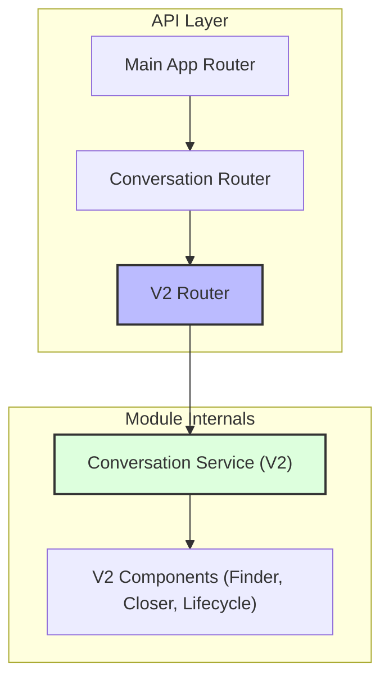

# Relatório de Remoção de Código Legado (Conversation V1)

**Data:** 03/02/2026
**Autor:** Assistant (Arquitetura de Software)
**Atividade:** Remoção do módulo `src/modules/conversation/api/v1/`

---

## 1. Contexto e Problema

O diretório `src/modules/conversation/api/v1/` continha a implementação original (V1) da API de conversas. Com a evolução para a V2 (Clean Architecture, componentes desacoplados), este código tornou-se obsoleto (legacy code).

**Problemas identificados:**
- **Código Morto:** A V1 não era a rota principal exposta, mas ainda existiam referências no Container de Injeção de Dependência (`Container`) e no roteador agregador (`router.py`).
- **Confusão:** Manter duas versões de API no código fonte (mesmo que uma inativa) gera confusão para novos desenvolvedores e manutenção desnecessária.
- **Débito Técnico:** A V1 não seguia os padrões arquiteturais mais recentes do projeto.

## 2. Análise de Risco

| Risco | Nível | Descrição |
|-------|-------|-----------|
| Quebra de Dependências | Baixo | A V1 estava isolada em seu pacote. As únicas referências externas eram na configuração de DI e no roteador pai. |
| Perda de Funcionalidade | Nulo | A V2 já substituiu completamente as funcionalidades da V1 e possui testes de compatibilidade (`test_v1_compatibility.py`) garantindo o mesmo comportamento. |
| Impacto em Testes | Baixo | Os testes existentes (`tests/modules/conversation`) já focam na V2 ou na compatibilidade de comportamento, não importando diretamente a implementação V1. |

## 3. Solução Executada

Foi realizada a remoção completa do diretório e a limpeza das referências ("cirurgia limpa").

### Passos Realizados:

1.  **Limpeza de Referências:**
    - Removido `router.include_router(v1_router)` de `src/modules/conversation/api/router.py`.
    - Removido `src.modules.conversation.api.v1.conversations` da lista `wiring_config` em `src/core/di/container.py`.

2.  **Exclusão de Arquivos:**
    - Diretório `src/modules/conversation/api/v1/` removido permanentemente.

### Diagrama da Solução (Estado Atual)

## 4. Resultados e Próximos Passos

- **Resultado:** O projeto está mais limpo, sem código morto e focado exclusivamente na arquitetura V2.
- **Testes:** Os testes de compatibilidade V1 (`test_v1_compatibility.py`) foram mantidos, pois validam que a V2 respeita os contratos de comportamento esperados, sem depender do código fonte antigo.
- **Recomendação:** Verificar se clientes externos (se houver) já estão consumindo exclusivamente `/conversation/v2` ou se a rota `/conversation/v1` (agora removida) ainda recebia tráfego. Como a rota foi removida do router, qualquer chamada para `/conversation/v1` retornará 404.

---
**Status:** ✅ Concluído
