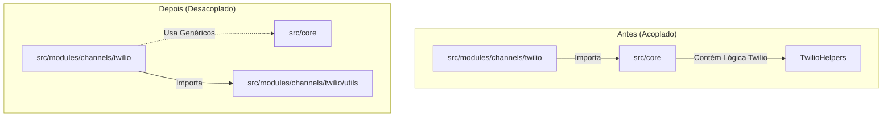
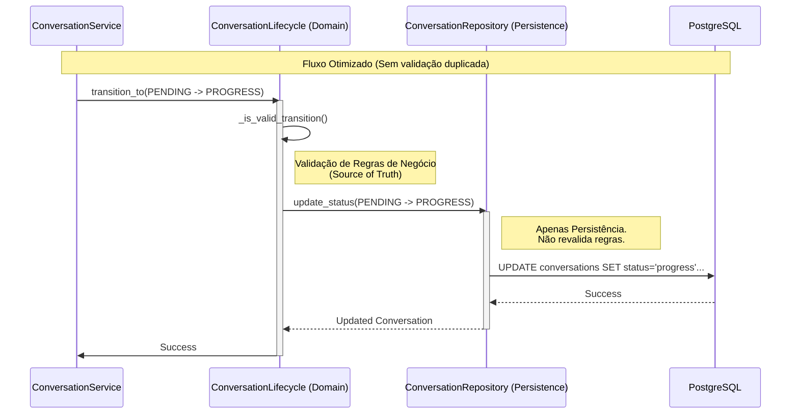

# Relatório de Refinamento Arquitetural - Fase 3

**Data:** 04/02/2026
**Atividade:** Refinamento Arquitetural e Limpeza de Dívida Técnica (Fase 3 do Plano de Conformidade)

---

## 1. Limpeza de Fronteiras (Core vs Modules)

### Especificação
- **Local:** `src/core/utils/helpers.py` e `src/modules/channels/twilio/utils/helpers.py`
- **Problema:** O utilitário `TwilioHelpers` (responsável pelo download de mídia) residia no módulo `core`, violando os limites arquiteturais, pois lógica específica de um canal (Twilio) não deve estar no núcleo compartilhado da aplicação.
- **Risco:** Acoplamento desnecessário, ciclos de importação e dificuldade de extrair ou modularizar o canal Twilio no futuro.
- **Solução:** Migração da classe e métodos para `src/modules/channels/twilio/utils/helpers.py` e atualização das referências no `audio_processor.py`. O arquivo original no `core` foi marcado como depreciado.

### Diagrama de Componentes (Refatoração)

---

## 2. Endurecimento de Contratos (Identity & Conversation)

### Especificação
- **Local:** 
  - `src/modules/identity/models/user.py`
  - `src/modules/conversation/dtos/message_dto.py`
- **Problema:** Discrepâncias entre DTOs (Data Transfer Objects) e Modelos de Banco de Dados.
  - Em `Identity`, o modelo esperava `external_auth_id` enquanto o padrão estava migrando para `auth_id`.
  - Em `Conversation`, o DTO de criação de mensagem não suportava o campo `sent_by_ia`, impedindo a persistência correta dessa flag crítica.
- **Risco:** Falhas silenciosas de mapeamento de dados (campos ignorados), erros de runtime ao instanciar modelos e inconsistência de dados (mensagens de IA não identificadas como tal).
- **Solução:**
  - **Identity:** Renomeação de `external_auth_id` para `auth_id` no modelo `UserCreate`.
  - **Conversation:** Adição do campo `sent_by_ia` (default `False`) no `MessageCreateDTO`.

---

## 3. Centralização de Máquinas de Estado

### Especificação
- **Local:** `src/modules/conversation/repositories/impl/postgres/conversation_repository.py`
- **Problema:** Duplicação da lógica de validação de transição de estados (Máquina de Estados) dentro da camada de repositório (`PostgresConversationRepository`). O repositório estava revalidando regras de negócio que já eram responsabilidade do `ConversationLifecycle`.
- **Risco:** Violação do Princípio de Responsabilidade Única (SRP). Alterações nas regras de negócio exigiriam mudanças em múltiplas camadas (Service e Repository), aumentando a chance de bugs e inconsistências (ex: o Service permite uma transição que o Repository bloqueia, ou vice-versa).
- **Solução:** Remoção do bloco de validação duplicado no Repositório. Agora, o Repositório confia que a camada de Domínio (`ConversationLifecycle`) já validou a transição antes de solicitar a persistência.

### Diagrama de Sequência (Fluxo de Mudança de Estado)

---

## 4. Verificação e Testes

### Atividades Realizadas
1.  **Varredura de Helpers:**
    - Foi realizada uma varredura em `src/core/utils/` para identificar outros utilitários de domínio.
    - **Resultado:** Nenhum outro utilitário específico de domínio foi encontrado. `custom_ulid.py`, `exceptions.py` e `logging.py` são utilitários genéricos apropriados para o Core. `helpers.py` foi marcado como depreciado.
2.  **Testes Unitários de Ciclo de Vida:**
    - Foram executados e expandidos os testes em `tests/modules/conversation/components/test_conversation_lifecycle.py`.
    - **Novos Casos de Teste:**
        - Transição de `HUMAN_HANDOFF` para `PROGRESS` (retorno ao bot).
        - Transições de expiração (`PENDING` -> `EXPIRED`, `PROGRESS` -> `EXPIRED`).
    - **Resultado:** Todos os testes passaram, confirmando que a lógica de transição de estados está segura e correta dentro do componente `ConversationLifecycle`, validando a remoção da lógica duplicada no repositório.

---

## Resumo dos Resultados

| Atividade | Status | Impacto |
| :--- | :---: | :--- |
| **Migração de Utils** | ✅ Concluído | Código mais limpo e modular; redução de dívida técnica no Core. |
| **Ajuste de DTOs** | ✅ Concluído | Prevenção de bugs de dados; maior robustez na criação de usuários e mensagens. |
| **Refatoração Repository** | ✅ Concluído | Melhor separação de responsabilidades (Clean Architecture); manutenção centralizada no Lifecycle. |
| **Verificação e Testes** | ✅ Concluído | Garantia de qualidade e segurança nas alterações arquiteturais. |

---
