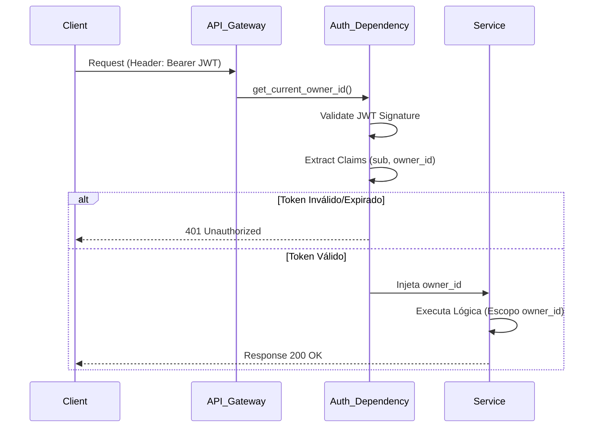
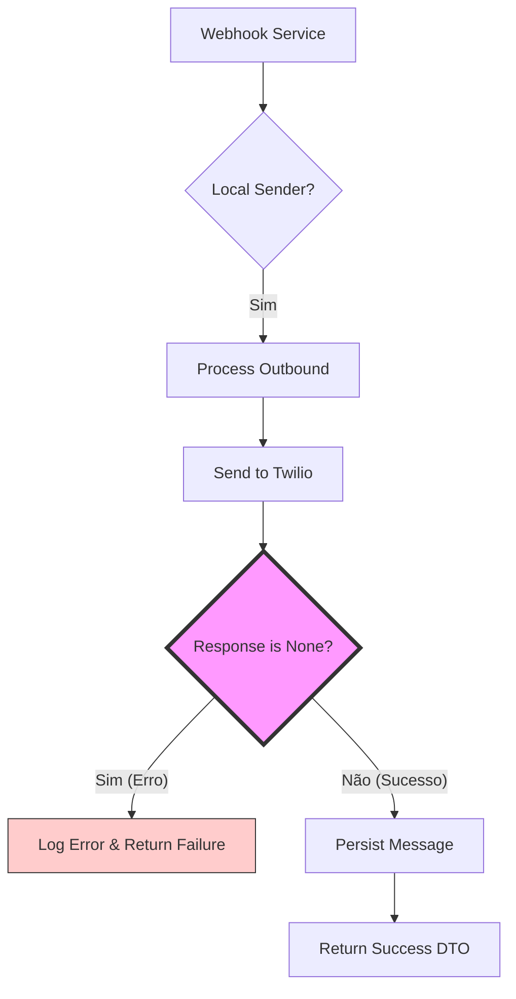

# Relatório de Atividades - Fase 1 e Correções (2026-02-05)

## 1. Contexto
Execução da **Fase 1 do Plano de Ação de Conformidade**, focada em Segurança (Auth Gateway), Saneamento de Configurações (Side-Effects) e Estabilização de Testes. Adicionalmente, investigação de erro em Webhooks.

## 2. Atividades Realizadas

### 2.1. Refatoração de Segurança (Auth Gateway)
**Local:** `src/core/security.py`, `src/modules/identity`, `src/modules/conversation`

*   **Problema:** A aplicação confiava cegamente em parâmetros como `owner_id` enviados pelo cliente (query/body) ou headers inseguros (`X-Auth-ID`), permitindo potencial escalação de privilégio ou acesso cruzado entre tenants (Broken Access Control).
*   **Solução:**
    *   Implementação de `src/core/security.py` utilizando `pyjwt` para validação de tokens JWT.
    *   Criação de dependências `get_current_owner_id` e `get_current_user_id`.
    *   Refatoração das rotas de `Identity` (v1) e `Conversation` (v2) para exigir autenticação via Token e injetar o ID do proprietário validado, removendo a confiança na entrada do usuário.

### 2.2. Saneamento de Configurações (Side-Effects)
**Local:** `src/core/config/settings.py`, `src/main.py`, `src/modules/ai/infrastructure/llm.py`

*   **Problema:** A importação global de `load_dotenv()` em múltiplos arquivos causava efeitos colaterais imprevisíveis (side-effects), dificultando testes e podendo mascarar falhas de configuração em produção.
*   **Solução:**
    *   Remoção de `load_dotenv()` do escopo global de módulos.
    *   Centralização do carregamento de variáveis no entrypoint (`src/main.py`).
    *   Adição de validador em `Settings` que **impede** a inicialização da aplicação em ambiente `production` se a `SECRET_KEY` for o valor padrão (`change-me-in-production`).

### 2.3. Correção e Refatoração de Testes
**Local:** `tests/modules/identity`, `tests/test_webhooks_owner_lookup.py`

*   **Problema:** As mudanças de segurança quebraram testes que dependiam de injeção manual de headers ou que não simulavam o contexto de autenticação. Além disso, a refatoração assíncrona dos Webhooks (Queue) invalidou testes que esperavam resposta síncrona da API.
*   **Solução:**
    *   **Identity:** Atualização dos testes para usar `app.dependency_overrides` simulando a autenticação JWT. Adição de testes para cenários de "Acesso Negado" (403).
    *   **Webhooks:** Refatoração de `test_owner_lookup_inbound_local_sender` para invocar diretamente o serviço `TwilioWebhookService`, contornando a API assíncrona e permitindo validação lógica síncrona dos fluxos de negócio.

## 3. Análise de Erro e Recomendação (Webhook Service)

### 3.1. O Erro
**Log:** `src.modules.channels.twilio.services.twilio_webhook_service ERROR Failed to process webhook event task error='NoneType' object has no attribute 'sid' level=error`

**Local:** `src/modules/channels/twilio/services/twilio_webhook_service.py` (Método `_process_outbound_message`)

**Causa Raiz:**
O método `message_handler.send_twilio_message` chama `twilio_service.send_message`.
Em `src/modules/channels/twilio/services/twilio_service.py`, o método `send_message` pode retornar `None` em dois casos principais:
1.  Não consegue criar/recuperar o cliente Twilio (`client = None`).
2.  Ocorre uma exceção `TwilioRestException` capturada (logada, mas retorna `None`).

No `twilio_webhook_service.py`, o código tenta acessar `response.sid` sem verificar se `response` é válido (`None`).

```python
# Trecho problemático em twilio_webhook_service.py
response = await self.message_handler.send_twilio_message(owner_id, payload)

# Se response for None, isso falha:
message = await self.message_handler.persist_outbound_message(
    ...,
    response_sid=response.sid,  # <--- AttributeError: 'NoneType' object has no attribute 'sid'
    ...
)
```

### 3.2. Solução Aplicada
Implementada uma verificação defensiva ("Guard Clause") após o envio da mensagem.

```python
# Solução Implementada em src/modules/channels/twilio/services/twilio_webhook_service.py
response = await self.message_handler.send_twilio_message(owner_id, payload)

if not response:
    logger.error("Failed to send outbound message via Twilio", owner_id=owner_id)
    # Retornar erro ou processar falha de envio
    return TwilioWebhookResponseDTO(
        success=False,
        message="Failed to send message to Twilio provider",
        conv_id=conversation.conv_id,
        msg_id=None,
    )

# Prosseguir com persistência apenas se response existir
...
```

## 4. Diagramas

### 4.1. Fluxo de Autenticação (Auth Gateway)



### 4.2. Correção de Erro Webhook (Fluxo Proposto)



## 5. Próximos Passos
1.  [Concluído] Aplicar a correção defensiva no `TwilioWebhookService` para evitar o crash `NoneType`.
2.  Prosseguir para a **Fase 2** do plano (Padronização de Logging e Tratamento de Erros Global).
