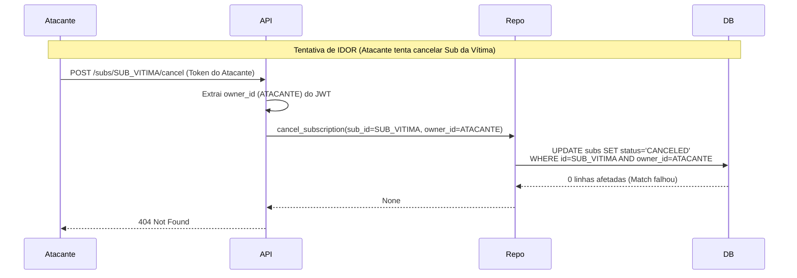
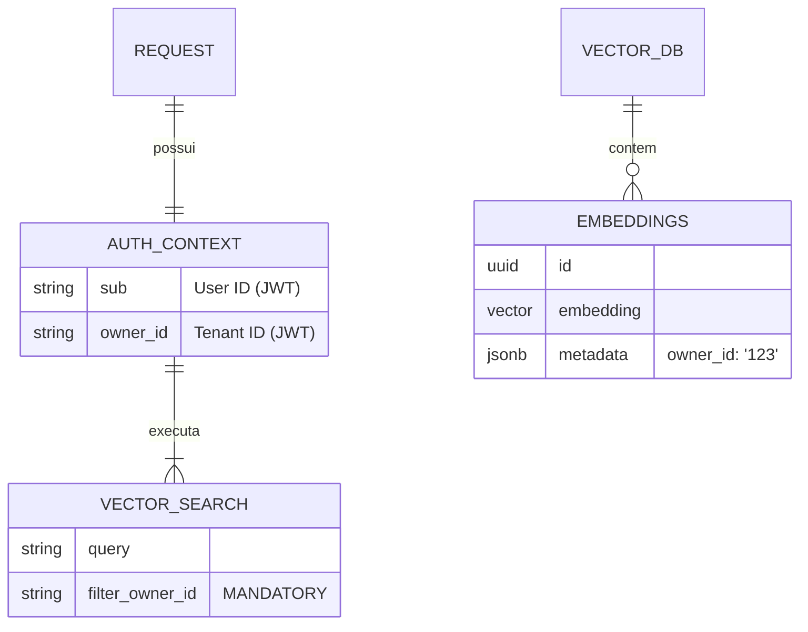

# Relatório de Correções de Segurança e Controle de Acesso (P0)

**Data:** 05/02/2026  
**Atividade:** Implementação do Item 1 da Análise de Convergência de Riscos (Segurança Crítica).  
**Status:** ✅ Concluído e Validado.

Este relatório documenta as intervenções realizadas para mitigar riscos críticos de segurança (IDOR, Spoofing, Vazamento de PII e Isolamento de Dados) identificados na análise arquitetural.

---

## 1. Correção de IDOR em Assinaturas

### 📍 Local
*   **API:** `src/modules/identity/api/v1/subscriptions.py`
*   **Repositório:** `src/modules/identity/repositories/impl/postgres/subscription_repository.py`

### 🚨 Problema
O endpoint `POST /subscriptions/{id}/cancel` confiava apenas no ID da assinatura fornecido na URL. Não havia validação se a assinatura pertencia, de fato, ao `owner` autenticado.

### ⚠️ Risco
**Crítico.** Um usuário autenticado mal-intencionado poderia cancelar a assinatura de qualquer outro cliente apenas iterando sobre IDs (Insecure Direct Object Reference).

### 🛡️ Solução
1.  Injeção de dependência segura: `owner_id: str = Depends(get_authenticated_owner_id)` extraído do JWT.
2.  Blindagem no Repositório: O método `cancel_subscription` foi alterado para executar um `UPDATE ... WHERE subscription_id = %s AND owner_id = %s`.
3.  Se o `owner_id` não bater, o banco retorna 0 linhas afetadas e a API retorna 404/403.

### 📊 Diagrama de Solução (Sequência)



---

## 2. Unificação de Autenticação (Remoção de X-Auth-ID)

### 📍 Local
*   Todos os controladores em `src/modules/identity/api/v1/` (`users.py`, `owners.py`, `subscriptions.py`, `features.py`).

### 🚨 Problema
O sistema aceitava um header customizado `X-Auth-ID` para identificar o usuário, ignorando a validação criptográfica do token em alguns fluxos.

### ⚠️ Risco
**Crítico (Spoofing).** Qualquer agente capaz de injetar headers HTTP poderia se passar por qualquer usuário ou administrador do sistema, contornando completamente a segurança.

### 🛡️ Solução
1.  Remoção total da leitura do header `X-Auth-ID`.
2.  Padronização do uso de `Depends(get_authenticated_owner_id)` e `Depends(get_current_user_id)`.
3.  A fonte da verdade da identidade agora é exclusivamente o **JWT (Bearer Token)** assinado e validado.

---

## 3. Privacidade e Mascaramento de PII (Condicional)

### 📍 Local
*   `src/core/utils/logging.py`
*   `src/modules/ai/ai_result/services/ai_log_thought_service.py`

### 🚨 Problema
Dados sensíveis (E-mail, CPF, Telefone) estavam sendo gravados em texto plano nos logs da aplicação e no histórico de "pensamentos" da IA (`ai_results`), violando princípios de Privacy by Design e LGPD.

### ⚠️ Risco
**Alto.** Vazamento de dados pessoais em caso de acesso indevido aos logs ou ao banco de dados de auditoria.

### 🛡️ Solução
1.  Criação da função `mask_pii(text)` com Regex aprimorado para detectar padrões sensíveis.
2.  Implementação de **Lógica Condicional de Ambiente**: O mascaramento só é aplicado se `API_ENVIRONMENT=production`. Em `development` ou `staging`, os dados originais são mantidos para facilitar o debug.
3.  Aplicação do filtro na persistência de inputs, outputs e mensagens da IA.

### 📊 Lógica de Mascaramento

```mermaid
flowchart TD
    A[Dados de Entrada/Log] --> B{Ambiente == Production?}
    B -- Não --> C[Manter Dados Originais]
    B -- Sim --> D[Aplicar Regex PII]
    D --> E[Substituir por [REDACTED]]
    C --> F[Persistir/Logar]
    E --> F
```

---

## 4. Isolamento de Busca Vetorial (RAG)

### 📍 Local
*   `src/modules/ai/memory/services/hybrid_memory_service.py`
*   `tests/modules/ai/memory/test_memory_integration_flow.py`

### 🚨 Problema
A busca semântica (Vector Search) permitia execução sem filtro de `owner_id`, potencialmente retornando fragmentos de memória de outros inquilinos (tenants) se a query fosse semanticamente similar.

### ⚠️ Risco
**Alto (Cross-Tenant Leakage).** Vazamento de informações confidenciais entre empresas/usuários diferentes.

### 🛡️ Solução
1.  Implementação de *Guard Clause* no `HybridMemoryService`: Se `owner_id` não for fornecido, a busca vetorial é abortada imediatamente com erro logado.
2.  Correção de Testes: Ajuste no `test_memory_integration_flow.py` que quebrou após a mudança, garantindo que os testes de integração respeitem a nova regra de segurança.

### 📊 Diagrama de Componentes (Dados Seguros)



---

## Conclusão

O pilar de **Segurança Crítica** foi endereçado com sucesso. O sistema agora:
1.  Garante a identidade via criptografia (JWT) e não confiança implícita.
2.  Protege recursos contra acesso cruzado (IDOR/Tenant Isolation).
3.  Respeita a privacidade do usuário em produção sem atrapalhar o desenvolvimento.

**Próximo Passo Recomendado:** Iniciar Item 2: Performance e Bloqueio do Event Loop (Async/Sync Refactor).
