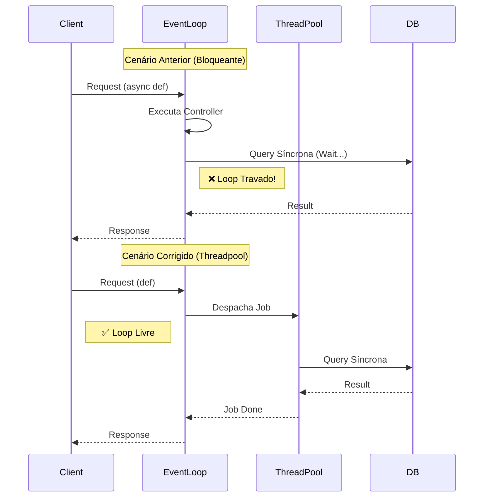

# Relatório de Otimização de Performance: Event Loop e Redis

**Data:** 05/02/2026
**Responsável:** Trae AI Architect

## 1. Contexto
Este relatório documenta as correções de performance críticas identificadas na "Análise de Convergência de Riscos" (Item 2), focadas no desbloqueio do Event Loop do FastAPI e na otimização de operações de I/O no Redis.

## 2. Detalhamento das Alterações

### 2.1. Desbloqueio do Event Loop (Conversation API)

*   **Local:** `src/modules/conversation/api/v2/conversations.py`
*   **Problema:** Os controladores da API estavam definidos como `async def`, mas utilizavam internamente repositórios baseados no `psycopg2` (síncrono/bloqueante).
*   **Risco:** No FastAPI, uma função `async def` é executada diretamente no Event Loop. Se ela chama código bloqueante, todo o loop para, impedindo o processamento de outras requisições (Health Checks, outras chamadas) até que o I/O termine. Isso degrada severamente a concorrência.
*   **Solução:** Remoção da keyword `async` dos controladores.
    *   **Mecanismo:** Ao definir a rota como `def` (síncrona), o FastAPI automaticamente despacha a execução para um *Threadpool* separado, liberando o Event Loop principal para continuar aceitando conexões.

#### Diagrama de Sequência: Async vs Sync (Threadpool)



### 2.2. Eliminação de N+1 no Redis (AI Memory)

*   **Local:**
    *   `src/modules/ai/memory/repositories/redis_memory_repository.py`
    *   `src/modules/ai/memory/services/hybrid_memory_service.py`
*   **Problema:** O método de "Read-Through" do serviço de memória populava o cache (Redis) iterando sobre as mensagens recuperadas do banco e inserindo-as uma a uma (`add_message`).
*   **Risco:** Para um histórico de 50 mensagens, isso gerava 50 *round-trips* de rede para o Redis. Em ambientes distribuídos, a latência de rede acumulada tornava a operação lenta.
*   **Solução:** Implementação do método `add_messages_bulk` utilizando *Pipelines* do Redis.
    *   **Resultado:** Todas as mensagens são enviadas em um único pacote de comando, reduzindo a latência de `N * RTT` para `1 * RTT`.

#### Comparativo de Fluxo de Dados

```mermaid
flowchart TD
    subgraph "Antes (N+1)"
        A1[Service] -->|Msg 1| R1[(Redis)]
        A1 -->|Msg 2| R1
        A1 -->|...| R1
        A1 -->|Msg N| R1
    end

    subgraph "Depois (Pipeline)"
        A2[Service] -->|Bulk [Msg 1..N]| R2[(Redis)]
    end
```

## 3. Correções Colaterais (Testes)

A mudança na assinatura das chamadas de repositório (de `add_message` para `add_messages_bulk`) quebrou testes unitários que usavam Mocks estritos.

*   **Arquivos Corrigidos:**
    *   `tests/modules/ai/memory/test_hybrid_memory_service.py`
    *   `tests/modules/ai/memory/test_memory_integration_flow.py`
*   **Ação:** Atualização dos *assertions* dos mocks para verificar a chamada única com lista, ao invés de múltiplas chamadas individuais.

## 4. Conclusão

As alterações garantem que a aplicação escale melhor sob carga (evitando travamentos do Event Loop) e responda mais rápido em operações de memória (otimização de I/O). O sistema agora está mais robusto e alinhado com as boas práticas do FastAPI e Redis.

---
**Status:** ✅ Concluído e Validado (Testes Passaram)
