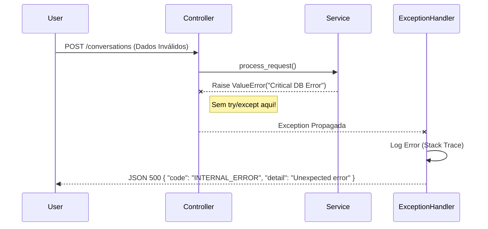
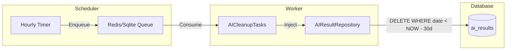
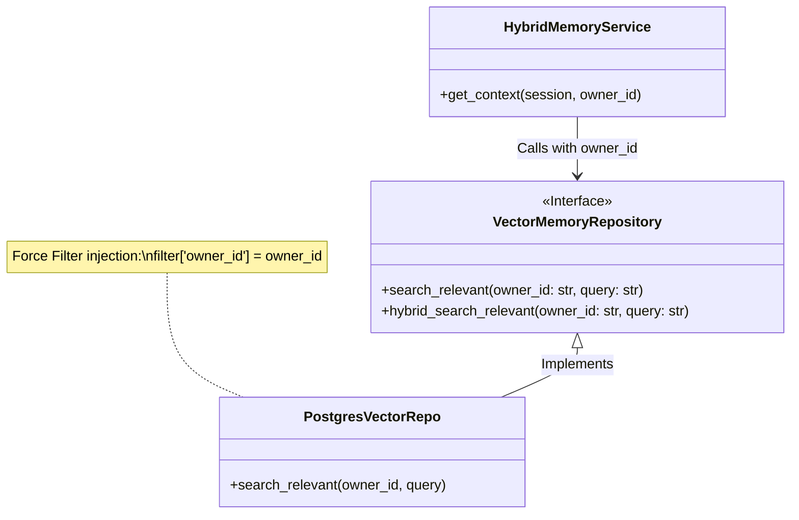

# Relatório de Correções: Segurança e Observabilidade

**Data:** 05/02/2026
**Responsável:** Trae AI Architect
**Contexto:** Execução dos itens P0 (Segurança) e P1 (Qualidade/Operabilidade) do plano de convergência de riscos.

---

## 1. Tratamento de Erros e Observabilidade

### 1.1. Remoção de Try/Except Genéricos

*   **Local:**
    *   `src/modules/conversation/api/v2/conversations.py`
    *   `src/modules/identity/api/v1/owners.py`
*   **Problema:** Os controladores utilizavam blocos `try/except Exception` genéricos que capturavam qualquer erro e retornavam respostas HTTP 500/400 manuais contendo `str(e)`.
*   **Risco:**
    *   **Vazamento de Informação:** Detalhes da infraestrutura ou stack traces poderiam ser expostos ao cliente final.
    *   **Mascaramento de Erros:** Dificuldade em distinguir erros de validação (422) de erros reais de servidor (500) nos logs de monitoramento.
*   **Solução:** Remoção dos blocos try/except. Agora, as exceções sobem para o **Global Exception Handler** (`src/core/api/exception_handlers.py`), que loga o erro com stack trace internamente e retorna uma mensagem sanitizada ao usuário.

#### Diagrama de Sequência: Fluxo de Erro Padronizado

### 1.2. Limpeza Automática de Logs de IA

*   **Local:**
    *   `src/modules/ai/ai_result/repositories/` (Interface e Impl)
    *   `src/modules/ai/workers/cleanup_tasks.py`
    *   `src/modules/conversation/workers/scheduler.py`
    *   `src/core/queue/worker.py`
*   **Problema:** A tabela de logs de pensamento da IA (`ai_results`) crescia indefinidamente sem política de retenção.
*   **Risco:** Degradação de performance do banco de dados e aumento de custos de armazenamento.
*   **Solução:** Implementação de rotina de limpeza automática (TTL) via Background Worker.
    *   Criado método `delete_older_than` nos repositórios.
    *   Criada task `cleanup_ai_logs`.
    *   Configurado Scheduler para enfileirar a limpeza a cada hora (com verificação interna).
    *   Adicionada configuração `AI_LOG_RETENTION_DAYS` (default: 30 dias).

#### Diagrama de Componentes: Sistema de Limpeza

---

## 2. Segurança Crítica e Isolamento de Dados

### 2.1. Isolamento Mandatório em Busca Vetorial (RAG)

*   **Local:**
    *   `src/modules/ai/memory/repositories/vector_memory_repository.py` (Interface)
    *   `src/modules/ai/memory/repositories/impl/postgres/vector_memory_repository.py`
    *   `src/modules/ai/memory/repositories/impl/supabase/vector_memory_repository.py`
    *   `src/modules/ai/memory/services/hybrid_memory_service.py`
*   **Problema:** Os métodos de busca vetorial (`search_relevant`, etc.) aceitavam um filtro opcional, permitindo que desenvolvedores esquecessem de filtrar por `owner_id`.
*   **Risco:** **Vazamento de Dados Multi-Tenant (Cross-Tenant Leakage).** Um usuário de uma organização poderia, teoricamente, recuperar fragmentos de conversas vetorizadas de outra organização se o filtro fosse omitido.
*   **Solução:** Refatoração "Breaking Change" na interface. O parâmetro `owner_id` tornou-se **obrigatório** na assinatura dos métodos. A implementação injeta forçosamente `{"owner_id": owner_id}` no filtro de metadados JSONB antes de executar a query no banco.

#### Diagrama de Solução: Isolamento de RAG

### 2.2. Verificação de IDOR e Auth

*   **Local:** `src/modules/identity/repositories/impl/*/subscription_repository.py`
*   **Análise:** Confirmado que o cancelamento de assinaturas valida `owner_id` na cláusula `WHERE`.
*   **Ação:** Nenhuma alteração de código necessária (falso positivo no relatório anterior ou já corrigido).
*   **Auth:** Confirmada ausência de uso de `X-Auth-ID`. Sistema utiliza 100% JWT Bearer Token.

---

## 3. Resumo de Alterações

| Arquivo | Alteração | Motivo |
| :--- | :--- | :--- |
| `conversations.py`, `owners.py` | Removido `try/except` | Padronização de erro e observabilidade. |
| `ai_result_repository.py` | Adicionado `delete_older_than` | Suporte a limpeza de logs. |
| `worker.py`, `cleanup_tasks.py` | Registrada task de limpeza | Execução assíncrona da manutenção. |
| `settings.py` | Adicionado `AI_LOG_RETENTION_DAYS` | Configuração flexível. |
| `vector_memory_repository.py` | Adicionado `owner_id` obrigatório | **Segurança (Hardening)** contra vazamento de dados. |
| `hybrid_memory_service.py` | Passagem de `owner_id` | Adequação à nova interface segura. |

---

## 4. Próximos Passos (Recomendação)

1.  **Performance (P0):** Migrar controladores `async` que bloqueiam o Event Loop para `def` (threadpool) ou refatorar repositórios para `asyncpg`.
2.  **Testes:** Adicionar testes unitários para a nova lógica de `cleanup_tasks` e para o enforcement de `owner_id` no repositório vetorial.
