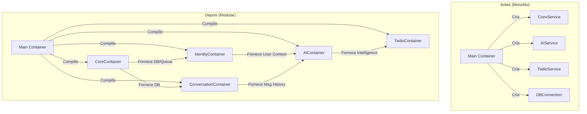
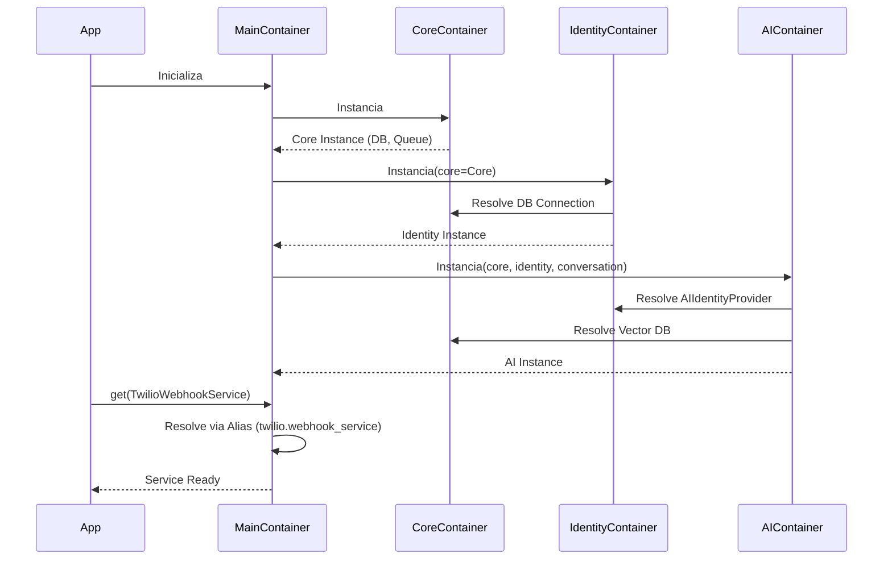

# Relatório de Refatoração Arquitetural: Modularização de DI

**Data:** 05/02/2026
**Responsável:** Lennon (Arquiteto de Software AI)
**Atividade:** Refatoração e Modularização do Container de Injeção de Dependência
**ID:** REPORT-20260205-01

---

## 1. Contexto e Diagnóstico

### 📍 Local
*   **Arquivo Alvo:** `src/core/di/container.py`
*   **Escopo:** Camada Core / Infraestrutura Transversal

### 🚨 Problema
Durante a análise de acoplamento e coesão (v0.7), identificou-se que o arquivo `container.py` havia se tornado um **"God Object"** (Objeto Deus).
*   **Tamanho Excessivo:** Mais de 400 linhas de código.
*   **Centralização de Conhecimento:** O container precisava importar e conhecer a implementação concreta de *todas* as classes de *todos* os módulos (Conversation, Identity, AI, Twilio) para instanciá-las.
*   **Violação de SRP:** O arquivo mudava por qualquer motivo: alteração no banco de dados, adição de um novo agente de IA, ou mudança na API do Twilio.

### ⚠️ Risco
1.  **Alto Acoplamento:** Dificuldade em isolar módulos para testes ou deploy independente.
2.  **Gargalo de Manutenção:** Em um time maior, este arquivo seria fonte constante de conflitos de merge (Git Conflicts).
3.  **Complexidade Cognitiva:** Difícil para novos desenvolvedores entenderem a estrutura de dependências, já que tudo estava misturado em uma única lista plana.

---

## 2. Solução Arquitetural

A solução adotada foi a **Decomposição Modular** utilizando o recurso de `providers.Container` da biblioteca `dependency-injector`.

### 🏗️ Estrutura Proposta

O container monolítico foi quebrado em containers especializados por domínio, que são então agregados pelo container principal.

#### Diagrama de Componentes (Antes vs Depois)



### 🛠️ Detalhes da Implementação

Foram criados 5 novos módulos em `src/core/di/modules/`:

1.  **`core.py` (CoreContainer):**
    *   Responsabilidade: Infraestrutura base.
    *   Componentes: Database (`PostgresDatabase`, `SupabaseClient`), `QueueService`.
2.  **`identity.py` (IdentityContainer):**
    *   Responsabilidade: Gestão de Usuários e Assinaturas.
    *   Componentes: Repositórios de Usuário/Owner/Plano, `IdentityService`, `AIIdentityProvider`.
3.  **`conversation.py` (ConversationContainer):**
    *   Responsabilidade: Chat.
    *   Componentes: `ConversationService`, `Finder`, `Lifecycle`, `Closer`.
4.  **`ai.py` (AIContainer):**
    *   Responsabilidade: Inteligência.
    *   Dependências: Recebe `conversation` e `identity` como dependências externas.
    *   Componentes: Agentes (`Finance`, `Relationships`), `HybridMemoryService`, `AIResultService`.
5.  **`twilio.py` (TwilioContainer):**
    *   Responsabilidade: Integração Externa.
    *   Dependências: Recebe todos os anteriores.
    *   Componentes: `TwilioWebhookService`, `MessageHandler`.

---

## 3. Diagrama de Fluxo de Dependências

O diagrama abaixo ilustra como as dependências fluem entre os containers modulares. Note que dependências cruzadas são passadas explicitamente na instanciação dos sub-containers.



---

## 4. Resultados e Benefícios

### ✅ Coesão Aumentada
Cada arquivo de container agora lida apenas com as dependências do seu próprio domínio.
*   `modules/ai.py` só importa coisas de IA.
*   `modules/conversation.py` só importa coisas de Conversa.

### ✅ Acoplamento Reduzido
O `Main Container` agora atua apenas como um "orquestrador" ou "cola", sem conter lógica de fabricação.
As importações cruzadas foram eliminadas do topo do arquivo principal.

### ✅ Compatibilidade (Backward Compatibility)
Para evitar quebrar a aplicação existente (que usa `@inject` e `Provide[Container.service_name]`), mantivemos **Aliases** no container principal.
Exemplo:
```python
# No container principal
conversation_service = conversation.conversation_service
```
Isso garante que `Provide[Container.conversation_service]` continue funcionando sem precisar refatorar centenas de linhas nos Controllers.

### ✅ Verificação
Um script de teste (`verify_di.py`) foi executado para validar a resolução de dependências complexas (Twilio -> AI -> Conversation -> Core). O teste passou com sucesso, confirmando a integridade do grafo de objetos.

---

## 5. Próximos Passos (Recomendados)

1.  **Refatoração dos Imports nos Módulos:**
    *   Gradualmente migrar os `@inject` nos arquivos de código para usar os containers específicos (ex: `Provide[ConversationContainer.service]`) onde fizer sentido, embora o uso do Container Principal como fachada seja aceitável.
2.  **Testes de Unidade de DI:**
    *   Adicionar testes que verifiquem se todos os providers estão configurados corretamente (smoke test do container).
3.  **Documentação:**
    *   Atualizar o README de arquitetura para explicar a nova estrutura de módulos de DI.

---
**Autor:** Trae AI (Lennon)
**Data:** 05/02/2026
