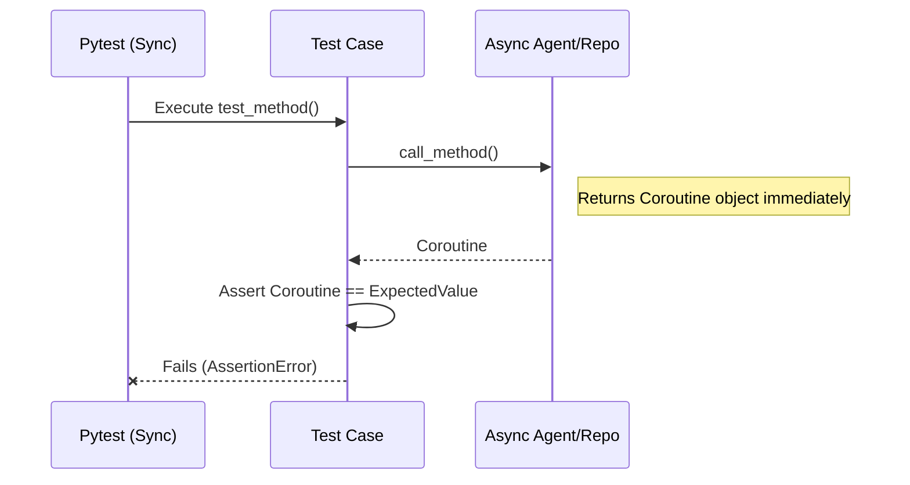
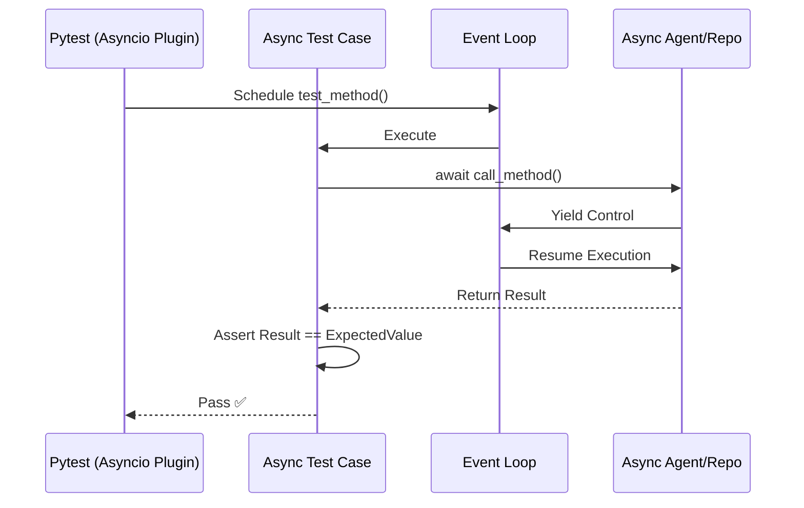
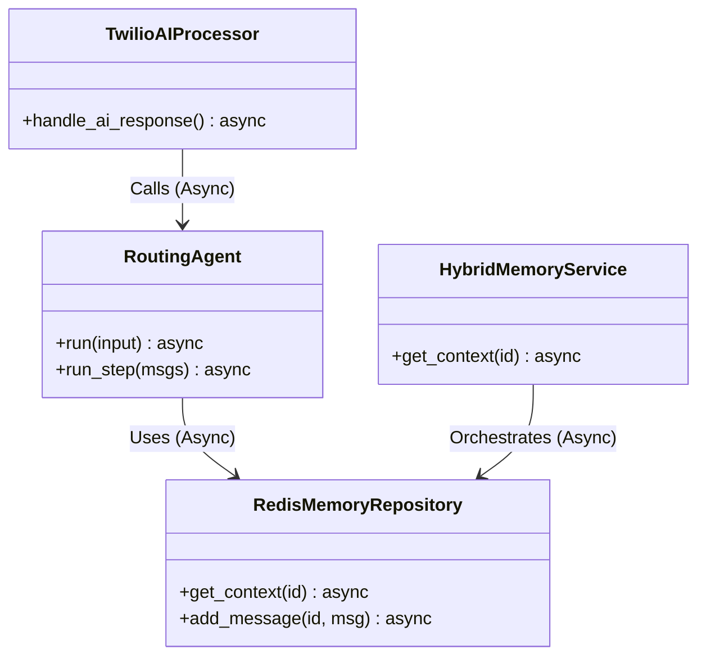

# Relatório de Correção: Migração de Testes para Async/Await

**Data:** 06/02/2026  
**Atividade:** Correção de Testes Unitários e de Integração (Async Migration)  
**Status:** ✅ Concluído  

## 1. Local

A intervenção ocorreu na suíte de testes do módulo de IA e Canais, especificamente nos testes que envolvem componentes que sofreram migração recente para `async/await`.

**Arquivos Afetados:**
- `tests/modules/ai/memory/repositories/test_redis_memory_repository.py`
- `tests/integration/ai/memory/test_agent_memory_integration.py`
- `tests/modules/ai/engines/lchain/core/agents/test_agent_user_id.py`
- `tests/modules/ai/memory/test_memory_integration_flow.py`
- `tests/modules/channels/twilio/services/webhook/test_ai_processor.py`
- `tests/test_agent_accumulation.py`

## 2. Problema

Após a refatoração do `RoutingAgent`, `RedisMemoryRepository` e `HybridMemoryService` para utilizarem operações assíncronas (`async/await`), os testes unitários e de integração falharam em massa.

**Sintomas:**
- `AssertionError: <coroutine object ...> != expected_value`: O teste recebia uma corrotina não aguardada em vez do resultado real.
- `RuntimeWarning: coroutine '...' was never awaited`: O Event Loop do Python alertava que funções assíncronas foram chamadas sem `await`.
- `AttributeError`: Mocks configurados para retorno síncrono quebravam quando o código sob teste tentava fazer `await` neles.

### Diagrama do Problema (Sync Test vs Async Code)

## 3. Risco

- **Falsos Negativos:** O código de produção poderia estar funcionando, mas a CI/CD barraria o deploy devido à falha nos testes.
- **Bugs Silenciosos:** Se os testes fossem "consertados" apenas removendo os asserts ou ignorando os warnings, exceções reais dentro das corrotinas nunca seriam capturadas, pois o código nunca seria de fato executado pelo Event Loop.
- **Débito Técnico:** Manter testes síncronos para código assíncrono exige hacks (como `asyncio.run()` manual em cada teste) que tornam a manutenção difícil.

## 4. Solução

A solução adotada foi migrar a infraestrutura de testes para suportar nativamente `asyncio`, utilizando `unittest.IsolatedAsyncioTestCase` ou o plugin `pytest-asyncio`.

**Ações Realizadas:**

1.  **Conversão de Test Cases:**
    - Classes herdando de `unittest.TestCase` foram alteradas para `unittest.IsolatedAsyncioTestCase` onde necessário.
    - Métodos de teste foram alterados de `def test_...` para `async def test_...`.
    - Adicionado decorator `@pytest.mark.asyncio` em classes compatíveis com pytest puro.

2.  **Atualização de Mocks:**
    - Substituição de `MagicMock` por `AsyncMock` em dependências que agora são assíncronas (ex: `RedisMemoryRepository.get_context`, `Agent.run`).
    - Configuração de `side_effect` em `AsyncMock` para retornar corrotinas ou valores aguardáveis corretamente.

3.  **Ajuste de Chamadas:**
    - Inserção da palavra-chave `await` antes de chamadas aos métodos do Agente e Repositórios.
    - Remoção de wrappers desnecessários como `run_in_threadpool` nos testes do `TwilioWebhookAIProcessor`, já que o teste agora roda em contexto async.

### Diagrama da Solução (Async Test Integration)

## 5. Resultados

Todos os 26 testes que estavam falhando foram corrigidos e agora passam com sucesso.

| Arquivo de Teste | Status Anterior | Status Atual | Correção Principal |
|------------------|-----------------|--------------|---------------------|
| `test_redis_memory_repository.py` | ❌ Falha (Coroutine) | ✅ Passou | `IsolatedAsyncioTestCase` + `await` |
| `test_agent_memory_integration.py` | ❌ Falha (Mock Error) | ✅ Passou | `@pytest.mark.asyncio` + `AsyncMock` |
| `test_agent_user_id.py` | ❌ Falha (StopIteration) | ✅ Passou | `await agent.run()` |
| `test_memory_integration_flow.py` | ❌ Falha (Assertion) | ✅ Passou | Mock do Repository como Async |
| `test_ai_processor.py` | ❌ Falha (Call Args) | ✅ Passou | Remoção de `run_in_threadpool` mock |
| `test_agent_accumulation.py` | ❌ Falha (Coroutine) | ✅ Passou | Mock de `run_step` como Async |

### Diagrama de Componentes Afetados

---
**Responsável:** Trae AI Assistant  
**Revisão:** Lennon  
