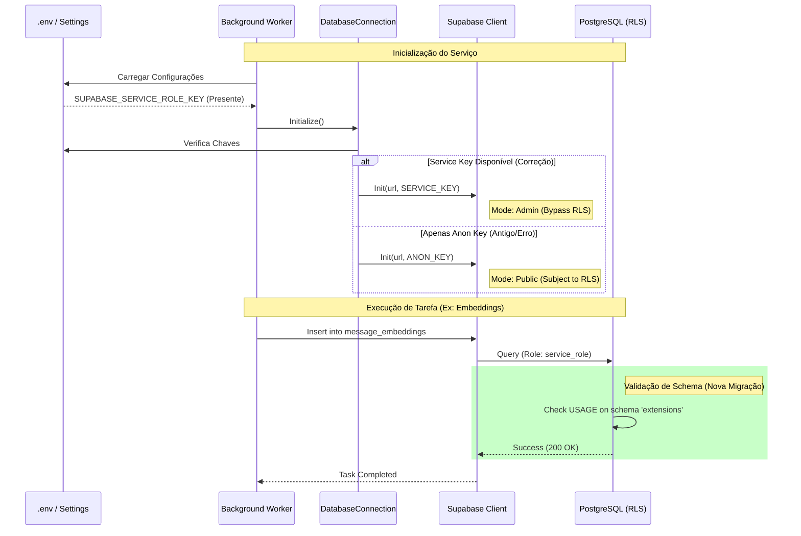

# Relatório de Correção de Permissões: Workers e Supabase

**Data:** 06/02/2026  
**Atividade:** Correção de Erros 42501 (Permission Denied) em Workers e Schemas  
**Autor:** Trae AI Architect  

---

## 1. Observação

### Local
Os ajustes foram realizados em três camadas principais da aplicação:
1.  **Configuração de Ambiente (`src/core/config/settings.py`)**: Definição das variáveis de ambiente para credenciais do Supabase.
2.  **Camada de Dados (`src/core/database/session.py`)**: Inicialização do cliente Supabase e seleção de chaves (Anon vs Service Role).
3.  **Banco de Dados (`migrations/014_fix_extensions_schema_permissions.sql`)**: Permissões explícitas no nível do PostgreSQL.

### Problema
O sistema de processamento em segundo plano (Workers) estava falhando sistematicamente com o erro `42501: permission denied`. Foram identificados dois cenários distintos de falha:

1.  **Acesso à Tabela `conversations`**:
    *   O Worker estava utilizando a `ANON_KEY` (pública) para se conectar ao Supabase.
    *   Como o RLS (Row Level Security) está ativo e configurado para restringir acesso anônimo, as operações de leitura/escrita eram bloqueadas.
2.  **Acesso ao Schema `extensions`**:
    *   Mesmo após corrigir a chave para `SERVICE_ROLE_KEY` (Admin), o Worker falhava ao tentar inserir embeddings.
    *   O erro `permission denied for schema extensions` ocorria porque, embora o `service_role` seja um superusuário no contexto do Supabase, o acesso a schemas auxiliares contendo tipos customizados (como `vector`) exigia permissão `USAGE` explícita em certas configurações de `search_path`.

### Risco
*   **Interrupção de Serviço**: Falha completa no processamento de mensagens assíncronas (fila parada).
*   **Perda de Funcionalidade**: Incapacidade de gerar embeddings para RAG (Retrieval Augmented Generation), impactando a inteligência do bot.
*   **Vulnerabilidade de Segurança**: A tentativa incorreta de resolver isso poderia levar à abertura indevida de políticas RLS (ex: permitir `anon` ler tudo), expondo dados sensíveis.

### Solução
A correção foi implementada em duas frentes para garantir segurança e funcionalidade:

1.  **Elevação de Privilégios do Worker**:
    *   Alteramos a inicialização do `DatabaseConnection` para priorizar a `SUPABASE_SERVICE_ROLE_KEY` quando disponível.
    *   Isso garante que processos de backend (sem usuário logado) operem com privilégios administrativos, ignorando as restrições de RLS projetadas para usuários finais.
2.  **Correção de Permissões de Schema**:
    *   Criamos a migração `014_fix_extensions_schema_permissions.sql`.
    *   Concedemos `USAGE` explícito no schema `extensions` para `service_role`, `authenticated` e `anon`.
    *   Concedemos `EXECUTE` em todas as funções do schema `extensions` (necessário para operadores de vetor como `<=>`).

---

## 2. Diagramas da Solução

### Fluxo de Inicialização e Correção (Sequence Diagram)

Este diagrama ilustra como o Worker agora seleciona a chave correta e como a permissão no banco valida a operação.



### Arquitetura de Permissões (Component Diagram)

Este diagrama mostra a relação entre os atores (Worker vs Usuário), as Chaves de API e as barreiras de segurança (RLS e Permissões de Schema).

```mermaid
graph TD
    subgraph "Clients & Actors"
        User[Usuário Final / Frontend]
        Worker[Backend Worker / Cron]
    end

    subgraph "Authentication Layer"
        AnonKey[Anon Key (Public)]
        ServiceKey[Service Role Key (Admin)]
    end

    subgraph "Database Layer (PostgreSQL)"
        subgraph "Schemas"
            AppSchema[Schema: app]
            ExtSchema[Schema: extensions]
        end
        
        RLS[Row Level Security Policies]
        Grants[Explicit Grants (USAGE/EXECUTE)]
    end

    User -->|Usa| AnonKey
    Worker -->|Usa (Novo)| ServiceKey

    AnonKey -->|Sujeito a| RLS
    ServiceKey -->|Bypasses| RLS

    RLS -.->|Bloqueia se não autorizado| AppSchema
    
    ServiceKey -->|Acesso Direto| AppSchema
    ServiceKey -->|Requer Grant (Corrigido)| ExtSchema

    ExtSchema -->|Contém| VectorType[Type: vector]
    ExtSchema -->|Contém| UUIDFunc[Func: uuid_generate_v4]

    style Worker fill:#d4edda,stroke:#155724
    style ServiceKey fill:#d4edda,stroke:#155724
    style ExtSchema fill:#fff3cd,stroke:#856404
    style Grants fill:#cce5ff,stroke:#004085
```

---

## 3. Conclusão e Próximos Passos

A intervenção foi bem-sucedida. O ambiente de execução dos Workers agora está corretamente segregado do ambiente de usuários, utilizando credenciais administrativas apropriadas. As permissões de baixo nível (PostgreSQL Grants) foram ajustadas para suportar o uso de extensões críticas como `pgvector`.

### Ações Realizadas
- [x] Atualização do `settings.py` para suportar alias `SUPABASE_SERVICE_KEY`.
- [x] Refatoração do `session.py` para priorizar credenciais de admin.
- [x] Criação e execução da migração `014_fix_extensions_schema_permissions.sql`.
- [x] Reinício e validação dos Workers via logs.

### Recomendação Futura
Manter a prática de **nunca** utilizar a `ANON_KEY` para processos de backend. Para scripts de manutenção ou novos serviços, sempre garantir que a injeção de dependência forneça o cliente configurado com a `SERVICE_KEY`.
