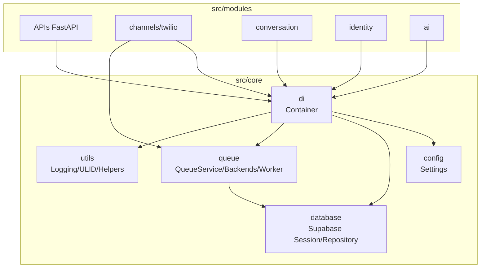
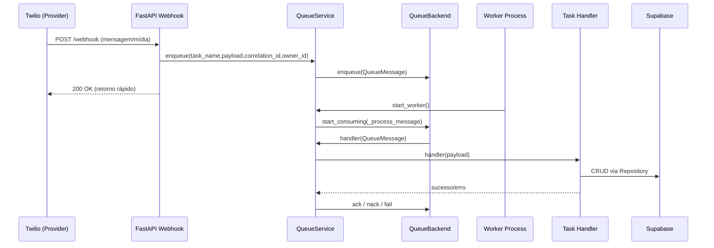
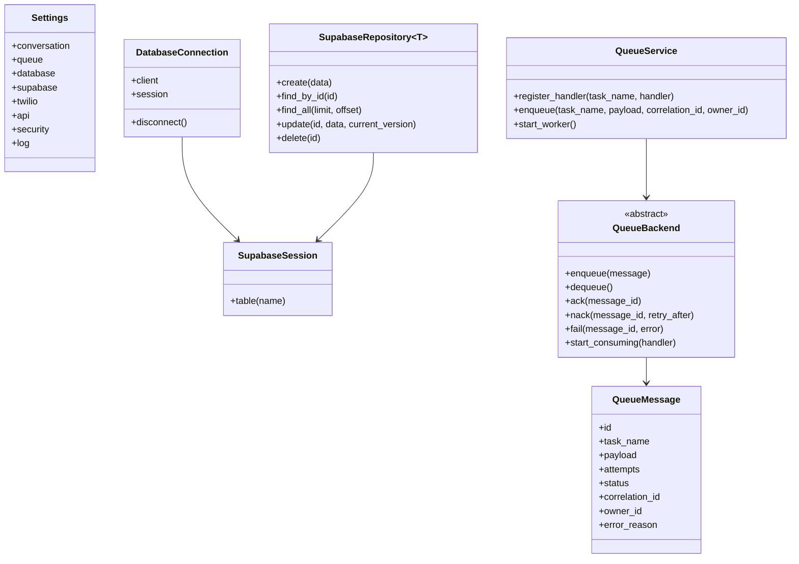

# Análise Completa do Módulo `src/core`

Escopo: [src/core](file:///Users/lennon/projects/ai_engineering/whatsapp_twilio_ai/src/core)  
Data: 2026-01-30

## Visão Geral

O `src/core` concentra as fundações técnicas do projeto: configuração tipada, conexão com banco (Supabase), injeção de dependências, infraestrutura de fila/worker e utilitários (logging/ULID/helpers). A separação em pacotes é boa e cria uma base escalável, porém existem alguns riscos relevantes de previsibilidade (efeitos colaterais em imports), segurança (defaults sensíveis) e observabilidade (prints e políticas hardcoded na fila).

### Mapa de Responsabilidades (alto nível)

| Pacote | Responsabilidade | Arquivos-chave |
|---|---|---|
| `config/` | Settings e variáveis de ambiente (Pydantic) | [settings.py](file:///Users/lennon/projects/ai_engineering/whatsapp_twilio_ai/src/core/config/settings.py) |
| `database/` | Sessão/conexão e base de Repository Pattern | [session.py](file:///Users/lennon/projects/ai_engineering/whatsapp_twilio_ai/src/core/database/session.py), [supabase_repository.py](file:///Users/lennon/projects/ai_engineering/whatsapp_twilio_ai/src/core/database/supabase_repository.py) |
| `di/` | Composição do grafo de dependências | [container.py](file:///Users/lennon/projects/ai_engineering/whatsapp_twilio_ai/src/core/di/container.py) |
| `queue/` | Infra de tarefas assíncronas e backends plugáveis | [service.py](file:///Users/lennon/projects/ai_engineering/whatsapp_twilio_ai/src/core/queue/service.py), [interfaces.py](file:///Users/lennon/projects/ai_engineering/whatsapp_twilio_ai/src/core/queue/interfaces.py), [worker.py](file:///Users/lennon/projects/ai_engineering/whatsapp_twilio_ai/src/core/queue/worker.py) |
| `utils/` | Logging estruturado, ULID, helpers | [logging.py](file:///Users/lennon/projects/ai_engineering/whatsapp_twilio_ai/src/core/utils/logging.py), [custom_ulid.py](file:///Users/lennon/projects/ai_engineering/whatsapp_twilio_ai/src/core/utils/custom_ulid.py), [helpers.py](file:///Users/lennon/projects/ai_engineering/whatsapp_twilio_ai/src/core/utils/helpers.py) |

## Diagramas (Mermaid)

### Componentes (Core x Modules)

### Sequência (Webhook → Enfileirar → Worker → Handler)

### Estruturas (Dados/Classes principais)

## Avaliação por Pacote

### `config/`

**Conformidade**
- Boa: Settings tipados e organizados por domínio via `BaseSettings` e `env_prefix` ([settings.py](file:///Users/lennon/projects/ai_engineering/whatsapp_twilio_ai/src/core/config/settings.py)).
- Parcial: o `load_dotenv()` é executado no import (efeito colateral) e `Settings` também define `env_file=".env"`, gerando fonte dupla/duplicada de configuração.

**Pontos fortes**
- Tipagem e centralização: fácil rastrear e evoluir configurações por responsabilidade (`queue`, `supabase`, `whisper`, etc.).
- `extra="ignore"` reduz fragilidade quando o `.env` tem chaves a mais.

**Pontos fracos**
- Efeito colateral em import (linha 11): dificulta previsibilidade em testes e ferramentas.
- `SecuritySettings.secret_key` tem default inseguro (`change-me-in-production`) ([settings.py](file:///Users/lennon/projects/ai_engineering/whatsapp_twilio_ai/src/core/config/settings.py#L110-L121)).

**Risco**
- Alto (segurança): rodar em produção com `secret_key` default compromete autenticação/token.
- Médio (manutenção): configuração carregada “cedo” torna comportamento mais difícil de depurar e controlar por ambiente.

**Oportunidades**
- Aplicar “guard-rail” por ambiente: falhar/alertar em `production` se `secret_key` estiver default.
- Escolher uma única estratégia de carregamento (`env_file` do Pydantic OU `load_dotenv`), evitando duplicação e efeitos colaterais.

### `database/`

**Conformidade**
- Boa: há separação entre contrato (`IDatabaseSession`) e implementação (`SupabaseSession`) ([interface.py](file:///Users/lennon/projects/ai_engineering/whatsapp_twilio_ai/src/core/database/interface.py), [session.py](file:///Users/lennon/projects/ai_engineering/whatsapp_twilio_ai/src/core/database/session.py)).
- Parcial: `DatabaseConnection` é singleton e ainda existe `db = DatabaseConnection()` global (side effect) ([session.py](file:///Users/lennon/projects/ai_engineering/whatsapp_twilio_ai/src/core/database/session.py#L80-L92)). Além disso, `src/core/utils/__init__.py` reexporta `db`/`DatabaseConnection` e incentiva imports com efeitos colaterais ([utils/__init__.py](file:///Users/lennon/projects/ai_engineering/whatsapp_twilio_ai/src/core/utils/__init__.py#L1-L7)).

**Pontos fortes**
- `SupabaseRepository` padroniza CRUD e adiciona validação ULID ([supabase_repository.py](file:///Users/lennon/projects/ai_engineering/whatsapp_twilio_ai/src/core/database/supabase_repository.py)).
- Suporte a “optimistic locking” simples via `current_version` no `update` (incremento e filtro por versão).

**Pontos fracos**
- Conexão inicializada no import torna testes e bootstrap mais frágeis (principalmente se `SUPABASE_URL/KEY` faltarem).
- Mistura de estilos de logging: `database/session.py` usa `logging.getLogger` enquanto o restante do core usa `structlog` via `get_logger()`.
- Existem implementações alternativas (`postgres_repository.py`, `sqlalchemy_repository.py`) que parecem “reserva”; se não forem usadas, aumentam custo cognitivo.

**Risco**
- Alto (operacional/testes): import involuntário pode derrubar processos de CLI/worker se env não estiver completo.
- Médio (evolução): várias opções de repositório sem uma política clara podem levar a divergências arquiteturais.

**Oportunidades**
- Deixar lifecycle do DB exclusivamente com o DI (remover `db = DatabaseConnection()` global e evitar reexport no `utils/__init__.py`).
- Padronizar logging no pacote `database` para reduzir atrito na observabilidade.

### `di/`

**Conformidade**
- Boa: uso de `dependency_injector` e providers (`Singleton`, `Factory`) é consistente para composição ([container.py](file:///Users/lennon/projects/ai_engineering/whatsapp_twilio_ai/src/core/di/container.py)).
- Parcial: `container.py` importa muitos módulos de features; isso aumenta tempo de import e risco de ciclos de import (especialmente em Python).

**Pontos fortes**
- Visibilidade do grafo: o projeto tem um “mapa único” de composição de serviços/repositórios.
- `wiring_config` explicita pontos de integração com API e workers.

**Pontos fracos**
- Arquivo grande e altamente acoplado às features; tende a crescer continuamente.
- Fábricas para serviços que registram handlers por efeito colateral (ex.: `TwilioWebhookService` instanciado para registrar tarefas) tornam o boot menos explícito ([worker.py](file:///Users/lennon/projects/ai_engineering/whatsapp_twilio_ai/src/core/queue/worker.py#L24-L31)).

**Risco**
- Médio: circular imports e boot order frágil conforme novas features entram.
- Médio: inicialização por “efeitos colaterais” dificulta manutenção e testes (ex.: instanciar apenas para registrar handler).

**Oportunidades**
- Modularizar o container por domínio (ex.: `container_identity.py`, `container_ai.py`, `container_twilio.py`) e compor no `Container` principal.
- Tornar registro de handlers explícito (um “registry” dedicado) para eliminar efeitos colaterais.

### `queue/`

**Conformidade**
- Boa: abstração `QueueBackend` permite alternar transporte (sqlite/redis/bullmq/sqs) sem alterar produtores/consumidores ([interfaces.py](file:///Users/lennon/projects/ai_engineering/whatsapp_twilio_ai/src/core/queue/interfaces.py)).
- Parcial: política de retry/backoff e logs do loop de consumo são hardcoded e usam `print()` no core ([interfaces.py](file:///Users/lennon/projects/ai_engineering/whatsapp_twilio_ai/src/core/queue/interfaces.py#L61-L86)).

**Pontos fortes**
- Estrutura simples e efetiva: `QueueService.enqueue()` + `register_handler()` + `start_worker()` ([service.py](file:///Users/lennon/projects/ai_engineering/whatsapp_twilio_ai/src/core/queue/service.py)).
- `QueueMessage` suporta metadados (`correlation_id`, `owner_id`) para rastreabilidade, já previsto no modelo ([models.py](file:///Users/lennon/projects/ai_engineering/whatsapp_twilio_ai/src/core/queue/models.py#L8-L23)).
- Backends cobrem cenários locais (sqlite) e produção (SQS/BullMQ).

**Pontos fracos**
- Observabilidade: `print()` no loop, enquanto o restante do projeto usa logging estruturado.
- Retry: `MAX_RETRIES=3` e backoff fixo reduzem flexibilidade por ambiente e dificultam tuning.
- Semântica de ID no SQS: `QueueMessage.id` é sobrescrito pelo `ReceiptHandle` para permitir `ack()`, misturando identidade de domínio com identificador de transporte ([sqs.py](file:///Users/lennon/projects/ai_engineering/whatsapp_twilio_ai/src/core/queue/backends/sqs.py#L95-L105)).
- BullMQ: `start_consuming` bloqueia em `Event().wait()` sem mecanismo de stop explícito (depende de cancelamento) ([bullmq.py](file:///Users/lennon/projects/ai_engineering/whatsapp_twilio_ai/src/core/queue/backends/bullmq.py#L123-L135)).

**Risco**
- Médio (prod): tuning inadequado de retry/backoff pode causar tempestade de reprocessamento ou “silêncio” excessivo.
- Médio (debug): falta de logs estruturados/labels dificulta correlacionar eventos ponta-a-ponta.
- Baixo a médio (arquitetura): hacks no SQS podem confundir métricas/telemetria e auditoria.

**Oportunidades**
- Tornar retry/backoff configuráveis em `settings.queue` e trocar `print()` por `get_logger()` com `correlation_id/owner_id`.
- Separar identidade do “job” (id interno) do identificador de ACK no SQS (ex.: `ack_token` no modelo ou metadata), removendo o overload do `id`.
- Adicionar suporte a “graceful shutdown” (cancelamento + limpeza) consistente entre backends.

### `utils/`

**Conformidade**
- Boa: logging estruturado (structlog) com renderer diferente por ambiente ([logging.py](file:///Users/lennon/projects/ai_engineering/whatsapp_twilio_ai/src/core/utils/logging.py)).
- Parcial: `utils/__init__.py` reexporta `db` e `DatabaseConnection` (acopla utilitário com infraestrutura de DB e amplia risco de import side effects) ([utils/__init__.py](file:///Users/lennon/projects/ai_engineering/whatsapp_twilio_ai/src/core/utils/__init__.py)).

**Pontos fortes**
- `ColoredConsoleRenderer` melhora DX em dev e mantém JSON em prod (bom para observabilidade).
- `custom_ulid.py` oferece utilitários completos e coesos (validação, geração, timestamp).

**Pontos fracos**
- `helpers.py` mistura infraestrutura (download de mídia Twilio) com domínio (`User`) e inclui resposta mock `generate_response()`, o que tende a virar “lixeira” de utilidades ([helpers.py](file:///Users/lennon/projects/ai_engineering/whatsapp_twilio_ai/src/core/utils/helpers.py#L76-L92)).
- `download_media()` usa `requests` (bloqueante). Se for chamado em contexto async/worker concorrente, pode prejudicar throughput.
- Downloads são gravados em diretório fixo `downloads/` e não existe política explícita de limpeza.

**Risco**
- Médio (performance): chamadas bloqueantes podem degradar serviços async.
- Médio (manutenção): helpers em `core/utils` viram dependência global, aumentando acoplamento entre domínios.

**Oportunidades**
- Mover helpers Twilio para o módulo de canal (`src/modules/channels/twilio/...`) e manter `core/utils` apenas para utilidades genéricas.
- Introduzir estratégia de cleanup/TTL para downloads temporários (especialmente para mídia e transcrição).

## Conclusão (Síntese)

**O `src/core` está bem estruturado** como infraestrutura transversal, com escolhas sólidas: settings tipados, DI explícito, fila plugável e logging estruturado. **Os principais pontos de atenção** são: (1) efeitos colaterais em import (`load_dotenv()` e `db = DatabaseConnection()`), (2) defaults sensíveis em segurança, e (3) políticas operacionais hardcoded/sem logs estruturados na fila.

### Recomendações Prioritárias (alto impacto)

1) **Endurecer segurança em produção**: impedir `secret_key` default em `production`.  
2) **Remover side effects em import**: DB e dotenv sob lifecycle do DI e entrypoints (API/Worker).  
3) **Observabilidade e tuning da fila**: logs estruturados e retry/backoff configuráveis por ambiente.  
4) **Desacoplar `core/utils` do domínio Twilio**: mover helpers e remover mock `generate_response()`.  

