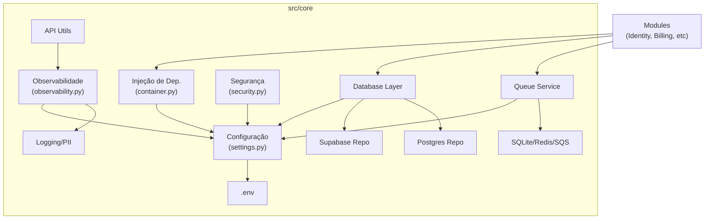
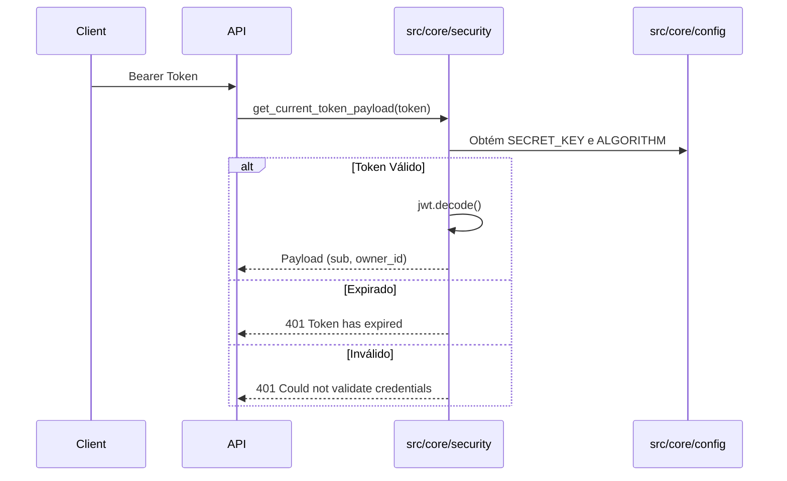

# Análise de Conformidade - Módulo Core (`src/core`)

**Data:** 2026-02-06
**Responsável:** Trae AI Assistant
**Contexto:** Módulo central (Kernel) da aplicação, fornecendo infraestrutura transversal (DI, Config, Logs, DB, Queue).

---

## 1. Sumário Executivo

O módulo `src/core` apresenta uma arquitetura madura e bem estruturada, atuando corretamente como um *Shared Kernel* para a aplicação. Destaca-se pela forte adesão a boas práticas de **Observabilidade** (OpenTelemetry + Structlog com Redação de PII) e **Configuração** (Pydantic Settings).

A infraestrutura de **Injeção de Dependência** é centralizada e robusta, embora o container principal (`di/container.py`) esteja crescendo em complexidade. O padrão de repositório está em transição ou suporta modo híbrido (Supabase via REST vs Postgres direto), o que traz flexibilidade mas também ambiguidade arquitetural.

A segurança é tratada com seriedade (validação de secrets em prod, mascaramento de dados), mas a implementação manual de JWT (`security.py`) merece revisão para garantir alinhamento com padrões modernos (OIDC/OAuth2 completos).

**Veredito:** O módulo é sólido, seguro e observável, necessitando apenas de refatorações pontuais para reduzir dívida técnica em DI e clarificar a estratégia de banco de dados.

---

## 2. Mapa de Responsabilidades

---

## 3. Avaliação por Categorias

### ✅ Arquitetura
*   **Status:** Conforme
*   **Justificativa:** Organização clara em camadas transversais (`di`, `database`, `config`). Uso consistente de Injeção de Dependência.
*   **Pontos de Atenção:**
    *   `src/core/di/container.py` atua como um *God Object*, conhecendo todos os módulos. Considere quebrar em containers menores por domínio (já iniciado com `IdentityContainer`, etc., mas a agregação central ainda é pesada).
    *   Coexistência de `SupabaseRepository` (REST) e `PostgresRepository` (SQL) requer governança para evitar uso inconsistente.

### 🔒 Segurança
*   **Status:** Conforme (com ressalvas)
*   **Justificativa:**
    *   **Pontos Fortes:** `PIIMaskingProcessor` em `logging.py` é excelente para LGPD/GDPR. Validação de `SECRET_KEY` em produção impede deploys inseguros.
    *   **Riscos:** Implementação manual de JWT em `security.py` (embora use `pyjwt`) aumenta a superfície de ataque comparado a usar serviços gerenciados ou bibliotecas de alto nível de Auth. Validação de `SECRET_KEY` no `field_validator` tem limitações de acesso ao contexto (`environment`).

### 💎 Qualidade de Código
*   **Status:** Conforme
*   **Justificativa:**
    *   Uso extensivo de **Type Hints**.
    *   **Docstrings** presentes na maioria das classes e funções.
    *   Uso de `warnings.warn` para depreciação (`base_repository.py`) demonstra cuidado com evolução da API.
    *   Testes unitários (`tests/core`) usam `pytest` e `mock` adequadamente.

### 🚀 Performance
*   **Status:** Parcial
*   **Justificativa:**
    *   `SupabaseRepository` opera via HTTP (REST), o que adiciona latência comparado a conexões TCP diretas (Postgres). Para alta carga, isso pode ser um gargalo.
    *   `QueueService` suporta Redis/SQS, o que garante escalabilidade assíncrona.
    *   Logs estruturados em JSON (Prod) são eficientes para ingestão.

### 📡 Observabilidade
*   **Status:** Excelente
*   **Justificativa:** Implementação de referência.
    *   **Tracing:** OpenTelemetry configurado com exportador OTLP.
    *   **Logging:** Structlog com renderização condicional (Cores em Dev, JSON em Prod) e filtro de PII.
    *   **Métricas:** Hooks para instrumentação de FastAPI e HTTPX.

### 📦 Dependências
*   **Status:** Conforme
*   **Justificativa:**
    *   Uso de bibliotecas padrão de mercado (`pydantic-settings`, `structlog`, `opentelemetry`, `dependency-injector`).
    *   Abstração de backends de fila permite trocar libs sem quebrar contrato.

---

## 4. Destaques

### 💪 Pontos Fortes
1.  **Redação de PII:** O `PIIMaskingProcessor` é uma defesa proativa contra vazamento de dados sensíveis em logs.
2.  **Configuração Tipada:** O uso de `Pydantic` para `settings.py` garante que falhas de configuração sejam detectadas na inicialização (Fail Fast).
3.  **Flexibilidade de Infra:** O `QueueService` e a camada de Banco de Dados suportam múltiplos backends (SQLite/Redis/SQS, Supabase/Postgres), facilitando testes locais vs produção.

### ⚠️ Pontos Fracos
1.  **Complexidade do Container DI:** O arquivo `container.py` centraliza muitas importações, criando acoplamento entre o Core e todos os módulos de negócio.
2.  **Hardcoded Version:** A versão do serviço `"4.1.0"` está *hardcoded* em `observability.py`. Deveria vir do `pyproject.toml` ou `.env`.
3.  **Validação de IDs:** A lógica de validação híbrida (Int vs ULID) em `SupabaseRepository` adiciona complexidade cognitiva.

### 🔴 Riscos
1.  **Performance do Supabase Repo:** O uso exclusivo da interface REST do Supabase pode gerar latência em operações de *batch* ou *joins* complexos, além de risco de *Rate Limiting* da API do Supabase.

---

## 5. Diagramas Específicos

### Fluxo de Autenticação (JWT Manual)

---

## 6. Matriz de Priorização

| Item | Impacto | Esforço | Prioridade |
|------|---------|---------|------------|
| Remover versão hardcoded em `observability.py` | Baixo | Baixo | 🟢 Quick Win |
| Refatorar validação de `SECRET_KEY` para `model_validator` raiz | Médio | Baixo | 🟢 Quick Win |
| Padronizar estratégia de DB (Migrar queries críticas para SQL/PostgresRepo) | Alto | Alto | 🟡 Estrutural |
| Desacoplar `Container` principal (Inversão de dependência real) | Médio | Médio | 🟡 Estrutural |

---

## 7. Plano de Ação (Top 5)

1.  **Fix Version:** Ler versão da aplicação dinamicamente em `src/core/observability.py`.
2.  **Refatorar Settings:** Mover lógica de validação de segurança para o validador raiz em `Settings` para acesso limpo a `api.environment`.
3.  **Cleanup:** Remover/Arquivar `base_repository.py` se a depreciação já estiver consolidada, ou documentar o prazo de remoção.
4.  **Security Review:** Revisar Regex de mascaramento de telefone em `logging.py` para evitar falsos positivos em IDs numéricos longos (já há um comentário sobre isso no código).
5.  **Docs:** Adicionar Docstrings faltantes em `api/exception_handlers.py`.

---

## 8. Perguntas de Arquitetura (para discussão)

1.  **Estratégia de Banco de Dados:** A migração de `SupabaseRepository` (REST) para `PostgresRepository` (SQL) é um objetivo estratégico de curto prazo? Devemos congelar novas features no repositório REST?
2.  **Escalabilidade da DI:** O `Container` principal está centralizando o conhecimento de todos os módulos. Devemos adotar uma abordagem estritamente modular onde o container raiz apenas compõe os containers filhos, sem expor seus serviços internos diretamente?
3.  **Auth Provider:** Devemos manter a implementação manual de JWT ou migrar para o Supabase Auth (GoTrue) para delegar a gestão de segurança de tokens?

---

## 9. Nota Final

**Nota: 9.0 / 10**

O módulo `core` é um exemplo de robustez. As falhas apontadas são débitos técnicos naturais de um projeto em evolução, e não erros estruturais graves. A base é sólida para escalar.
