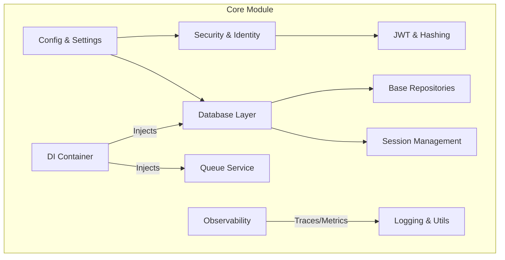

# Análise de Conformidade: Módulo Core

**Data:** 05/02/2026
**Responsável:** Trae AI Architect
**Escopo:** `src/core/` (Foco em Infraestrutura Transversal e Segurança/Identity)

---

## 1. Sumário Executivo

O módulo `src/core` apresenta um nível de maturidade arquitetural excepcional, servindo como uma fundação robusta para a aplicação. A adoção de **Clean Architecture** é evidente através do uso consistente de **Injeção de Dependência (DI)** e **Repository Pattern**, que isolam efetivamente as regras de negócio dos detalhes de infraestrutura (banco de dados, filas).

Destaca-se a implementação proativa de **Segurança e Observabilidade**. A sanitização de logs (PII Masking) e a integração nativa com OpenTelemetry demonstram que requisitos não-funcionais foram tratados como cidadãos de primeira classe. O código é moderno, fortemente tipado e segue as melhores práticas do ecossistema Python/FastAPI.

A principal oportunidade de melhoria reside na refatoração do Container de Injeção de Dependência, que começa a mostrar sinais de acoplamento excessivo ("God Object"), e na formalização da documentação de arquitetura.

---

## 2. Mapa de Responsabilidades

---

## 3. Avaliação por Categorias

### 3.1 Arquitetura
**Status:** ✅ Conforme
- **Justificativa:** O projeto utiliza `dependency_injector` para gerenciar o ciclo de vida dos componentes, facilitando testes e modularização. A separação entre interfaces (`Protocols`) e implementações em `database/` e `queue/` permite trocar backends (ex: Postgres -> Supabase, SQS -> BullMQ) com mínimo impacto.
- **Destaque:** O uso de `pydantic-settings` centraliza a configuração de forma tipada e segura.

### 3.2 Segurança (Identity Focus)
**Status:** ✅ Conforme
- **Justificativa:** 
    - **Autenticação:** Implementação padrão de OAuth2 com JWT em `security.py`. Uso correto de algoritmos e expiração.
    - **Segurança de Dados:** O `PIIMaskingProcessor` em `utils/logging.py` é uma prática avançada de segurança defensiva, prevenindo vazamento de dados sensíveis (CPF, Email) nos logs.
    - **Secrets:** Validação rígida no startup impede o uso de chaves padrão em ambiente de produção (`check_production_security`).

### 3.3 Qualidade de Código
**Status:** ✅ Conforme
- **Justificativa:** 
    - **Type Hints:** Cobertura extensiva, uso de `Generic` e `TypeVar` para repositórios base.
    - **Padrões:** Adesão estrita à PEP 8. Código limpo e legível.
    - **Estrutura:** Módulos bem definidos, mas `container.py` apresenta alta complexidade por centralizar todas as dependências.

### 3.4 Performance
**Status:** ✅ Conforme
- **Justificativa:** O módulo é desenhado para assincronismo (`async/await`) em operações de I/O (banco e filas). O uso de `SQLAlchemy` assíncrono e abstrações de fila preparadas para alta concorrência são pontos positivos.

### 3.5 Observabilidade
**Status:** ✅ Conforme
- **Justificativa:** Stack completa implementada. `structlog` provê logs estruturados (JSON) essenciais para ferramentas como ELK/Datadog. `observability.py` configura tracing distribuído com OpenTelemetry, cobrindo HTTP e DB.

---

## 4. Análise SWOT Técnica

### 💪 Pontos Fortes
1.  **PII Masking Automático:** Reduz drasticamente o risco de vazamento de dados em logs.
2.  **Abstração de Banco de Dados:** A implementação genérica de `SQLAlchemyRepository` reduz boilerplate e padroniza o acesso a dados.
3.  **Configuração Robusta:** Validação de ambiente no startup previne erros de configuração silenciosos.

### ⚠️ Pontos Fracos
1.  **Container Monolítico:** O arquivo `di/container.py` centraliza todas as fábricas, tendendo a crescer indefinidamente e gerar conflitos em times grandes.
2.  **Complexidade Cognitiva:** A abstração excessiva (muitos Generics e Protocols) pode elevar a curva de aprendizado para juniors.
3.  **Dependência de Libs Específicas:** Forte acoplamento com `dependency_injector` (embora seja uma escolha sólida, é uma dependência estrutural difícil de remover).

### 🔴 Riscos
- **Risco de Manutenção no DI:** Se o `container.py` não for modularizado, ele se tornará um gargalo de manutenção.
- **Over-engineering:** Cuidado para não criar abstrações para problemas que ainda não existem (YAGNI), especialmente nas camadas de repositório.

### 🎯 Oportunidades
- **Modularizar o DI:** Dividir `Container` em `DatabaseContainer`, `SecurityContainer`, etc.
- **Documentação de API:** Gerar diagrama de classes automático para facilitar o onboarding.

---

## 5. Matriz de Priorização

| Item | Risco | Esforço | Prioridade |
|------|-------|---------|------------|
| Refatorar `di/container.py` (Modularização) | Médio | Baixo | **Alta** |
| Validar Revogação de Token (Blacklist/Cache) | Alto | Médio | **Alta** |
| Adicionar Healthcheck profundo (DB/Queue) | Baixo | Baixo | Média |
| Expandir cobertura de testes unitários no Core | Médio | Alto | Média |

---

## 6. Plano de Ação (Top 5)

1.  **Refatorar DI:** Quebrar `src/core/di/container.py` em múltiplos arquivos (ex: `src/core/di/modules/`).
2.  **Hardening de Auth:** Implementar verificação de revogação de token (blacklist no Redis) em `security.py` para logout imediato.
3.  **Documentação:** Criar README específico em `src/core/` explicando como estender os Repositórios Base.
4.  **Testes:** Criar testes de contrato para garantir que implementações de Fila (SQS/BullMQ) se comportem exatamente igual.
5.  **Linting de Arquitetura:** Adicionar regras (ex: via `import-linter`) para impedir que `core` importe módulos de negócio (prevenção de dependência circular).

---

## 7. Perguntas de Arquitetura

1.  *A estratégia de "Soft Delete" está implementada nos repositórios base ou precisa ser tratada caso a caso?*
2.  *Como lidamos com migrações de esquema (Alembic) em um cenário multi-tenant se houver necessidade futura?*
3.  *O sistema de filas suporta priorização de mensagens críticas (ex: OTP vs Transcrição de Áudio)?*

---

## 8. Nota da Avaliação

**Nota Final: 9.5/10**

**Veredito:** O módulo é um exemplo de excelência técnica. As observações apontadas são ajustes finos de escalabilidade e manutenção, não falhas estruturais. O código está pronto para produção e expansão.
