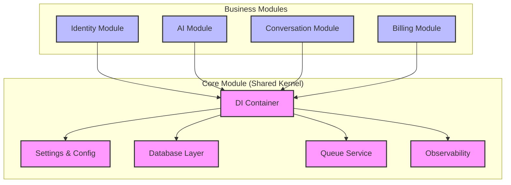
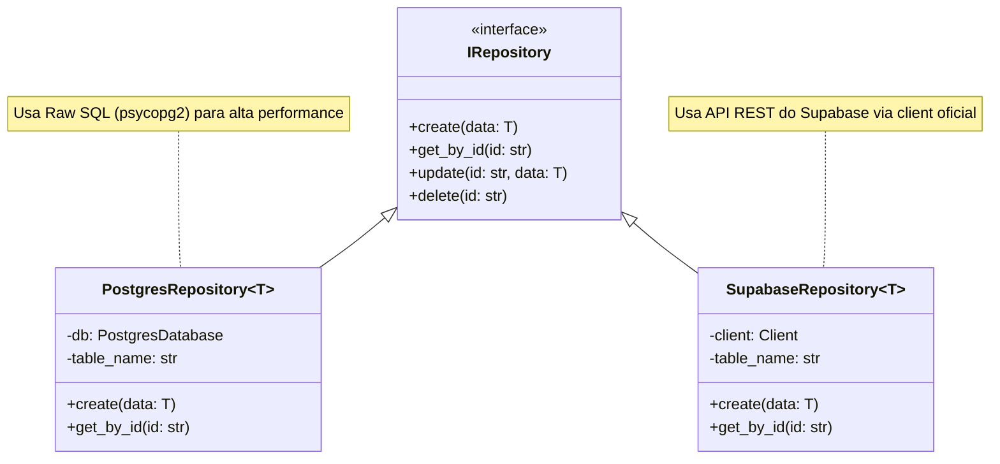
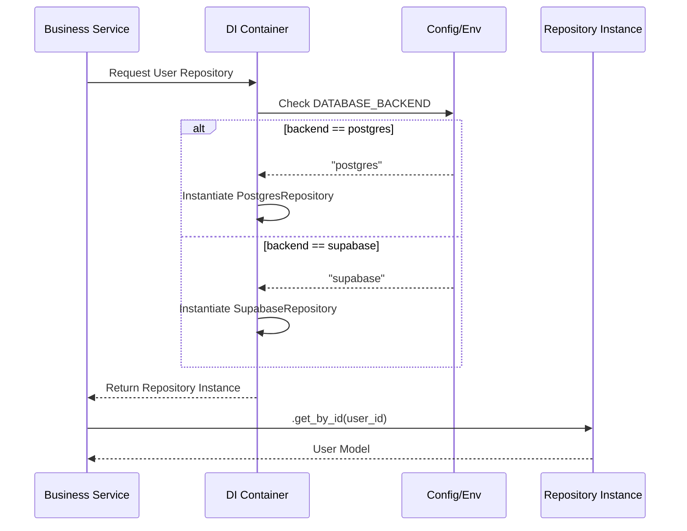

# Whatsapp Twilio AI - Core Module


## 📖 Descrição

O módulo **Core** atua como o *Shared Kernel* (Núcleo Compartilhado) de toda a arquitetura do projeto **Whatsapp Twilio AI**. Ele é responsável por fornecer a infraestrutura base, abstrações fundamentais e serviços transversais que suportam os módulos de negócio (Identity, AI, Conversation, Billing).

Seu objetivo é isolar a complexidade técnica (banco de dados, filas, configuração, injeção de dependência) para que os domínios de negócio possam focar em regras e lógica, seguindo os princípios da **Clean Architecture**.

---

## 📸 Preview


---

## 🧩 Arquitetura e Design

### Visão Geral (Component Diagram)

O diagrama abaixo ilustra como o módulo **Core** centraliza os serviços de infraestrutura e provê dependências para os demais módulos através do Container de Injeção de Dependência.



### Padrão de Repositório (Class Diagram)

O Core implementa um padrão de repositório híbrido e genérico, permitindo trocar o backend de persistência (Postgres vs Supabase) via configuração, sem alterar o código de negócio.



### Fluxo de Injeção de Dependência (Sequence Diagram)

Exemplo de como um serviço solicita uma dependência (ex: Repositório) e o Core resolve baseada na configuração (ENV).



---

## ✨ Funcionalidades Principais

*   **Injeção de Dependência (DI):** Gerenciamento centralizado do ciclo de vida dos objetos via `dependency-injector`.
*   **Abstração de Banco de Dados:** Suporte transparente para múltiplos backends (Postgres Local/Cloud e Supabase).
*   **Sistema de Filas Assíncronas:** Interface unificada para processamento em background (suporte a BullMQ/Redis, SQS e SQLite).
*   **Configuração Centralizada:** Gestão de variáveis de ambiente tipadas e validadas com Pydantic Settings.
*   **Observabilidade:** Configuração pronta para OpenTelemetry, Tracing e Logging estruturado (Structlog).
*   **Tratamento de Erros:** Handlers globais de exceção para padronização de respostas API.

---

## 🛠 Tecnologias Utilizadas

*   **Linguagem:** Python 3.12+
*   **Framework Web:** FastAPI
*   **Configuração:** Pydantic & Pydantic-Settings
*   **Injeção de Dependência:** Dependency Injector
*   **Banco de Dados:**
    *   `psycopg2-binary` (Postgres Raw)
    *   `supabase` (Supabase Client)
    *   `sqlalchemy` (ORM Support - opcional)
*   **Filas:** `bullmq` (Redis), `aiobotocore` (SQS)
*   **Observabilidade:** `opentelemetry-api`, `structlog`

---

## ✅ Pré-requisitos

Para rodar ou utilizar este módulo, você precisará de:

*   **Python 3.12+** instalado.
*   **Redis** (necessário se usar o backend de filas BullMQ).
*   **PostgreSQL** ou acesso a um projeto **Supabase**.
*   Arquivo `.env` configurado na raiz do projeto.

---

## 🚀 Instalação

1.  **Clone o repositório:**
    ```bash
    git clone https://github.com/seu-org/whatsapp-twilio-ai.git
    cd whatsapp-twilio-ai
    ```

2.  **Crie e ative o ambiente virtual:**
    ```bash
    python -m venv venv
    source venv/bin/activate  # Linux/Mac
    # ou
    .\venv\Scripts\activate  # Windows
    ```

3.  **Instale as dependências:**
    ```bash
    pip install -r requirements.txt
    ```

4.  **Configure o ambiente:**
    Copie o exemplo e ajuste as variáveis.
    ```bash
    cp .env.example .env
    ```

---

## 💻 Uso

O uso principal do Core é através do Container de Injeção de Dependência.

**Exemplo de uso em um script ou serviço:**

```python
from src.core.di.container import Container
from src.core.utils.logging import get_logger

logger = get_logger(__name__)

def main():
    # Inicializa o container
    container = Container()
    
    # Resolve um serviço (ex: Queue Service)
    queue_service = container.queue_service()
    
    # Usa o serviço
    logger.info("Enfileirando mensagem...")
    await queue_service.publish(
        queue_name="transcriptions",
        message={"audio_url": "http://...", "chat_id": "123"}
    )

if __name__ == "__main__":
    import asyncio
    asyncio.run(main())
```

---

## 📂 Estrutura de Pastas

```text
src/core/
├── api/                # Utilitários para API (Exception Handlers, Middlewares)
├── config/             # Configurações globais (Pydantic Settings)
├── database/           # Camada de abstração de dados (Repositories, Sessions)
├── di/                 # Módulos e Container de Injeção de Dependência
├── docs/               # Documentação específica do módulo
├── queue/              # Implementação de filas (Backends, Interfaces, Workers)
├── utils/              # Utilitários gerais (Logging, Helpers)
├── observability.py    # Configuração de Telemetria
└── security.py         # Utilitários de Segurança
```

---

## 🤝 Contribuição

1.  Faça um Fork do projeto.
2.  Crie uma Branch para sua Feature (`git checkout -b feature/MinhaFeature`).
3.  Commit suas mudanças (`git commit -m 'Add: Minha nova feature'`).
4.  Push para a Branch (`git push origin feature/MinhaFeature`).
5.  Abra um Pull Request.

---

## 📄 Licença

Distribuído sob a licença **MIT**. Veja `LICENSE` para mais informações.

---

## 📞 Contato

**Equipe de Engenharia**

*   **Lead Engineer / Autor:** Lennon
*   **Email:** lennonconstantino@gmail.com
*   **Time:** AI Engineering Team

---
*Documentação gerada automaticamente com auxílio de IA.*
