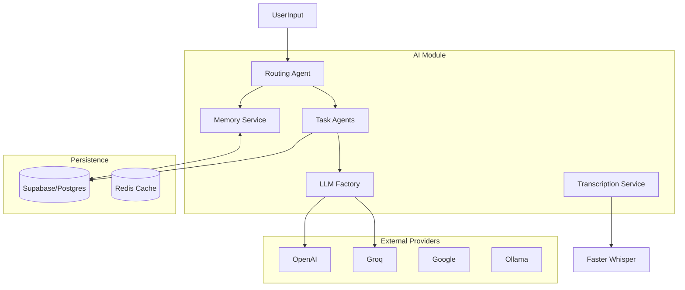
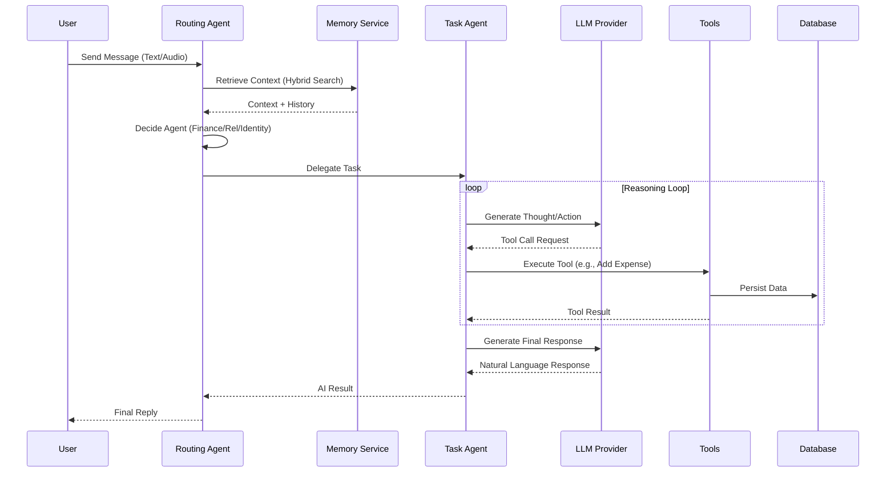

# Whatsapp Twilio AI Module


## Descrição

O **Whatsapp Twilio AI Module** é o núcleo de inteligência do sistema, responsável por processar interações naturais, orquestrar agentes autônomos e gerenciar o fluxo de conversação inteligente. Ele implementa uma arquitetura agnóstica a provedores de LLM, permitindo o uso fluido de modelos da OpenAI, Groq, Google e outros, com suporte robusto a memória de longo prazo e execução de ferramentas.

Este módulo não é apenas um wrapper de API, mas uma engine completa que gerencia identidade, contexto, memória híbrida (vetorial + relacional) e execução de tarefas complexas como gestão financeira e CRM pessoal.

## Preview

### Arquitetura de Componentes



### Fluxo de Execução



## Funcionalidades Principais

- **Agentes Especializados**: Sistema multi-agente com roteamento inteligente para domínios específicos (Financeiro, Relacionamento, Identidade).
- **Memória Híbrida**: Combinação de busca semântica (embeddings) e busca textual (full-text search) para recuperação precisa de contexto.
- **Abstração de LLM**: Interface unificada para múltiplos provedores (OpenAI, Groq, Google, Ollama) com suporte a *lazy loading*.
- **Transcrição Local**: Serviço de *Speech-to-Text* integrado usando `faster-whisper` para privacidade e velocidade.
- **Rastreabilidade (CoT)**: Logs detalhados de "Chain of Thought" para auditoria de raciocínio e debug de alucinações.
- **Tooling Extensível**: Framework simples para criação de ferramentas conectadas ao banco de dados ou APIs externas.

## Tecnologias Utilizadas

- **Linguagem**: Python 3.12+
- **Orquestração**: LangChain (Core)
- **LLMs**:
  - **OpenAI**: GPT-4o, GPT-4o-mini
  - **Groq**: Llama 3, DeepSeek
  - **Google**: Gemini 1.5
- **Banco de Dados**: PostgreSQL / Supabase (pgvector)
- **Áudio**: Faster-Whisper (CTranslate2)
- **Validação**: Pydantic v2
- **Logging**: Structlog (com redação de PII)

## Pré-requisitos

Para executar este módulo, o ambiente deve atender aos seguintes requisitos:

1.  **Python 3.12** ou superior.
2.  **FFmpeg** instalado (obrigatório para processamento de áudio).
    -   MacOS: `brew install ffmpeg`
    -   Linux: `sudo apt install ffmpeg`
3.  **Dependências Python** instaladas (ver `pyproject.toml` na raiz).
4.  **Variáveis de Ambiente** configuradas corretamente.

## Instalação

O módulo faz parte do monorepo. A instalação é feita na raiz do projeto:

```bash
# Na raiz do projeto
poetry install
```

Ou via pip:

```bash
pip install -r requirements.txt
```

Certifique-se de que o arquivo `.env` contenha as chaves necessárias:

```env
# LLM Providers
OPENAI_API_KEY=sk-...
GROQ_API_KEY=gsk_...
GOOGLE_API_KEY=...

# Database
SUPABASE_URL=https://xyz.supabase.co
SUPABASE_KEY=ey...

# AI Settings
DEFAULT_LLM_PROVIDER=openai
DEFAULT_MODEL_NAME=gpt-4o
```

## Uso

### Executando o Agente Principal

O `RoutingAgent` é o ponto de entrada principal. Ele decide automaticamente qual sub-agente deve tratar a solicitação.

```python
import asyncio
from src.modules.ai.engines.lchain.core.agents.routing_agent import RoutingAgent
from src.modules.ai.infrastructure.llm import models

async def main():
    # Inicializa o agente de roteamento
    agent = RoutingAgent(llm=models)

    # Simula uma entrada de usuário
    response = await agent.run(
        user_input="Gastei 50 reais no almoço hoje",
        user={"id": "user_123", "phone": "+5511999999999"}
    )

    print(f"Resposta: {response.content}")
    print(f"Pensamento: {response.thought_process}")

if __name__ == "__main__":
    asyncio.run(main())
```

### Usando o Serviço de Transcrição

```python
from src.modules.ai.services.transcription_service import TranscriptionService

service = TranscriptionService(model_size="base")
texto = service.transcribe("audio_mensagem.ogg")
print(texto)
```

## Estrutura de Pastas

A organização do módulo segue uma arquitetura limpa e modular:

```
src/modules/ai/
├── ai_result/          # Modelos e serviços para padronização de respostas
├── engines/
│   └── lchain/         # Implementação LangChain
│       ├── core/       # Agentes base, Tools genéricas, Interfaces
│       └── feature/    # Agentes especializados (Finance, Relationships)
├── infrastructure/     # Configuração de LLMs e serviços externos
├── memory/             # Implementação de Memória (Vector/Redis/Hybrid)
├── services/           # Serviços de domínio (Transcription, etc.)
└── docs/               # Documentação técnica específica
```

## Contribuição

1.  Faça um Fork do projeto.
2.  Crie uma Branch para sua Feature (`git checkout -b feature/AmazingFeature`).
3.  Commit suas mudanças (`git commit -m 'Add some AmazingFeature'`).
4.  Push para a Branch (`git push origin feature/AmazingFeature`).
5.  Abra um Pull Request.

## Licença

Distribuído sob a licença MIT. Veja `LICENSE` para mais informações.

## Contato

**Equipe de Engenharia**

-   **Lead Engineer / Autor:** Lennon
-   **Email:** lennonconstantino@gmail.com
