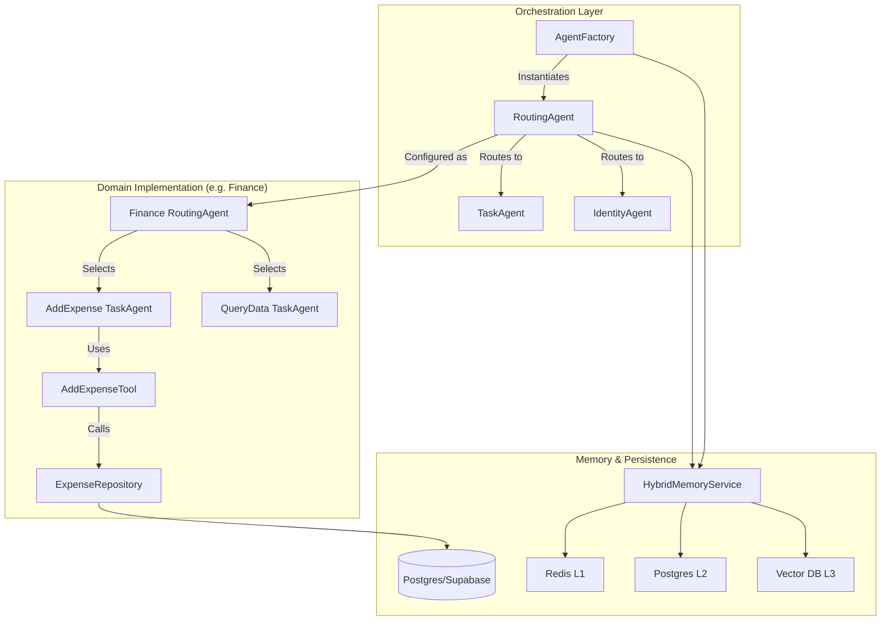

# Análise de Conformidade do Módulo AI (`src/modules/ai`)

## 1. Sumário Executivo

O módulo `src/modules/ai` apresenta um nível elevado de maturidade arquitetural, implementando padrões avançados como **Arquitetura Multi-Agente Hierárquica**, **Memória Híbrida em Três Níveis (L1/L2/L3)** e **Lazy Loading** de modelos. A separação entre o *core* de execução (`engines/lchain/core`) e as funcionalidades de negócio (`engines/lchain/feature`) demonstra um design pensado para escalabilidade e manutenção a longo prazo.

No entanto, a análise revelou **riscos críticos de segurança e privacidade** que comprometem a prontidão para produção em ambientes multi-tenant. A exposição de PII (Dados Pessoais Identificáveis) em logs e a validação permissiva de isolamento de dados na busca vetorial (L3) são vulnerabilidades que exigem correção imediata. Em termos de performance, gargalos identificados na sincronização com o Redis podem impactar a latência sob carga.

A nota geral reflete uma base técnica sólida ofuscada por falhas pontuais, mas severas, de segurança e operação.

---

## 2. Mapa de Responsabilidades

## 3. Avaliação por Categorias

### 3.1 Arquitetura
*   **Status**: ✅ Conforme
*   **Justificativa**: A estrutura de diretórios é lógica e modular. A separação entre interfaces (ABCs) e implementações (impl/postgres, impl/supabase) segue rigorosamente o princípio de inversão de dependência (DIP), facilitando testes e troca de tecnologias.
*   **Destaque**: A implementação de `LazyModelDict` em `infrastructure/llm.py` resolveu problemas de tempo de inicialização e dependências circulares.

### 3.2 Segurança
*   **Status**: 🔴 Não Conforme (Crítico)
*   **Justificativa**:
    1.  **Vazamento de Contexto (Multi-tenant)**: O método `HybridMemoryService.get_context` apenas loga um aviso (`warning`) quando `owner_id` está ausente na busca vetorial, permitindo potencialmente o acesso a memórias de outros usuários.
    2.  **Exposição de PII**: Agentes registram o corpo das mensagens e números de telefone em nível `INFO`, violando princípios de privacidade e proteção de dados.
    3.  **Safety Settings**: Configurações do Google Generative AI estão definidas como `BLOCK_NONE`, removendo barreiras contra conteúdo nocivo.

### 3.3 Qualidade de Código
*   **Status**: ⚠️ Parcial
*   **Justificativa**: O código é fortemente tipado (Type Hints) e segue PEP 8. Porém, a classe base `Tool` força a conversão de resultados para string, perdendo estruturas JSON ricas. A função `_convert_to_langchain_messages` em `agent.py` possui alta complexidade ciclomática, indicando necessidade de refatoração.

### 3.4 Performance
*   **Status**: ⚠️ Parcial
*   **Justificativa**:
    1.  **N+1 no Redis**: A população do cache (Write-Through) itera sobre mensagens inserindo-as uma a uma, mesmo usando pipeline internamente por operação, gerando overhead de rede desnecessário.
    2.  **Rate Limiting**: Ausência de controle de taxa nativo no módulo, expondo a API a custos excessivos de LLM.

### 3.5 Observabilidade
*   **Status**: ⚠️ Parcial
*   **Justificativa**: O uso de `structlog` é excelente. Contudo, a função crítica de limpeza de dados antigos (`delete_old_results` em `AIResultService`) não está implementada (retorna 0), o que levará ao crescimento descontrolado das tabelas de log de pensamento da IA.

### Nota da Avaliação: 6.5 / 10

---

## 4. Pontos Fortes, Fracos e Riscos

### 💪 Pontos Fortes
1.  **Memória Híbrida Sofisticada**: Combinação eficaz de Redis para curto prazo, SQL para histórico e Vetorial para contexto semântico.
2.  **Design Patterns**: Uso correto de Factory (Agents, LLM) e Strategy (Repositories).
3.  **Logging Estruturado**: Logs ricos em metadados facilitam o debugging (apesar do vazamento de PII).

### ⚠️ Pontos Fracos
1.  **Verbosidade Tóxica nos Logs**: Registro indevido de dados sensíveis dos usuários.
2.  **Otimização de Escrita no Cache**: Operações em loop no Redis em vez de *batch*.
3.  **Normalização de Mensagens**: Lógica complexa e frágil para converter formatos de mensagens de diferentes provedores.

### 🔴 Riscos
1.  **Vazamento de Dados entre Tenants**: Falta de *enforcement* rigoroso do `owner_id` na busca vetorial.
2.  **Custos Imprevistos**: Falta de *Rate Limiting* e *Safety Settings* permissivas.
3.  **Degradação do Banco**: Ausência de rotina de limpeza de logs antigos (`ai_results`).

---

## 5. Matriz de Priorização (Risco x Esforço)

| Item | Risco | Esforço | Prioridade |
| :--- | :---: | :---: | :---: |
| **Enforce `owner_id` na Busca Vetorial** | Alto | Baixo | 🔥 **Imediata** |
| **Sanitização de PII nos Logs** | Alto | Baixo | 🔥 **Imediata** |
| **Implementar Batch Insert no Redis** | Médio | Médio | 🚀 Alta |
| **Ativar Limpeza de Logs Antigos** | Médio | Baixo | 🚀 Alta |
| **Refatorar Conversão de Mensagens** | Baixo | Alto | 📅 Média |

---

## 6. Plano de Ação (Top 5)

1.  **Hardening de Segurança (L3)**: Alterar `HybridMemoryService` para lançar uma exceção (`ValueError`) bloqueante caso `owner_id` não seja fornecido em buscas vetoriais.
2.  **Privacidade de Logs**: Revisar `agent.py` e `routing_agent.py` para mascarar ou remover o log do corpo da mensagem e telefone em nível `INFO` (mover para `DEBUG` ou aplicar máscara).
3.  **Otimização Redis**: Implementar método `add_messages` (plural) no `RedisMemoryRepository` e atualizar o serviço para usar um único pipeline para todas as mensagens.
4.  **Governança de Dados**: Implementar a lógica do método `delete_old_results` no `AIResultService` para expurgar registros com mais de X dias (configurável).
5.  **Safety Settings**: Revisar e restringir as configurações de segurança do provedor Google em `llm.py` para valores padrão mais seguros (ex: `BLOCK_MEDIUM_AND_ABOVE`).

---

## 7. Perguntas de Arquitetura

1.  *Existe um motivo de negócio para as Safety Settings estarem em `BLOCK_NONE`, ou foi apenas para desenvolvimento?*
2.  *A conversão de objetos `Tool` para string é mandatória para todos os LLMs suportados, ou poderíamos passar o JSON estruturado para modelos que suportam Function Calling nativo?*
3.  *O módulo de AI deve ser responsável pelo Rate Limiting, ou isso deve ser delegado para o API Gateway / Middleware da aplicação principal?*

---

## 8. Nota Geral Final

**Nota: 6.5 (Parcialmente Conforme)**

O módulo é tecnicamente avançado e bem desenhado, mas não pode ser considerado "Conforme" (nota 8+) enquanto persistirem as falhas de segurança e privacidade identificadas. A correção desses itens é rápida e elevará a nota substancialmente.
