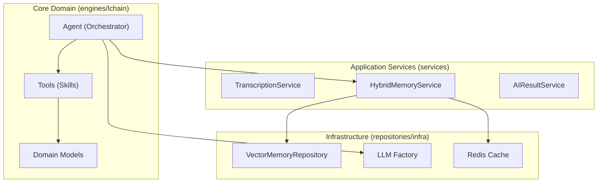

# Análise de Conformidade - Módulo AI (`src/modules/ai`)

**Data:** 06/02/2026
**Responsável:** Trae AI Assistant
**Versão:** 1.0

## 1. Sumário Executivo

O módulo de AI (`src/modules/ai`) apresenta um **alto nível de maturidade técnica**, seguindo rigorosamente padrões de **Clean Architecture** e **Domain-Driven Design (DDD)**. A separação entre *core business* (`engines/lchain`), serviços de orquestração (`services`) e persistência (`repositories`) está bem definida, facilitando a manutenção e a testabilidade.

A segurança é um ponto forte, com gestão de segredos centralizada e validação explícita de isolamento de *tenants* (`owner_id`) em serviços críticos. A observabilidade também se destaca com logging estruturado e persistência de "pensamentos" da IA.

Os principais pontos de atenção referem-se ao tamanho de alguns arquivos centrais (`query.py`, `agent.py`) que começam a apresentar características de "God Class", e a necessidade de aumentar a granularidade dos testes unitários. A base de código está pronta para escala, mas beneficiar-se-ia de refatorações preventivas.

## 2. Mapa de Responsabilidades

## 3. Avaliação por Categorias

### 3.1. Arquitetura
*   **Status:** ✅ Conforme
*   **Justificativa:** O módulo utiliza explicitamente o Padrão Repository e Injeção de Dependência. A estrutura de pastas reflete a separação de camadas (Core, Feature, Infra, Interface).
*   **Destaque:** Uso de Factories (`LLMFactory`) e abstrações claras (`MemoryInterface`) permitem troca de implementações (ex: Postgres vs Supabase) sem impacto no core.

### 3.2. Segurança
*   **Status:** ✅ Conforme
*   **Justificativa:**
    *   **Secrets:** Gerenciados via `settings` e variáveis de ambiente, sem credenciais hardcoded.
    *   **Isolamento:** `HybridMemoryService` aborta buscas se `owner_id` não for fornecido.
    *   **PII:** Implementação de `mask_pii` no `AILogThoughtService` protege dados sensíveis nos logs.
    *   **Injeção de Prompt:** `Agent` isola contexto de usuário e sistema para mitigar riscos de *hallucination* e injeção.

### 3.3. Qualidade de Código
*   **Status:** ⚠️ Parcial
*   **Justificativa:** O código é moderno, tipado e bem documentado (Docstrings). No entanto, arquivos como `query.py` (561 linhas) e `agent.py` (485 linhas) violam o princípio de responsabilidade única e o limite sugerido de 300 linhas.
*   **Complexidade:** `query.py` implementa um *mini-parser* SQL manual, o que é complexo e propenso a erros.

### 3.4. Performance
*   **Status:** ✅ Conforme
*   **Justificativa:** Uso extensivo de `async/await`. Operações bloqueantes (IO pesado) são delegadas para `run_in_threadpool` (ex: `EmbeddingTasks`), garantindo que o Event Loop do FastAPI não seja bloqueado.

### 3.5. Observabilidade
*   **Status:** ✅ Conforme
*   **Justificativa:**
    *   **Logging:** Uso de `structlog` (via `get_logger`) com chaves contextuais (`event_type`, `owner_id`).
    *   **Tracing de IA:** Serviço dedicado `AILogThoughtService` permite auditar o raciocínio do agente passo a passo.

### 3.6. Documentação
*   **Status:** ⚠️ Parcial
*   **Justificativa:** O código possui boas Docstrings e Type Hints, tornando-o auto-explicativo. Porém, falta um `README.md` na raiz do módulo explicando a arquitetura geral e como adicionar novas *Tools* ou *Agents*.

## 4. Matriz de Priorização (Riscos x Esforço)

| Item | Risco/Impacto | Esforço | Prioridade |
| :--- | :--- | :--- | :--- |
| **Refatorar `query.py`** | Alto (Manutenibilidade/Segurança) | Médio | **P1 - Crítico** |
| **Refatorar `agent.py`** | Médio (Complexidade Ciclomática) | Alto | **P2 - Alta** |
| **Criar README do Módulo** | Baixo (Onboarding) | Baixo | **P3 - Média** |
| **Aumentar Cobertura de Testes** | Médio (Regressão) | Alto | **P4 - Média** |

## 5. Plano de Ação

1.  **Refatorar `query.py`**:
    *   Extrair lógica de *parsing* SQL para uma classe dedicada `SQLQueryBuilder`.
    *   Mover validadores Pydantic complexos para arquivos separados.
2.  **Modularizar `Agent`**:
    *   Extrair lógica de gestão de contexto (`_get_agent_user_id`, injeção de prompt) para um `AgentContextManager`.
    *   Mover lógica de *loop* de execução para uma estratégia separada se crescer mais.
3.  **Documentação**:
    *   Criar `src/modules/ai/README.md` com diagrama Mermaid e guia de "Como criar uma nova Tool".
4.  **Testes**:
    *   Criar testes unitários específicos para os *parsers* regex do `query.py` para garantir segurança contra *SQL Injection* indireto.

## 6. Perguntas de Arquitetura

1.  O *parser* manual de SQL em `query.py` é estritamente necessário ou poderíamos usar recursos nativos do SQLAlchemy/ORM para construir essas queries dinâmicas de forma mais segura?
2.  A injeção de dependência do `Agent` está ficando complexa (`__init__` com muitos parâmetros). Devemos considerar um *Builder Pattern* para construção de Agentes?
3.  Existe uma estratégia de *fallback* definida se o provedor de LLM principal falhar (além do *retry* simples)?

## 7. Nota Final

**Nota: 8.5/10 (Conforme)**

O módulo é robusto e bem projetado. As penalidades são apenas pela complexidade de arquivos específicos que cresceram organicamente e pela ausência de documentação de alto nível.
