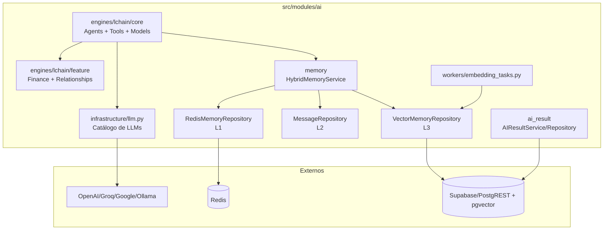
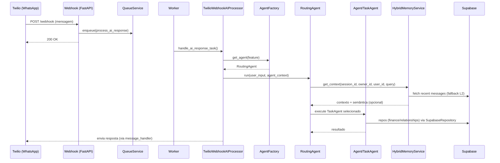
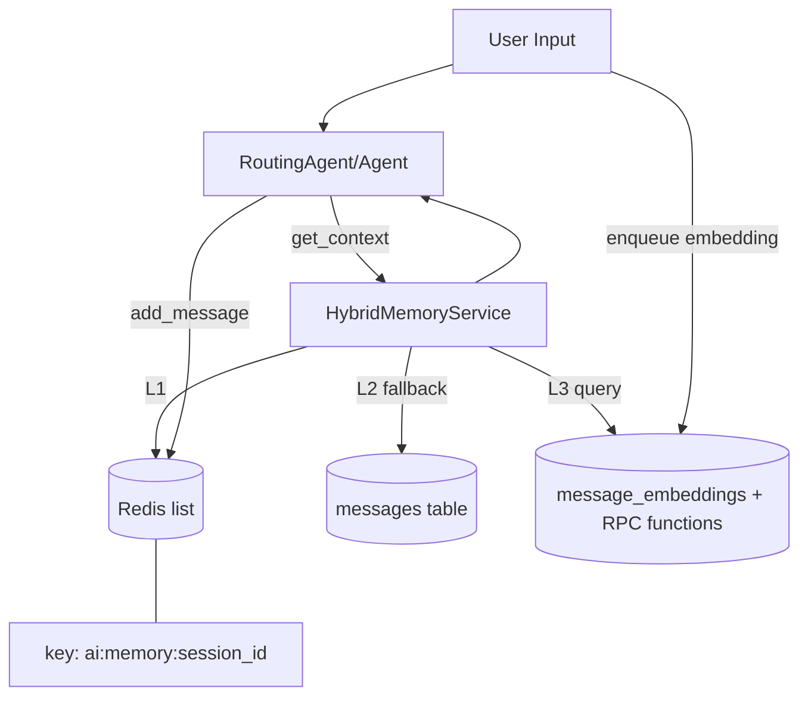

# Análise Completa do Módulo `src/modules/ai`

Escopo: [src/modules/ai](file:///Users/lennon/projects/ai_engineering/whatsapp_twilio_ai/src/modules/ai)  
Data: 2026-01-30

## Visão Geral

O módulo `src/modules/ai` implementa um motor de agentes (baseado em LangChain) para atender mensagens recebidas via WhatsApp/Twilio, com suporte a roteamento por “feature” (ex.: Finance, Relationships), memória híbrida (Redis + banco + busca vetorial) e persistência de “rastros”/auditoria (ai_results). Em geral, a estrutura é modular e extensível, porém existem pontos críticos em **segurança e privacidade** (logs e persistência de histórico com PII, isolamento multi-tenant dependente de RLS, e segurança de conteúdo em provedores) e oportunidades claras de **robustez operacional** (rate limiting, inicialização de LLM sem efeitos colaterais, e políticas de observabilidade).

## Mapa de Responsabilidades (alto nível)

| Pacote | Responsabilidade | Arquivos-chave |
|---|---|---|
| `engines/lchain/core/` | Infra de agentes, tools, schemas e utilitários | [agent.py](file:///Users/lennon/projects/ai_engineering/whatsapp_twilio_ai/src/modules/ai/engines/lchain/core/agents/agent.py), [routing_agent.py](file:///Users/lennon/projects/ai_engineering/whatsapp_twilio_ai/src/modules/ai/engines/lchain/core/agents/routing_agent.py), [tool.py](file:///Users/lennon/projects/ai_engineering/whatsapp_twilio_ai/src/modules/ai/engines/lchain/core/tools/tool.py) |
| `engines/lchain/feature/` | Bounded contexts por feature (prompts + tools + repositórios + modelos) | [finance](file:///Users/lennon/projects/ai_engineering/whatsapp_twilio_ai/src/modules/ai/engines/lchain/feature/finance), [relationships](file:///Users/lennon/projects/ai_engineering/whatsapp_twilio_ai/src/modules/ai/engines/lchain/feature/relationships) |
| `memory/` | Memória L1/L2/L3 (cache + persistência + vetorial) | [hybrid_memory_service.py](file:///Users/lennon/projects/ai_engineering/whatsapp_twilio_ai/src/modules/ai/memory/services/hybrid_memory_service.py), [redis_memory_repository.py](file:///Users/lennon/projects/ai_engineering/whatsapp_twilio_ai/src/modules/ai/memory/repositories/redis_memory_repository.py), [vector_memory_repository.py](file:///Users/lennon/projects/ai_engineering/whatsapp_twilio_ai/src/modules/ai/memory/repositories/vector_memory_repository.py) |
| `ai_result/` | Auditoria/telemetria do agente (logs de execução e tool calls) | [ai_log_thought_service.py](file:///Users/lennon/projects/ai_engineering/whatsapp_twilio_ai/src/modules/ai/ai_result/services/ai_log_thought_service.py), [ai_result_repository.py](file:///Users/lennon/projects/ai_engineering/whatsapp_twilio_ai/src/modules/ai/ai_result/repositories/ai_result_repository.py) |
| `infrastructure/` | Catálogo e inicialização de LLMs/provedores | [llm.py](file:///Users/lennon/projects/ai_engineering/whatsapp_twilio_ai/src/modules/ai/infrastructure/llm.py) |
| `workers/` | Handlers assíncronos (embeddings) | [embedding_tasks.py](file:///Users/lennon/projects/ai_engineering/whatsapp_twilio_ai/src/modules/ai/workers/embedding_tasks.py) |
| `services/` | Serviços auxiliares do domínio AI (ex.: transcrição) | [transcription_service.py](file:///Users/lennon/projects/ai_engineering/whatsapp_twilio_ai/src/modules/ai/services/transcription_service.py) |

## Diagramas (Mermaid)

### Componentes (AI Engine + Memória + Persistência)

### Sequência (WhatsApp → Fila → Agente → Tools/DB → Resposta)

### Dados (Memória híbrida L1/L2/L3)

## Avaliação por Categoria (Conformidade + Fortes/Fracos/Oportunidades/Riscos)

### Conformidade Arquitetural

✅ **Conformidade**: **Parcial (75%)**  
💪 **Pontos Fortes**
- Separação clara entre core reutilizável (agents/tools/models) e features (prompts/tools/repositories) por contexto: [feature](file:///Users/lennon/projects/ai_engineering/whatsapp_twilio_ai/src/modules/ai/engines/lchain/feature).
- Memória híbrida bem definida (L1 Redis + L2 mensagens + L3 vetorial) com estratégia read-through: [HybridMemoryService.get_context](file:///Users/lennon/projects/ai_engineering/whatsapp_twilio_ai/src/modules/ai/memory/services/hybrid_memory_service.py#L30-L156).
- Integração assíncrona correta do processamento de IA via fila (evita timeout do provedor): [TwilioWebhookAIProcessor](file:///Users/lennon/projects/ai_engineering/whatsapp_twilio_ai/src/modules/channels/twilio/services/webhook/ai_processor.py#L33-L223).
⚠️ **Pontos Fracos**
- Side effects no import e inicialização eager de múltiplos modelos no carregamento do módulo: [llm.py](file:///Users/lennon/projects/ai_engineering/whatsapp_twilio_ai/src/modules/ai/infrastructure/llm.py#L9-L133).
- Coesão e contratos de Tool inconsistentes entre features (algumas tools retornam `ToolResult` mas podem ser encapsuladas como `str` dependendo do override de `_run`): [Tool._run](file:///Users/lennon/projects/ai_engineering/whatsapp_twilio_ai/src/modules/ai/engines/lchain/core/tools/tool.py#L24-L40) vs [relationships/tools/add.py](file:///Users/lennon/projects/ai_engineering/whatsapp_twilio_ai/src/modules/ai/engines/lchain/feature/relationships/tools/add.py#L18-L65).
- Multi-tenant no nível de dados das features depende de regras externas (RLS) e não aparece como filtro de domínio nos repositórios: [repository_finance.py](file:///Users/lennon/projects/ai_engineering/whatsapp_twilio_ai/src/modules/ai/engines/lchain/feature/finance/repositories/repository_finance.py#L29-L206).
🎯 **Oportunidades**
- Padronizar contrato de tools: `execute()` sempre retorna `ToolResult` e o core não reembrulha como `str`.
- Modularizar inicialização de LLM (lazy + por provider/model) e remover `load_dotenv()` em import.
- Explicitamente definir “bounded contexts” e invariantes de multi-tenancy (ex.: `owner_id` obrigatório em todas as operações sensíveis).
🔴 **Riscos**
- Dependência implícita de boot/import pode causar falhas em ambientes onde variáveis não estão completas (criticidade: **Média**).
- Inconsistência de ToolResult pode mascarar falhas e levar a comportamento não determinístico (criticidade: **Média**).

Nota geral: boa modularização e extensibilidade; precisa endurecer contratos e eliminar efeitos colaterais.

### Segurança

✅ **Conformidade**: **Parcial (55%)**  
💪 **Pontos Fortes**
- Secrets centralizados via env/settings e documentados em [.env.example](file:///Users/lennon/projects/ai_engineering/whatsapp_twilio_ai/.env.example) (OpenAI/Groq/Google, Redis, Whisper).
- Validação de schema em várias tools (Pydantic) e validação de colunas para query dinâmica (reduz abuso): [QueryConfig](file:///Users/lennon/projects/ai_engineering/whatsapp_twilio_ai/src/modules/ai/engines/lchain/feature/finance/tools/query.py#L73-L344).
- Logs estruturados com `structlog` (base para auditoria e correlação).
⚠️ **Pontos Fracos**
- Risco de vazamento multi-tenant em L3 se `owner_id` não for imposto; o próprio código alerta: [HybridMemoryService](file:///Users/lennon/projects/ai_engineering/whatsapp_twilio_ai/src/modules/ai/memory/services/hybrid_memory_service.py#L103-L111).
- Cache Redis usa chave apenas por `session_id` e ignora `owner_id/user_id` no key (potencial colisão e isolamento frágil): [RedisMemoryRepository._get_key](file:///Users/lennon/projects/ai_engineering/whatsapp_twilio_ai/src/modules/ai/memory/repositories/redis_memory_repository.py#L75-L138).
- Logging potencialmente sensível: agentes registram entrada, prompt e telefone; também persistem histórico em `ai_results` (PII e dados de usuário): [agent.py](file:///Users/lennon/projects/ai_engineering/whatsapp_twilio_ai/src/modules/ai/engines/lchain/core/agents/agent.py#L63-L90), [routing_agent.py](file:///Users/lennon/projects/ai_engineering/whatsapp_twilio_ai/src/modules/ai/engines/lchain/core/agents/routing_agent.py#L158-L173), [ai_log_thought_service.py](file:///Users/lennon/projects/ai_engineering/whatsapp_twilio_ai/src/modules/ai/ai_result/services/ai_log_thought_service.py#L94-L140).
- “Safety settings” do provedor Google configuradas para não bloquear conteúdo perigoso: [llm.py](file:///Users/lennon/projects/ai_engineering/whatsapp_twilio_ai/src/modules/ai/infrastructure/llm.py#L77-L87).
- Vetores e embeddings podem armazenar PII sem política explícita de retenção/anonimização: [EmbeddingTasks](file:///Users/lennon/projects/ai_engineering/whatsapp_twilio_ai/src/modules/ai/workers/embedding_tasks.py#L19-L47), [VectorMemoryRepository.add_texts](file:///Users/lennon/projects/ai_engineering/whatsapp_twilio_ai/src/modules/ai/memory/repositories/vector_memory_repository.py#L189-L197).
🎯 **Oportunidades**
- Impor `owner_id` obrigatório no L3 (falhar/skip quando ausente) e garantir RLS no Supabase como defesa em profundidade.
- Reduzir/mascarar PII em logs (ex.: hashing parcial de telefone; truncar `prompt`/`input`; desligar em produção).
- Adotar “tool authorization”: allowlist por feature + checagem de permissões/plan antes de executar tools que escrevem em DB.
- Sanitizar strings interpoladas em filtros do Supabase (ex.: `or_`/`ilike`) e limitar caracteres permitidos.
🔴 **Riscos**
- Vazamento cross-tenant via busca vetorial/filtros incompletos (criticidade: **Alta**).
- Exfiltração/PII leakage via logs e `ai_results` (criticidade: **Alta**).
- Prompt injection levando a operações indevidas (criação/alteração de registros) sem camada explícita de autorização (criticidade: **Alta**).

Nota geral: prioridade máxima para isolamento multi-tenant + higiene de logs + políticas de execução de tools.

### Performance

✅ **Conformidade**: **Parcial (70%)**  
💪 **Pontos Fortes**
- Operações bloqueantes críticas são empurradas para threadpool no fluxo assíncrono (LLM + chamadas sync de DB): [TwilioWebhookAIProcessor](file:///Users/lennon/projects/ai_engineering/whatsapp_twilio_ai/src/modules/channels/twilio/services/webhook/ai_processor.py#L81-L180).
- Cache Redis com TTL e limitação de histórico evita crescimento infinito: [RedisMemoryRepository.add_message](file:///Users/lennon/projects/ai_engineering/whatsapp_twilio_ai/src/modules/ai/memory/repositories/redis_memory_repository.py#L114-L136).
- Vector store possui “circuit breaker” simples (disable em erro de schema/cache): [VectorMemoryRepository._disable](file:///Users/lennon/projects/ai_engineering/whatsapp_twilio_ai/src/modules/ai/memory/repositories/vector_memory_repository.py#L33-L42).
⚠️ **Pontos Fracos**
- Inicialização eager de vários modelos LLM em import aumenta tempo de boot e pode falhar por dependências/credenciais: [llm.py](file:///Users/lennon/projects/ai_engineering/whatsapp_twilio_ai/src/modules/ai/infrastructure/llm.py#L105-L132).
- “Read-through populate” do Redis faz escrita mensagem-a-mensagem (múltiplas pipelines); poderia ser bulk: [HybridMemoryService](file:///Users/lennon/projects/ai_engineering/whatsapp_twilio_ai/src/modules/ai/memory/services/hybrid_memory_service.py#L92-L97).
- Sem “rate limiting” específico para chamadas de LLM/tools; risco de custo e degradação sob abuso.
🎯 **Oportunidades**
- Lazy init por demanda (somente modelo configurado) e cache de instâncias por provider/model.
- Batch write no Redis (um pipeline para N mensagens) e distinção Miss vs Empty no L1.
- Implementar rate limiting por `owner_id`/usuário (token bucket) na camada de processamento AI.
🔴 **Riscos**
- Custos e latência imprevisíveis sob volume alto/abuso (criticidade: **Média**).
- Boot instável em container/serverless devido a inicialização eager de LLMs (criticidade: **Média**).

Nota geral: base sólida (threadpool + cache), mas precisa de controles para custo/abuso e otimizações simples.

### Documentação

✅ **Conformidade**: **Parcial (45%)**  
💪 **Pontos Fortes**
- Docstrings e descrições razoáveis em classes-chave (agents/memória).
- Há documentação ampla do projeto em `docs/` e `plan/` (fora do módulo).
⚠️ **Pontos Fracos**
- Módulo `ai` não possui README próprio (setup, variáveis, diagrama do fluxo e invariantes).
- Ausência de contratos explícitos: como versionar prompts, como evoluir schemas das tools, e SLOs (tempo/custo).
🎯 **Oportunidades**
- Criar um README do módulo (sem alterar arquivos do projeto fora do solicitado): visão geral, como habilitar embeddings, como adicionar feature, convenções de tool/prompt.
- Formalizar “API interna” das tools (contratos de entrada/saída) e política de compatibilidade.
🔴 **Riscos**
- Alto custo de onboarding e regressões silenciosas ao adicionar features/tools (criticidade: **Média**).

Nota geral: documentação do projeto existe, mas falta “guia do módulo” e contratos internos.

### Observabilidade

✅ **Conformidade**: **Parcial (60%)**  
💪 **Pontos Fortes**
- Logging estruturado consistente via `get_logger()` (base para correlação).
- Persistência de ai_results permite auditoria e troubleshooting: [ai_log_thought_service.py](file:///Users/lennon/projects/ai_engineering/whatsapp_twilio_ai/src/modules/ai/ai_result/services/ai_log_thought_service.py).
⚠️ **Pontos Fracos**
- Alto volume e sensibilidade nos logs (prompts/inputs/telefone), com risco de compliance e custo de ingestão: [routing_agent.py](file:///Users/lennon/projects/ai_engineering/whatsapp_twilio_ai/src/modules/ai/engines/lchain/core/agents/routing_agent.py#L158-L173).
- Ausência de métricas e tracing distribuído (latência por etapa: roteamento, tools, DB, embeddings).
- `ai_results` pode crescer rapidamente sem política de retenção/expurgo.
🎯 **Oportunidades**
- Adicionar métricas (tempo por fase, tokens, erros por tool) e healthchecks específicos do subsistema de IA (LLM/Redis/Supabase).
- Implementar “PII-safe logging policy” por ambiente (dev vs prod) e redaction por chaves.
- Definir retenção e agregação para `ai_results` (ex.: TTL, amostragem, ou separação de campos).
🔴 **Riscos**
- Vazamento de dados e custo operacional elevado em observabilidade (criticidade: **Alta**).

Nota geral: há boas bases (structlog + auditoria), mas sem governança e métricas o módulo fica caro e arriscado.

### Dependências

✅ **Conformidade**: **Parcial (65%)**  
💪 **Pontos Fortes**
- Versões pinadas na maior parte dos pacotes principais (reduz drift): [requirements.txt](file:///Users/lennon/projects/ai_engineering/whatsapp_twilio_ai/requirements.txt).
- Stack coerente para o problema: FastAPI + Supabase + Redis + LangChain.
⚠️ **Pontos Fracos**
- Não há evidência de SCA automatizado (CVE/license scanning) no repositório (sem CI).
- Dependências de IA são pesadas e amplas (múltiplos providers) sem lazy init; risco de superfície e custo de manutenção.
🎯 **Oportunidades**
- Integrar `pip-audit`/`safety` e verificação de licenças no pipeline.
- Reduzir providers ativos por ambiente e inicializar sob demanda.
🔴 **Riscos**
- Exposição a CVEs e falhas de supply chain sem detecção (criticidade: **Média**).

Nota geral: pinagem ajuda, mas falta governança automatizada (CVE/licenças).

### Deploy/DevOps

✅ **Conformidade**: **Parcial (60%)**  
💪 **Pontos Fortes**
- Containerização presente e com usuário não-root: [Dockerfile](file:///Users/lennon/projects/ai_engineering/whatsapp_twilio_ai/Dockerfile#L23-L26).
- Separação explícita de processos (API + Worker/Scheduler) na arquitetura do projeto.
⚠️ **Pontos Fracos**
- Sem pipeline CI/CD no repositório (não há `.github/`), portanto testes/lint/audit não são garantidos.
- `HEALTHCHECK` do Docker usa `requests`, que não está em `requirements.txt`, podendo falhar: [Dockerfile](file:///Users/lennon/projects/ai_engineering/whatsapp_twilio_ai/Dockerfile#L30-L33).
- Inicialização de LLM por import (side effect) atrapalha previsibilidade do boot em deploy.
🎯 **Oportunidades**
- Adicionar CI mínimo (lint + tests + security audit + build image).
- Corrigir healthcheck para usar `httpx` já presente, ou `urllib` padrão.
- Definir limites de recursos e políticas de retry/backoff específicas para tasks de IA (custo/latência).
🔴 **Riscos**
- Deploy instável e regressões não detectadas sem CI (criticidade: **Média**).

Nota geral: base de container ok, mas falta automação e endurecimento do boot/healthcheck.

## Síntese (Pontos fortes, fracos, riscos e oportunidades)

**Pontos fortes**
- Arquitetura por features e core reutilizável (bom para escalar capacidades do agente).
- Memória híbrida (L1/L2/L3) e uso de fila para isolar latência do webhook.
- Auditoria de execução via ai_results e logging estruturado.

**Pontos fracos**
- Privacidade/segurança: logs e persistência de histórico com PII; dependência de RLS sem enforcement no app.
- Inicialização de LLM em import e múltiplos providers habilitados por padrão.
- Contratos de tool inconsistentes entre features (risco de erro em runtime e comportamento silencioso).

**Oportunidades (incrementais e de alto ROI)**
- Impor `owner_id` no L3 + RLS obrigatório; sanitização de filtros e redaction de logs.
- Padronizar ToolResult e centralizar política de execução/autorização de tools.
- Lazy init do LLM e métricas por etapa (latência/tokens/custo).

**Riscos (se não corrigido)**
- 🔴 **Alta**: vazamento multi-tenant/PII via L3, logs e ai_results.
- 🔴 **Alta**: prompt injection executando operações indevidas (sem autorização explícita).
- 🟠 **Média**: custo/latência por ausência de rate limiting e por boot instável.

## Relatório breve (reflexões e sugestões)

O módulo está em um bom ponto arquitetural: há separação por contextos (features) e um núcleo de agentes/tools que permite evolução incremental, além de uma memória híbrida e processamento assíncrono que respeitam o comportamento de provedores como Twilio. Isso é um bom “esqueleto” para um produto que precisa crescer em capacidades sem virar um monólito.

O maior gap atual é governança: **quem pode executar quais tools** (autorização e limites), **como proteger dados** (PII e multi-tenancy de ponta a ponta, incluindo embeddings), e **como observar/custear** (métricas e logs seguros). Endereçar isso com mudanças pequenas e bem posicionadas (enforcement de `owner_id`, redaction, rate limiting, lazy init) reduz drasticamente o risco e melhora previsibilidade em produção.
