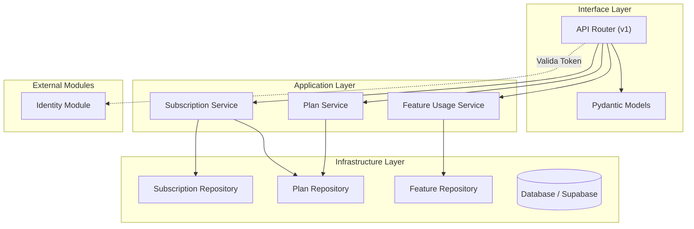
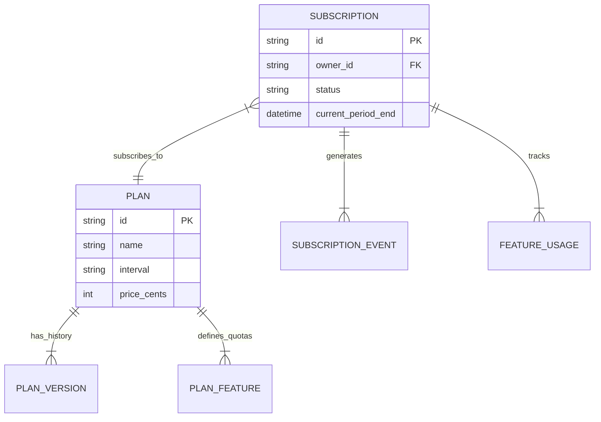

# Análise de Conformidade - Módulo Billing

## 1. Sumário Executivo

O módulo **Billing** (`src/modules/billing`) apresenta uma estrutura madura baseada em **Clean Architecture**, com clara separação de responsabilidades entre API, Serviços e Repositórios. O código demonstra boas práticas de engenharia de software, como Injeção de Dependência, uso de DTOs (Pydantic) e suporte a múltiplos backends de banco de dados (Postgres e Supabase).

No entanto, a análise revelou **falhas críticas de segurança** que impedem o módulo de ser considerado "Conforme" para produção. A ausência de validação de propriedade em endpoints sensíveis (IDOR) e a falta de controle de acesso baseado em função (RBAC) para gestão de planos são riscos de alta prioridade.

A qualidade de código é alta em termos de legibilidade e modularização, mas a documentação (docstrings) é inconsistente. A cobertura de testes existe, mas precisa garantir que os cenários de segurança sejam validados.

## 2. Mapa de Responsabilidades

## 3. Avaliação por Categorias

### ✅ Conformidade Arquitetural
**Status:** ✅ Conforme
- **Justificativa:** O módulo segue rigorosamente a Clean Architecture. A lógica de negócio reside nos Serviços e é agnóstica a detalhes de implementação (banco de dados/framework), que são injetados via `dependency-injector`.
- **Destaque:** Implementação do padrão Repository com suporte a múltiplos backends (`impl/postgres`, `impl/supabase`).

### 🔒 Conformidade de Segurança
**Status:** 🔴 Não Conforme (Crítico)
- **Justificativa:** Foram identificadas vulnerabilidades severas que expõem dados e operações a usuários não autorizados.
- **Falhas Críticas:**
    1.  **IDOR (Insecure Direct Object Reference):** Endpoints `upgrade_subscription` e `cancel_subscription` recebem `subscription_id` mas não verificam se pertence ao usuário autenticado.
    2.  **Falta de RBAC:** Endpoints administrativos de Planos (`create_plan`, `add_feature`) possuem comentários `TODO: Add check for System Admin role`, permitindo que qualquer usuário autenticado altere preços e cotas.

### 🧼 Qualidade de Código
**Status:** ⚠️ Parcial
- **Justificativa:** Código limpo, bem estruturado e tipado. Porém, a documentação inline (docstrings) é escassa em partes críticas da API e Models.
- **Métricas:** ~2400 linhas de código distribuídas em 49 arquivos. Complexidade ciclomática baixa na maioria das funções.

### 🚀 Performance
**Status:** ⚠️ Parcial
- **Justificativa:** A API é assíncrona (`async def`), mas chama serviços síncronos. Embora funcional, isso pode bloquear o event loop sob alta carga. O uso de `run_in_executor` em webhooks mitiga isso, mas a migração para `async` nativo nos repositórios seria ideal.

### 📚 Documentação
**Status:** ⚠️ Parcial
- **Justificativa:** README existe mas é básico. Faltam docstrings detalhadas nos endpoints da API para gerar um Swagger/OpenAPI rico (ex: descrição de erros 4xx/5xx).

### 👁️ Observabilidade
**Status:** ✅ Conforme
- **Justificativa:** Uso consistente de `structlog` para logs estruturados. Exceções são capturadas e logadas com contexto adequado antes de serem relançadas ou tratadas.

## 4. Diagramas

### Modelo de Dados (Billing)

## 5. Matriz de Priorização

| Risco / Impacto | Item | Esforço | Prioridade |
| :--- | :--- | :--- | :--- |
| **Crítico** | **Corrigir IDOR em Subscriptions** | Baixo | **Imediata** |
| **Crítico** | **Implementar RBAC (Admin) em Plans** | Baixo | **Imediata** |
| Alto | Validar inputs de limites (Quotas) | Médio | Alta |
| Médio | Migrar Repositórios para Async Nativo | Alto | Média |
| Baixo | Adicionar Docstrings faltantes | Baixo | Baixa |

## 6. Plano de Ação

1.  **Correção de Segurança (Imediato):**
    - Adicionar verificação de propriedade (`owner_id == current_user.owner_id`) nos endpoints `upgrade` e `cancel` de assinaturas.
    - Criar dependência `RequireRole('admin')` e aplicar nas rotas de escrita de Planos.

2.  **Melhoria de Testes:**
    - Criar testes de regressão que tentem explorar o IDOR (acessar assinatura de outro usuário) e garantam o bloqueio.

3.  **Documentação:**
    - Adicionar docstrings em todos os métodos públicos de Services e Repositories seguindo o padrão Google/NumPy.

4.  **Refatoração Async (Futuro):**
    - Planejar a migração dos drivers de banco para versões assíncronas (ex: `asyncpg` ou cliente async do Supabase).

## 7. Perguntas de Arquitetura

1.  *Por que os serviços foram implementados de forma síncrona se a API é assíncrona? Existe algum bloqueio técnico nos drivers atuais?*
2.  *Qual a estratégia de cache para a consulta de `FeatureUsage`? Sendo uma consulta frequente (a cada uso de recurso), ela pode gargalar o banco.*
3.  *Como lidamos com a consistência eventual dos Webhooks de pagamento? Existe um mecanismo de reconciliação diária?*

## 8. Nota Geral

**Nota: 6.0 / 10**

> O módulo perde pontos significativos devido às falhas de segurança (IDOR e RBAC) que o tornam inviável para produção no estado atual, apesar da excelente estrutura arquitetural.

---
*Relatório gerado automaticamente por Trae AI em 06/02/2026.*
