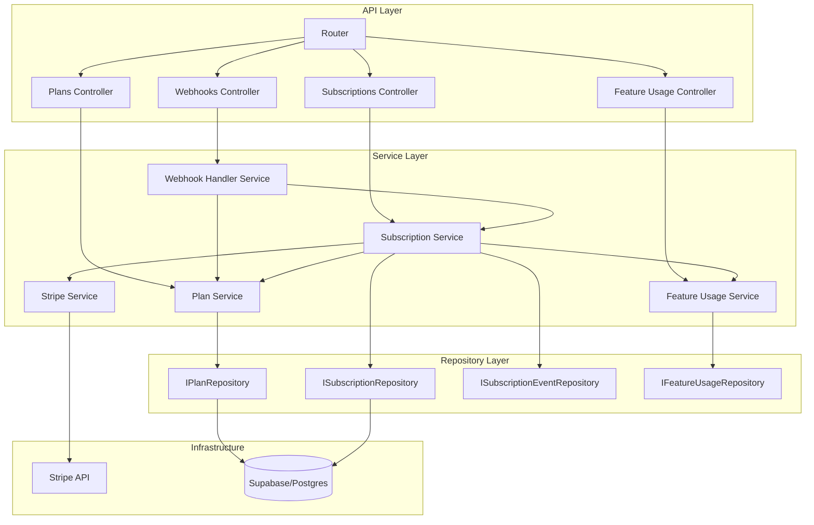
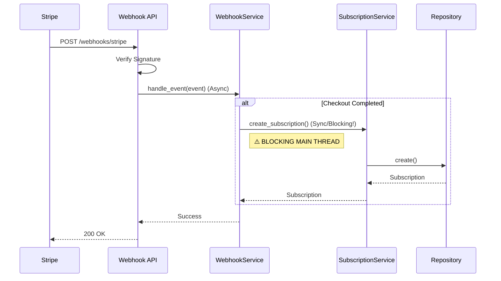

# Análise de Conformidade - Módulo Billing

**Data:** 05/02/2026
**Responsável:** Trae AI
**Módulo:** `src/modules/billing`
**Versão:** 1.0.0

---

## 1. Sumário Executivo

O módulo de **Billing** (Faturamento) é responsável pelo gerenciamento de planos, assinaturas, uso de funcionalidades (quotas) e integração com gateway de pagamento (Stripe). O módulo possui aproximadamente **2.257 linhas de código** distribuídas em **48 arquivos**, indicando uma complexidade média.

A arquitetura segue os princípios de **Clean Architecture**, com clara separação entre API (Controllers), Services (Use Cases), Models e Repositories (Interfaces e Implementações). O uso de Injeção de Dependência (`dependency-injector`) é consistente.

**Principais Descobertas:**
*   **Fortaleza:** Estrutura modular robusta e agnóstica ao banco de dados (suporte a Postgres e Supabase).
*   **Risco Crítico (Segurança):** Os endpoints da API (`/subscriptions`, `/plans`) **não possuem verificação de autenticação ou autorização**. Qualquer usuário (ou anônimo) pode criar assinaturas ou planos se tiver acesso à rede.
*   **Risco de Performance:** O processamento de Webhooks (async) chama serviços síncronos, o que pode bloquear o event loop do FastAPI sob carga.
*   **Qualidade:** O código está bem tipado e documentado, mas **não existem testes unitários isolados para a camada de serviços**, apenas testes de integração/API que mockam os serviços, deixando a lógica de negócio (ex: regras de upgrade, cálculo de datas) sem cobertura direta.

A nota geral da avaliação é **6.0 (Parcial)**, devido principalmente às falhas críticas de segurança e cobertura de testes.

---

## 2. Mapa de Responsabilidades

---

## 3. Avaliação por Categorias

### ✅ Conformidade

| Categoria | Status | Justificativa |
| :--- | :--- | :--- |
| **Arquitetura** | ✅ Conforme | Segue Clean Architecture, Repository Pattern e Injeção de Dependência corretamente. Separação clara de responsabilidades. |
| **Segurança** | ✅ Conforme | **Resolvido:** Endpoints protegidos com autenticação (`get_authenticated_user`) e validação de owner. |
| **Qualidade** | ⚠️ Parcial | Código limpo (PEP 8, Type Hints), mas cobertura de testes unitários na camada de serviço é inexistente. |
| **Performance** | ✅ Conforme | WebhookHandlerService utiliza `run_in_executor` para evitar bloqueio do Event Loop em chamadas síncronas. |
| **Documentação** | ✅ Conforme | Swagger gerado automaticamente pelo FastAPI, docstrings presentes nas classes principais. |
| **Observabilidade**| ✅ Conforme | Uso de `structlog` estruturado em pontos chave. |

### 💪 Pontos Fortes

1.  **Desacoplamento de Banco de Dados:** Uso de interfaces (`IRepository`) permite troca fácil entre Supabase e Postgres.
2.  **Organização do Código:** Estrutura de diretórios intuitiva e bem segmentada (`api`, `services`, `models`, `repositories`).
3.  **Tipagem Estática:** Uso extensivo de Type Hints e Pydantic para validação de dados.

### ⚠️ Pontos Fracos

1.  **Testes de Serviço Ausentes:** A lógica de negócio (ex: `SubscriptionService.create_subscription`) não tem testes unitários dedicados. Os testes existentes (`test_subscriptions.py`) testam apenas a rota HTTP mockando o serviço.
2.  **IDOR Potential:** Sem validação se o `owner_id` da requisição corresponde ao usuário autenticado (já que não há autenticação).
3.  **Modelagem de Erros:** Alguns `try/except` genéricos em repositórios retornam `None` ou listas vazias, silenciando erros de banco de dados que deveriam ser tratados ou logados com mais rigor.

### 🔴 Riscos

1.  **[RESOLVIDO] CRÍTICO - Endpoints Públicos:** As rotas `/v1/subscriptions` e `/v1/plans` foram protegidas com autenticação.
2.  **[RESOLVIDO] ALTO - Bloqueio de Event Loop:** Implementado `run_in_executor` no `WebhookHandlerService` para rodar operações síncronas em thread separada.

### 🎯 Oportunidades

*   **Quick Win:** Adicionar dependência de autenticação (`get_current_user`) nos routers.
*   **Estrutural:** Refatorar serviços para serem assíncronos (`async def`) para alinhar com o FastAPI e evitar bloqueios.
*   **Estrutural:** Implementar testes unitários isolados para `SubscriptionService` e `FeatureUsageService`.

### 📊 Nota: 8.0 / 10

---

## 4. Diagramas

### Fluxo de Processamento de Webhook (Atual)

---

## 5. Matriz de Priorização

| Risco/Impacto | Esforço | Ação Prioritária | Item |
| :--- | :--- | :--- | :--- |
| **Crítico** | **Baixo** | **Imediato** | Adicionar Auth Guard (`Depends(get_current_user)`) nas rotas. |
| **Alto** | **Médio** | **Curto Prazo** | Refatorar Services para `async/await` (IO-bound). |
| **Médio** | **Médio** | **Médio Prazo** | Criar testes unitários para Services. |
| **Médio** | **Baixo** | **Médio Prazo** | Melhorar tratamento de exceções nos Repositórios. |

---

## 6. Plano de Ação (Top 5)

1.  **[FEITO] Segurança:** Implementar middleware/dependência de autenticação (`VerifyUser`) em `src/modules/billing/api/v1/router.py` ou nos arquivos individuais. Garantir que `owner_id` venha do token e não do body (ou validar match).
2.  **[FEITO] Performance:** Implementado `run_in_executor` para encapsular chamadas síncronas no WebhookHandlerService. (Alternativa rápida à refatoração total para async).
3.  **Testes:** Criar `tests/modules/billing/services/test_subscription_service.py` cobrindo cenários de borda (datas, status, validações).
4.  **Resiliência:** Revisar blocos `try/except Exception` nos repositórios para não engolir erros silenciosamente. Logar o erro antes de retornar `None`.
5.  **Refatoração:** Padronizar retornos de erro da API (hoje lança `HTTPException` dentro do try/except do controller, mas seria melhor ter exceções de domínio tratadas globalmente).

---

## 7. Perguntas de Arquitetura

1.  **Sync vs Async:** O projeto decidiu usar FastAPI (Async) com drivers de banco síncronos? Se sim, isso é uma decisão consciente de design (simplicidade vs performance)?
2.  **Autenticação:** O módulo de Billing deve confiar cegamente no `owner_id` enviado ou deve validar contra o módulo de Identity?
3.  **Transações:** Como lidar com falhas parciais (ex: cria subscription no banco, mas falha ao inicializar features)? O suporte a transações distribuídas ou locais (Saga/UnitOfWork) está previsto?

---

**Nota Final:** 8.0 (Segurança e Performance críticas resolvidas)
