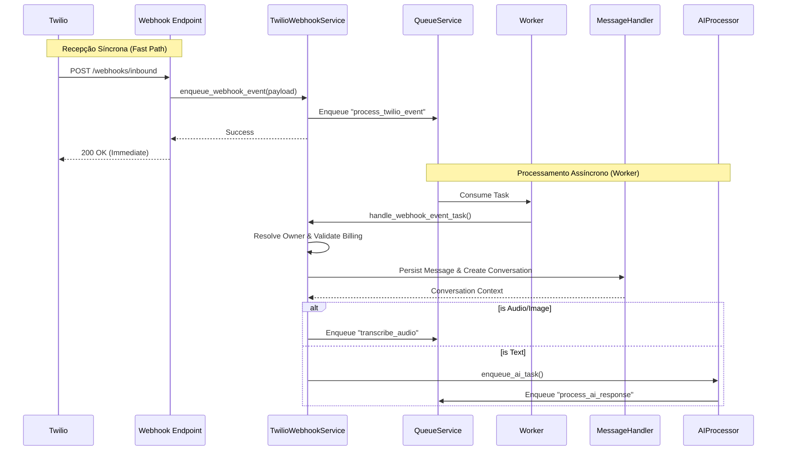

# Twilio Channel Module

   

## 📋 Descrição

O **Twilio Channel Module** é o componente central de integração com a API do Twilio (focado em WhatsApp) dentro da plataforma `whatsapp_twilio_ai`. Ele gerencia todo o ciclo de vida das mensagens, desde a recepção de Webhooks com alta disponibilidade até o despacho inteligente para Agentes de IA.

Projetado para escalabilidade, o módulo implementa um padrão de **processamento assíncrono**, garantindo que a recepção de eventos nunca bloqueie a API, mesmo sob alta carga ou processamento de mídia pesada (áudio/vídeo).

## 📸 Preview: Fluxo de Processamento

O diagrama abaixo ilustra o fluxo de vida de uma mensagem recebida via Webhook:



## ✨ Funcionalidades Principais

*   **⚡ Webhooks Non-Blocking:** Resposta imediata (200 OK) para o Twilio com enfileiramento de tarefas, prevenindo timeouts.
*   **🤖 Orquestração de IA:** Roteamento de mensagens para agentes especializados (Financeiro, Suporte, etc.) baseado em contexto.
*   **🔊 Processamento de Mídia:** Pipeline dedicado para transcrição de áudio e tratamento de imagens.
*   **🏢 Arquitetura Multi-Tenant:** Resolução dinâmica de proprietários (Owners) e gestão de múltiplas contas Twilio.
*   **💰 Integração com Billing:** Validação de limites de uso e features ativas antes do processamento.
*   **🔄 Recuperação de Falhas:** Mecanismo de retry automático via QueueService para falhas transientes.

## 🛠 Tecnologias Utilizadas

*   **Linguagem:** [Python 3.12+](https://www.python.org/)
*   **Framework Web:** [FastAPI](https://fastapi.tiangolo.com/)
*   **Integração:** Twilio Python SDK
*   **Validação de Dados:** Pydantic V2
*   **Processamento Assíncrono:** Custom QueueService (Redis/Postgres backed)
*   **Banco de Dados:** PostgreSQL (via SQLAlchemy/Supabase)
*   **Injeção de Dependência:** Containers para desacoplamento

## ⚙️ Pré-requisitos

Para executar este módulo, certifique-se de que o ambiente possui:

*   Python 3.12 ou superior
*   Servidor PostgreSQL ativo
*   Dependências do projeto instaladas
*   Variáveis de ambiente configuradas no `.env`

## 🚀 Instalação e Configuração

1.  **Configuração de Variáveis de Ambiente (.env)**
    Adicione as credenciais da sua conta Twilio:

    ```ini
    TWILIO_ACCOUNT_SID=ACxxxxxxxxxxxxxxxxxxxxxxxxxxxxx
    TWILIO_AUTH_TOKEN=your_auth_token
    TWILIO_PHONE_NUMBER=+15551234567
    ```

2.  **Verificação de Dependências**
    Este módulo utiliza injeção de dependência. Certifique-se de que o `TwilioContainer` está registrado no `src/core/di/container.py`.

3.  **Aplicação de Migrations**
    Garanta que as tabelas necessárias (conversations, messages, accounts) existam no banco de dados.

## 💻 Uso

### Endpoints de Webhook

Configure estes URLs no console do Twilio (Sandbox ou Production):

*   **Inbound Message:** `POST /api/v1/twilio/webhooks/inbound`
*   **Status Callback:** `POST /api/v1/twilio/webhooks/status`

### Envio Programático de Mensagens

Exemplo de como utilizar o serviço em outros módulos do sistema:

```python
from src.core.di.container import Container

async def send_notification(user_phone: str, message: str):
    # Obter instância via Container DI
    twilio_service = Container.twilio_service()
    
    await twilio_service.send_message(
        to_number=user_phone,
        body=message,
        owner_id="owner_ulid_123"
    )
```

## 📂 Estrutura de Pastas

```
src/modules/channels/twilio/
├── api/v1/             # Endpoints HTTP (Webhooks)
├── docs/               # Documentação técnica e ADRs
├── dtos/               # Modelos de transferência de dados (Pydantic)
├── models/             # Modelos de domínio
├── repositories/       # Camada de persistência (Interface + Impl)
├── services/           # Lógica de negócio
│   ├── webhook/        # Processadores específicos (AI, Audio, Message)
│   └── ...
├── utils/              # Helpers e utilitários
└── workers/            # Workers para processamento em background
```

## 🤝 Contribuição

1.  Faça um **Fork** do projeto
2.  Crie sua Feature Branch (`git checkout -b feature/NovaFeature`)
3.  Commit suas mudanças (`git commit -m 'Add: Nova funcionalidade de X'`)
4.  Push para a Branch (`git push origin feature/NovaFeature`)
5.  Abra um **Pull Request**

## 📝 Licença

Este projeto está licenciado sob a licença **MIT** - veja o arquivo LICENSE para detalhes.

## 📞 Contato

**Equipe de Engenharia**

*   **Lead Engineer:** Lennon
*   **Email:** lennonconstantino@gmail.com
*   **Time:** AI Engineering Team

---
*Documentação gerada automaticamente via Trae AI Assistant.*
