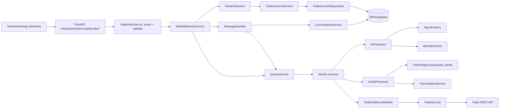
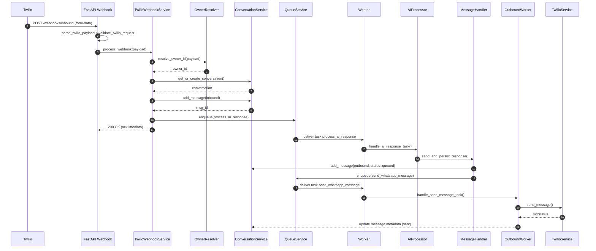
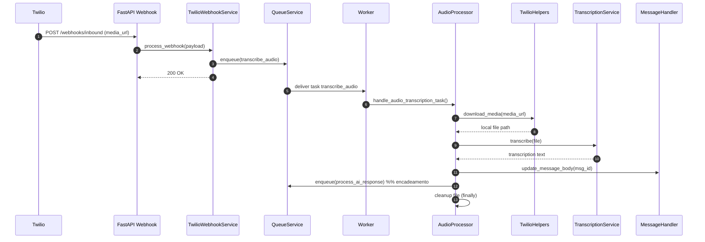

# Análise do Módulo Twilio (Channels)

Escopo: pacotes sob [twilio/](file:///Users/lennon/projects/ai_engineering/whatsapp_twilio_ai/src/modules/channels/twilio/), com foco em integração WhatsApp/Twilio, processamento assíncrono (fila/worker) e acoplamentos com Conversation/Identity/AI. Referências de código são citadas onde sustentam o diagnóstico.

## Sumário Executivo

O módulo está bem estruturado em camadas (API → serviços → repositórios/modelos → workers), com uma decisão arquitetural correta: **webhook responde rápido (200 OK) e delega processamento pesado para fila**, mitigando timeouts do provedor. Há, porém, alguns pontos de risco relevantes: **validação do webhook sensível a proxy**, **ausência de rate limiting**, **potencial vazamento de dados em logs/erros**, **segredos sensíveis (auth_token) persistidos sem evidência de criptografia**, e **algumas chamadas possivelmente bloqueantes no event loop**.

### Visão Geral de Conformidade (módulo)

- Arquitetural: **✅ 80% (Parcialmente Conforme)**
- Segurança: **⚠️ 60% (Parcial)**
- Performance: **⚠️ 70% (Parcial)**
- Documentação: **⚠️ 65% (Parcial)**
- Observabilidade: **⚠️ 65% (Parcial)**
- Dependências: **⚠️ 55% (Parcial)**
- Deploy/DevOps: **⚠️ 55% (Parcial)**

Nota geral (módulo): **7,1 / 10**

## Organização e Camadas

Estrutura (principal):
- API (REST): [api/router.py](file:///Users/lennon/projects/ai_engineering/whatsapp_twilio_ai/src/modules/channels/twilio/api/router.py), [api/v1/webhooks.py](file:///Users/lennon/projects/ai_engineering/whatsapp_twilio_ai/src/modules/channels/twilio/api/v1/webhooks.py)
- Dependências/segurança do webhook: [api/dependencies.py](file:///Users/lennon/projects/ai_engineering/whatsapp_twilio_ai/src/modules/channels/twilio/api/dependencies.py)
- Orquestração: [services/twilio_webhook_service.py](file:///Users/lennon/projects/ai_engineering/whatsapp_twilio_ai/src/modules/channels/twilio/services/twilio_webhook_service.py)
- Componentes especializados: [services/webhook/](file:///Users/lennon/projects/ai_engineering/whatsapp_twilio_ai/src/modules/channels/twilio/services/webhook/)
- Integração Twilio (SDK): [services/twilio_service.py](file:///Users/lennon/projects/ai_engineering/whatsapp_twilio_ai/src/modules/channels/twilio/services/twilio_service.py)
- Persistência TwilioAccount: [repositories/account_repository.py](file:///Users/lennon/projects/ai_engineering/whatsapp_twilio_ai/src/modules/channels/twilio/repositories/account_repository.py)
- Worker outbound (fila): [workers/outbound_worker.py](file:///Users/lennon/projects/ai_engineering/whatsapp_twilio_ai/src/modules/channels/twilio/workers/outbound_worker.py)

Camadas observadas:
- **Interface (API)**: FastAPI routers e dependências.
- **Aplicação (Orquestração)**: `TwilioWebhookService` coordena o fluxo e registra handlers de fila.
- **Domínio (modelo)**: DTOs/Pydantic para payload e entidades simples (ex.: `TwilioWhatsAppPayload`).
- **Infra (integrações)**: Twilio SDK, Supabase Repository, Queue backend, helpers de download.

## Domínio e Bounded Contexts (DDD)

O módulo atua principalmente como **Anti-Corruption Layer / Adapter** entre:
- Provedor (Twilio/WhatsApp) → bounded context de **Conversation** (mensagens/conversas)
- Provedor (Twilio/WhatsApp) → bounded context de **Identity** (tenant/owner, plano)
- Provedor (Twilio/WhatsApp) → bounded context de **AI** (agentes, transcrição, embeddings)

Não há um “domínio rico” local no módulo Twilio; o domínio real (conversa, usuário, planos, agentes) reside em outros contextos.

## Fluxos Principais

### Endpoints

- `POST /channels/twilio/v1/webhooks/inbound` e `POST /channels/twilio/v1/webhooks/outbound`: [webhooks.py](file:///Users/lennon/projects/ai_engineering/whatsapp_twilio_ai/src/modules/channels/twilio/api/v1/webhooks.py)
  - Ambos chamam `TwilioWebhookService.process_webhook(payload)` e retornam `TwilioWebhookResponseDTO`.
  - Autenticados via `X-API-Key` **ou** `X-Twilio-Signature` (exceto em development): [validate_twilio_request](file:///Users/lennon/projects/ai_engineering/whatsapp_twilio_ai/src/modules/channels/twilio/api/dependencies.py#L46-L73)

### Diagrama de Componentes (alto nível)

### Sequência: Inbound Texto (resposta via fila)

### Sequência: Inbound Áudio (transcrição + encadeamento)

---

## 1) Conformidade Arquitetural

✅ Conformidade: **80% (Parcialmente Conforme)**

💪 Pontos Fortes
- Camadas claras por diretório (API/Services/Repositories/Models/Workers), com boa modularização interna em componentes: [services/webhook/](file:///Users/lennon/projects/ai_engineering/whatsapp_twilio_ai/src/modules/channels/twilio/services/webhook/).
- Orquestração centralizada e coesa em `TwilioWebhookService`, com “composition root” via DI Container: [container.py](file:///Users/lennon/projects/ai_engineering/whatsapp_twilio_ai/src/core/di/container.py#L234-L270).
- Estratégia correta de webhook “ack rápido” + processamento assíncrono em fila (evita timeouts do provedor): [twilio_webhook_service.py](file:///Users/lennon/projects/ai_engineering/whatsapp_twilio_ai/src/modules/channels/twilio/services/twilio_webhook_service.py#L183-L203).

⚠️ Pontos Fracos
- Dois endpoints (inbound/outbound) fazem exatamente o mesmo fluxo; tende a gerar duplicação conceitual e custo de manutenção: [webhooks.py](file:///Users/lennon/projects/ai_engineering/whatsapp_twilio_ai/src/modules/channels/twilio/api/v1/webhooks.py).
- Acoplamento alto com múltiplos bounded contexts (Conversation/Identity/AI) dentro do caminho do webhook; o módulo é adaptador, mas o “caminho quente” depende de muitos serviços.
- Parte da resolução do owner (lookup em repositório) ocorre por chamada possivelmente síncrona no event loop (`resolve_owner_id` é sync e chamado sem threadpool): [twilio_webhook_service.py](file:///Users/lennon/projects/ai_engineering/whatsapp_twilio_ai/src/modules/channels/twilio/services/twilio_webhook_service.py#L54-L56), [owner_resolver.py](file:///Users/lennon/projects/ai_engineering/whatsapp_twilio_ai/src/modules/channels/twilio/services/webhook/owner_resolver.py#L23-L41).

🎯 Oportunidades
- Consolidar `inbound` e `outbound` em um único endpoint (ou documentar a diferença real de contrato/evento), reduzindo superfície e complexidade.
- Tornar a resolução do owner explicitamente assíncrona (ou encapsular o lookup em `run_in_threadpool`), evitando bloqueio do event loop.
- Definir interfaces/pontos de extensão (ports/adapters) para reduzir acoplamento direto com Identity/AI no caminho crítico.

🔴 Riscos
- Se o lookup de owner bloquear o event loop sob carga, o webhook degrada e pode causar perda de throughput (criticidade: **Média**).

Nota geral: **8 / 10**

## 2) Segurança

✅ Conformidade: **60% (Parcial)**

💪 Pontos Fortes
- Autenticidade do webhook suportada via `X-API-Key` ou `X-Twilio-Signature` (fora de dev): [validate_twilio_request](file:///Users/lennon/projects/ai_engineering/whatsapp_twilio_ai/src/modules/channels/twilio/api/dependencies.py#L46-L73).
- Validação básica de tipos/shape via Pydantic (`NumMedia`, `NumSegments`): [domain.py](file:///Users/lennon/projects/ai_engineering/whatsapp_twilio_ai/src/modules/channels/twilio/models/domain.py#L90-L96).

⚠️ Pontos Fracos
- Em development, a autenticação do webhook é bypassada; se `API_ENVIRONMENT` estiver incorreto em produção, o endpoint pode ficar exposto: [dependencies.py](file:///Users/lennon/projects/ai_engineering/whatsapp_twilio_ai/src/modules/channels/twilio/api/dependencies.py#L56-L57).
- Validação de assinatura usa `str(request.url)` e `await request.form()`; atrás de proxy sem headers corretos (host/scheme), pode ocorrer falso negativo (403): [dependencies.py](file:///Users/lennon/projects/ai_engineering/whatsapp_twilio_ai/src/modules/channels/twilio/api/dependencies.py#L69-L73).
- `TwilioAccount.auth_token` é modelado e persistido sem evidência de criptografia/rotações; risco de “sensitive data exposure”: [domain.py](file:///Users/lennon/projects/ai_engineering/whatsapp_twilio_ai/src/modules/channels/twilio/models/domain.py#L10-L21), [account_repository.py](file:///Users/lennon/projects/ai_engineering/whatsapp_twilio_ai/src/modules/channels/twilio/repositories/account_repository.py).
- Possível vazamento de detalhes internos ao retornar `Error: {str(e)}` no body HTTP: [webhooks.py](file:///Users/lennon/projects/ai_engineering/whatsapp_twilio_ai/src/modules/channels/twilio/api/v1/webhooks.py#L42-L47).
- Logging com payload completo de task de transcrição (pode conter media_url, ids e metadados): [audio_processor.py](file:///Users/lennon/projects/ai_engineering/whatsapp_twilio_ai/src/modules/channels/twilio/services/webhook/audio_processor.py#L58-L66).

🎯 Oportunidades
- Normalizar o “request URL canonical” para assinatura Twilio (considerar `X-Forwarded-Proto/Host` e/ou configurar ProxyHeadersMiddleware no app, se aplicável).
- Evitar expor `str(e)` em respostas; padronizar erro genérico no webhook e manter detalhe apenas em logs seguros.
- Criptografar `auth_token` em repouso (KMS/Secrets manager) ou armazenar apenas referencia a vault; rotacionar tokens.
- Sanitizar logs: remover payload bruto; logar apenas campos essenciais (correlation_id, msg_id, conv_id, owner_id).
- Implementar “deny-by-default” mesmo em dev, oferecendo bypass somente quando rodando local (por IP allowlist, ou env explícita e difícil de errar).

🔴 Riscos
- Exposição de webhook sem autenticação/assinatura por misconfig (criticidade: **Alta**).
- Vazamento de credenciais (auth_token) ou dados pessoais em logs (criticidade: **Alta**).
- Falsos 403 por proxy quebram ingestão de mensagens (criticidade: **Média**).

Nota geral: **6,5 / 10**

## 3) Performance

✅ Conformidade: **70% (Parcial)**

💪 Pontos Fortes
- Caminho de processamento pesado sai do request/response e vai para fila (`process_ai_response`, `transcribe_audio`, `send_whatsapp_message`): [twilio_webhook_service.py](file:///Users/lennon/projects/ai_engineering/whatsapp_twilio_ai/src/modules/channels/twilio/services/twilio_webhook_service.py#L183-L203), [outbound_worker.py](file:///Users/lennon/projects/ai_engineering/whatsapp_twilio_ai/src/modules/channels/twilio/workers/outbound_worker.py).
- Uso de `run_in_threadpool`/`asyncio.to_thread` para chamadas síncronas (DB/SDK), reduzindo travamento do event loop em pontos importantes: [message_handler.py](file:///Users/lennon/projects/ai_engineering/whatsapp_twilio_ai/src/modules/channels/twilio/services/webhook/message_handler.py#L83-L167), [outbound_worker.py](file:///Users/lennon/projects/ai_engineering/whatsapp_twilio_ai/src/modules/channels/twilio/workers/outbound_worker.py#L62-L71).
- Chunking de mensagens > 1500 chars evita falhas do Twilio e mantém integridade do corpo original: [twilio_service.py](file:///Users/lennon/projects/ai_engineering/whatsapp_twilio_ai/src/modules/channels/twilio/services/twilio_service.py#L133-L182).

⚠️ Pontos Fracos
- Resolução de owner e lookup de conta pode ser síncrona no caminho do request (risco de latência sob carga): [owner_resolver.py](file:///Users/lennon/projects/ai_engineering/whatsapp_twilio_ai/src/modules/channels/twilio/services/webhook/owner_resolver.py#L23-L41).
- Não há cache explícito para lookup de `TwilioAccount` por `To`/`AccountSid`; toda mensagem pode gerar chamadas ao banco.
- Não existe rate limiting no webhook (risco de abuso e custo operacional).
- Correlação no fluxo de áudio se perde porque `process_ai_response` é enfileirado com novos UUIDs (correlation_id diferente do evento original), dificultando debug de performance por request: [audio_processor.py](file:///Users/lennon/projects/ai_engineering/whatsapp_twilio_ai/src/modules/channels/twilio/services/webhook/audio_processor.py#L102-L114).

🎯 Oportunidades
- Cache in-memory (TTL curto) para `resolve_account` (AccountSid/To → owner_id), com invalidação simples (ex.: 5–15 min).
- Garantir que qualquer I/O síncrono no webhook seja encapsulado em threadpool.
- Adicionar rate limiting (por IP + por `AccountSid/From`) e proteção contra burst.
- Preservar `correlation_id` fim-a-fim no encadeamento de tasks para medir tempos (ingestão → transcrição → IA → outbound).

🔴 Riscos
- Sem rate limiting, qualquer flood pode saturar fila, CPU (Whisper/LLM) e gerar custo (criticidade: **Alta**).
- Bloqueios no event loop reduzem throughput e aumentam timeouts upstream (criticidade: **Média**).

Nota geral: **7 / 10**

## 4) Documentação

✅ Conformidade: **65% (Parcial)**

💪 Pontos Fortes
- Endpoints têm docstrings e estão no OpenAPI em ambientes não-prod: [main.py](file:///Users/lennon/projects/ai_engineering/whatsapp_twilio_ai/src/main.py#L44-L56), [webhooks.py](file:///Users/lennon/projects/ai_engineering/whatsapp_twilio_ai/src/modules/channels/twilio/api/v1/webhooks.py#L29-L34).
- Estratégia de versionamento de API presente via `/v1`: [api/router.py](file:///Users/lennon/projects/ai_engineering/whatsapp_twilio_ai/src/modules/channels/twilio/api/router.py#L5-L7).

⚠️ Pontos Fracos
- Não há documentação dedicada do módulo Twilio dentro do diretório (contrato esperado do webhook, exemplos de payload, headers e cenários).
- Docstrings existem, mas não há padronização de “contratos” (headers aceitos, códigos de retorno, idempotência, garantias).

🎯 Oportunidades
- Criar documentação curta do contrato do webhook (headers, autenticação, exemplos, idempotência e semântica dos endpoints).
- Incluir no README do projeto uma seção “Twilio Webhooks” (ou referenciar este documento).

🔴 Riscos
- Integrações externas sem contrato claro aumentam incidentes e retrabalho (criticidade: **Média**).

Nota geral: **6,5 / 10**

## 5) Observabilidade

✅ Conformidade: **65% (Parcial)**

💪 Pontos Fortes
- Logging estruturado utilizado amplamente (structlog) e correlação existe no fluxo principal (correlation_id): [twilio_webhook_service.py](file:///Users/lennon/projects/ai_engineering/whatsapp_twilio_ai/src/modules/channels/twilio/services/twilio_webhook_service.py#L130-L171), [ai_processor.py](file:///Users/lennon/projects/ai_engineering/whatsapp_twilio_ai/src/modules/channels/twilio/services/webhook/ai_processor.py#L79-L90).
- Health check global disponível: [main.py](file:///Users/lennon/projects/ai_engineering/whatsapp_twilio_ai/src/main.py#L82-L86).

⚠️ Pontos Fracos
- Logs potencialmente sensíveis (payload completo de task; mensagens/transcrições em claro): [audio_processor.py](file:///Users/lennon/projects/ai_engineering/whatsapp_twilio_ai/src/modules/channels/twilio/services/webhook/audio_processor.py#L58-L66).
- Uso misto de estilo de log (f-string vs campos estruturados; mensagem com `%s`), reduzindo consistência e capacidade de query: [message_handler.py](file:///Users/lennon/projects/ai_engineering/whatsapp_twilio_ai/src/modules/channels/twilio/services/webhook/message_handler.py#L61-L63), [twilio_webhook_service.py](file:///Users/lennon/projects/ai_engineering/whatsapp_twilio_ai/src/modules/channels/twilio/services/twilio_webhook_service.py#L136-L136).
- Sem métricas (latência por etapa, tamanho da fila, falhas por task) e sem tracing distribuído.

🎯 Oportunidades
- Padronizar logging (campos: owner_id, conv_id, msg_id, correlation_id, task_name).
- Remover payload bruto e criar “redaction layer” para logs.
- Expor métricas (Prometheus/OpenTelemetry) para: duração transcrição/IA, taxa de erro, depth de filas, retries.
- Tracing (OTel) para rastrear request→task chain (especialmente áudio→IA→outbound).

🔴 Riscos
- Incidentes difíceis de diagnosticar (sem correlação contínua e sem métricas) (criticidade: **Média**).
- Exposição de PII em logs pode ser incidente de segurança (criticidade: **Alta**).

Nota geral: **6,5 / 10**

## 6) Dependências

✅ Conformidade: **55% (Parcial)**

💪 Pontos Fortes
- Dependências principais estão pinadas (maior reprodutibilidade): [requirements.txt](file:///Users/lennon/projects/ai_engineering/whatsapp_twilio_ai/requirements.txt).
- Testes unitários existem para TwilioService e TwilioWebhookService: [test_twilio_service.py](file:///Users/lennon/projects/ai_engineering/whatsapp_twilio_ai/tests/modules/channels/twilio/services/test_twilio_service.py), [test_twilio_webhook_service.py](file:///Users/lennon/projects/ai_engineering/whatsapp_twilio_ai/tests/modules/channels/twilio/services/test_twilio_webhook_service.py).

⚠️ Pontos Fracos
- `requests` é importado e usado em `TwilioHelpers.download_media`, mas não aparece em `requirements.txt` (risco de falha em runtime/CI): [helpers.py](file:///Users/lennon/projects/ai_engineering/whatsapp_twilio_ai/src/core/utils/helpers.py#L5-L74).
- Não há evidência de varredura de CVEs/licenças (pip-audit, safety, osv-scanner) ou política de atualização.

🎯 Oportunidades
- Garantir que dependências realmente usadas estejam declaradas (ex.: `requests`).
- Adicionar job de CI para `pip-audit`/OSV e checagem de licenças (ex.: `pip-licenses`).
- Revisar dependências “pesadas” no runtime do webhook (LLM/Whisper/redis) e separar imagens/instalações por perfil quando necessário.

🔴 Riscos
- Falhas em produção por dependência ausente (criticidade: **Alta**).
- Vulnerabilidades não detectadas por falta de scanner (criticidade: **Média**).

Nota geral: **5,5 / 10**

## 7) Deploy / DevOps

✅ Conformidade: **55% (Parcial)**

💪 Pontos Fortes
- Dockerfile usa base slim e usuário não-root: [Dockerfile](file:///Users/lennon/projects/ai_engineering/whatsapp_twilio_ai/Dockerfile#L1-L26).
- Compose modela API + Worker + Scheduler + Redis/Postgres, coerente com arquitetura assíncrona: [docker-compose.yml](file:///Users/lennon/projects/ai_engineering/whatsapp_twilio_ai/docker-compose.yml#L36-L103).
- App segue 12-factor em boa parte (config via env/settings).

⚠️ Pontos Fracos
- Healthcheck do Dockerfile usa `requests`, que não está garantido nas dependências (pode quebrar a imagem): [Dockerfile](file:///Users/lennon/projects/ai_engineering/whatsapp_twilio_ai/Dockerfile#L30-L33).
- Não há pipeline de CI/CD (nenhum workflow encontrado).
- docker-compose expõe credenciais default (Postgres/pgAdmin) e configura CORS permissivo; aceitável para dev, mas perigoso se reutilizado em ambientes reais: [docker-compose.yml](file:///Users/lennon/projects/ai_engineering/whatsapp_twilio_ai/docker-compose.yml#L17-L116), [main.py](file:///Users/lennon/projects/ai_engineering/whatsapp_twilio_ai/src/main.py#L61-L68).
- Estratégia de rollback não documentada (blue/green, canary, tags imutáveis).

🎯 Oportunidades
- Separar compose de dev vs prod (ex.: `docker-compose.dev.yml`), removendo credenciais hardcoded e endurecendo CORS.
- Adicionar CI mínimo: lint + tests + audit + build da imagem.
- Adicionar “readiness/liveness” mais robustos (incluindo dependências do worker/fila).

🔴 Riscos
- Ambientes expostos com credenciais default e CORS permissivo (criticidade: **Alta**).
- Sem CI, regressões entram sem detecção (criticidade: **Média**).

Nota geral: **5,5 / 10**

---

## Riscos Prioritários (Top 6)

| Risco | Impacto | Prob. | Criticidade | Evidência |
|---|---:|---:|---:|---|
| Webhook sem auth por misconfig de ambiente | Alto | Média | **Alta** | [dependencies.py](file:///Users/lennon/projects/ai_engineering/whatsapp_twilio_ai/src/modules/channels/twilio/api/dependencies.py#L56-L57) |
| Vazamento de payload/PII em logs | Alto | Média | **Alta** | [audio_processor.py](file:///Users/lennon/projects/ai_engineering/whatsapp_twilio_ai/src/modules/channels/twilio/services/webhook/audio_processor.py#L58-L66) |
| Flood sem rate limit (custo + saturação) | Alto | Alta | **Alta** | Ausência de mecanismo |
| Dependência ausente (`requests`) quebrando runtime/healthcheck | Alto | Média | **Alta** | [helpers.py](file:///Users/lennon/projects/ai_engineering/whatsapp_twilio_ai/src/core/utils/helpers.py#L5), [Dockerfile](file:///Users/lennon/projects/ai_engineering/whatsapp_twilio_ai/Dockerfile#L30-L33) |
| Assinatura Twilio falhando atrás de proxy | Médio | Média | **Média** | [dependencies.py](file:///Users/lennon/projects/ai_engineering/whatsapp_twilio_ai/src/modules/channels/twilio/api/dependencies.py#L69-L73) |
| Event loop bloqueado por I/O síncrono (owner lookup) | Médio | Média | **Média** | [twilio_webhook_service.py](file:///Users/lennon/projects/ai_engineering/whatsapp_twilio_ai/src/modules/channels/twilio/services/twilio_webhook_service.py#L54-L56) |

## Sugestões Incrementais (ordem recomendada)

1) Segurança/observabilidade (rápido, alto impacto): remover `str(e)` das respostas; redigir logs; preservar `correlation_id` no áudio.
2) Robustez do webhook: canonicalizar URL para assinatura (proxy headers); adicionar rate limiting.
3) Performance: encapsular owner lookup em threadpool e/ou cache TTL do mapeamento `To/AccountSid → owner_id`.
4) Credenciais: plano de criptografia/segredos para `auth_token` (vault/KMS) + rotação.
5) DevOps: CI mínimo (tests + audit) e separar configurações dev/prod.

## Reflexões e Sugestões (1–2 parágrafos)

O módulo Twilio está em um bom ponto arquitetural: ele se comporta como um adaptador claro para o provedor, usando fila para absorver latência e variabilidade do processamento de IA/transcrição. A divisão em componentes (resolver/handler/processors) favorece coesão e reduz o tamanho da classe orquestradora, mantendo o fluxo legível e testável.

Para evoluir com segurança e escala, o maior ganho incremental está em “endurecer as bordas”: autenticação do webhook robusta em produção (proxy-aware), logs com redaction e correlação contínua, e rate limiting para proteger custo e disponibilidade. Em paralelo, reforçar gestão de segredos (especialmente tokens Twilio por tenant) e automatizar checks (CI + scanners) reduz o risco operacional sem exigir grandes refatorações.

