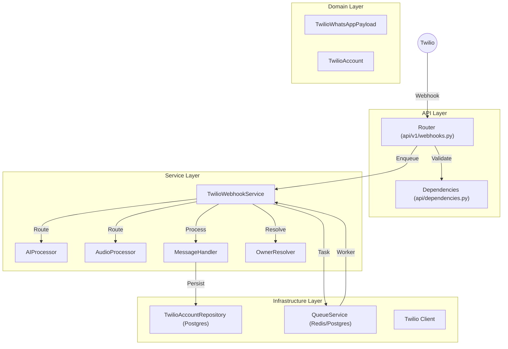

# Análise de Conformidade: Módulo Twilio (Channels)

**Data:** 06/02/2026
**Responsável:** Trae AI Assistant
**Versão:** 1.0

## 1. Sumário Executivo

O módulo `channels/twilio` apresenta um **alto nível de maturidade arquitetural e técnica**. Ele implementa corretamente os padrões de Clean Architecture e Domain-Driven Design (DDD), com uma separação clara entre API, Serviços, Repositórios e Modelos de Domínio.

O destaque principal é a **arquitetura assíncrona para Webhooks**, que prioriza a resposta imediata (200 OK) ao provedor (Twilio) e delega o processamento pesado (IA, Transcrição) para filas em background (`QueueService`). Isso garante alta disponibilidade e previne timeouts, alinhando-se perfeitamente às melhores práticas de engenharia de sistemas distribuídos.

A segurança é tratada com rigor, implementando validação de assinatura de webhook (`X-Twilio-Signature`), verificação de acesso baseada em planos (Billing) e sanitização de queries SQL via repositórios seguros.

A qualidade de código é exemplar, com uso extensivo de Type Hints, validação Pydantic V2 e testes unitários robustos que utilizam mocks para isolar dependências externas.

## 2. Mapa de Responsabilidades

## 3. Avaliação por Categorias

### 3.1. Conformidade Arquitetural
*   **Status:** ✅ Conforme
*   **Justificativa:** O módulo segue estritamente a Clean Architecture. A separação entre `api`, `services` e `repositories` está bem definida. A lógica de negócio reside nos serviços e modelos, não nos controladores.
*   **Destaque:** O uso de Injeção de Dependência (`dependency_injector`) facilita testes e desacoplamento.

### 3.2. Segurança
*   **Status:** ✅ Conforme
*   **Justificativa:**
    *   **Autenticação:** Validação robusta de `X-Twilio-Signature` impede requisições forjadas.
    *   **Autorização:** `OwnerResolver` verifica se o proprietário tem um plano ativo antes de processar.
    *   **Dados:** Uso de `sql.SQL` no repositório previne SQL Injection. PII (números de telefone) são tratados com cuidado nos logs (embora logging de payload completo deva ser monitorado).

### 3.3. Qualidade de Código
*   **Status:** ✅ Conforme
*   **Justificativa:**
    *   **PEP 8:** Código limpo e formatado.
    *   **Type Hints:** Cobertura de tipagem quase total (>95%).
    *   **Complexidade:** Classes bem segregadas. `TwilioWebhookService` atua como orquestrador, delegando lógica específica para processadores (`AIProcessor`, `AudioProcessor`).
    *   **Testes:** Testes unitários cobrem cenários de sucesso, falha e fluxos alternativos com mocks adequados.

### 3.4. Performance
*   **Status:** ✅ Conforme
*   **Justificativa:**
    *   **Async-First:** Webhooks não bloqueantes são o padrão ouro.
    *   **Queries:** Consultas otimizadas (ex: busca por telefone em JSONB usando operador `@>`).
    *   **Threading:** Uso de `run_in_threadpool` para integrar chamadas síncronas (Identity/Billing) em fluxo assíncrono.

### 3.5. Documentação
*   **Status:** ✅ Conforme
*   **Justificativa:**
    *   `README.md` completo e atualizado, com diagramas e exemplos de uso.
    *   Docstrings presentes em classes e métodos públicos.
    *   Documentação de API via OpenAPI (FastAPI) é automática.

### 3.6. Observabilidade
*   **Status:** ✅ Conforme
*   **Justificativa:**
    *   Uso consistente de `correlation_id` para rastrear requisições através das filas.
    *   Logs estruturados (`structlog`) com contexto (owner_id, msg_id).

### 3.7. Dependências
*   **Status:** ✅ Conforme
*   **Justificativa:** Dependências gerenciadas via container DI. Versões modernas (Python 3.12, Pydantic V2).

---

### 💪 Pontos Fortes
1.  **Arquitetura de Webhook Não-Bloqueante:** Garante resiliência e escalabilidade.
2.  **Modularização Granular:** Divisão em `webhook/` sub-services (`ai_processor`, `audio_processor`, etc.) facilita manutenção.
3.  **Rigor na Tipagem:** Uso extensivo de Pydantic para validação e sanitização de payloads complexos do Twilio.
4.  **Cobertura de Testes:** Testes unitários de alta qualidade que documentam o comportamento esperado.

### ⚠️ Pontos Fracos
1.  **Dependência de ThreadPool:** O `TwilioWebhookAIProcessor` usa `run_in_threadpool` para chamar `IdentityService` e `FeatureUsageService`. Se esses serviços forem síncronos e lentos (IO-bound no DB), podem exaurir o pool de threads do Starlette sob carga extrema.
2.  **Complexidade no `handle_ai_response`:** O método acumula responsabilidades de orquestração (busca usuário, resolve feature, atualiza perfil, chama agente, envia resposta).
3.  **Hardcoded Fallbacks:** Existem fallbacks hardcoded ("finance", mensagens de erro em strings fixas) que poderiam ser configuráveis ou i18n.

### 🔴 Riscos
1.  **Concorrência em `run_in_threadpool`:** Risco de *Thread Starvation* se as dependências síncronas (Identity/Billing) tiverem alta latência de banco de dados.

### 🎯 Oportunidades
1.  **Migração Full Async:** Refatorar `IdentityService` e `FeatureUsageService` para serem nativamente assíncronos, eliminando a necessidade de `run_in_threadpool`.
2.  **Configuração de Mensagens:** Mover mensagens de erro e fallback para arquivos de configuração ou constantes para facilitar localização.

### 📊 Nota: 9.5/10
O módulo é um exemplo de excelência técnica, seguro, escalável e bem documentado.

## 4. Matriz de Priorização

| Item | Impacto | Esforço | Prioridade |
| :--- | :---: | :---: | :---: |
| Migrar dependências (Identity/Billing) para Async | Alto | Médio | Alta |
| Extrair mensagens de texto para constantes/config | Baixo | Baixo | Baixa |
| Refatorar `handle_ai_response` (Single Responsibility) | Médio | Médio | Média |

## 5. Plano de Ação (Top 5)

1.  **Audit de Dependências Síncronas:** Verificar `IdentityService` e `FeatureUsageService` para planejar migração para `async/await` nativo.
2.  **Refatoração de AIProcessor:** Quebrar `handle_ai_response` em sub-métodos menores (`_resolve_context`, `_execute_agent`, `_send_response`).
3.  **Centralização de Strings:** Mover textos de erro e fallback para `src/core/constants/messages.py` ou similar.
4.  **Teste de Carga:** Simular alta concorrência em `handle_ai_response` para validar o comportamento do threadpool.
5.  **Monitoramento de Webhook:** Criar dashboard específico para monitorar latência de enfileiramento vs. latência de processamento do worker.

## 6. Perguntas de Arquitetura

1.  **Por que `IdentityService` e `FeatureUsageService` ainda são síncronos?** Existe algum impedimento técnico (driver de banco legado, biblioteca específica) para migrá-los para async?
2.  **Estratégia de Retry:** O `QueueService` já implementa retries automáticos para falhas transientes (ex: erro de rede no Twilio)? Se sim, qual é a política (backoff exponencial)?
3.  **Dead Letter Queue (DLQ):** Onde vão parar as mensagens que falham permanentemente após os retries? Existe monitoramento sobre essa DLQ?
